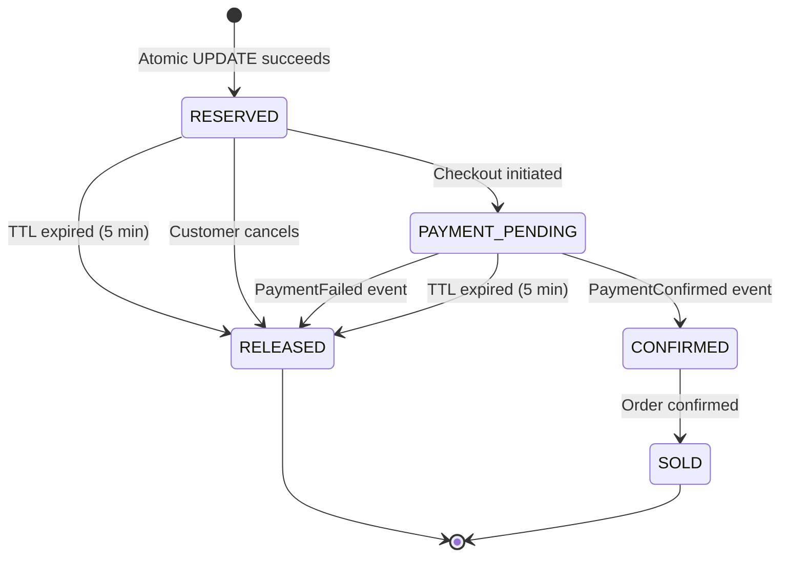
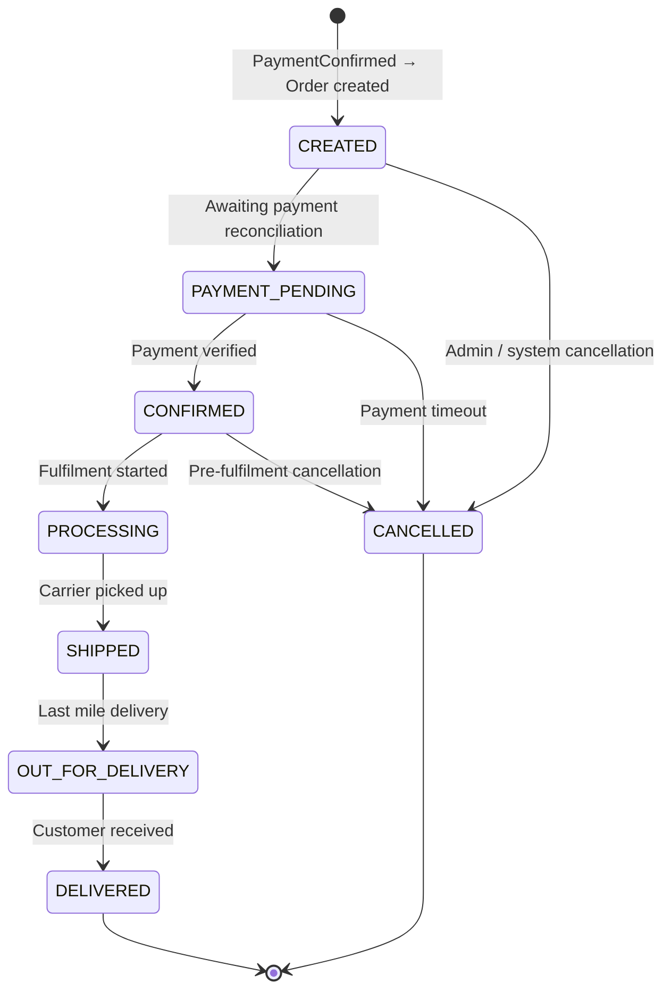
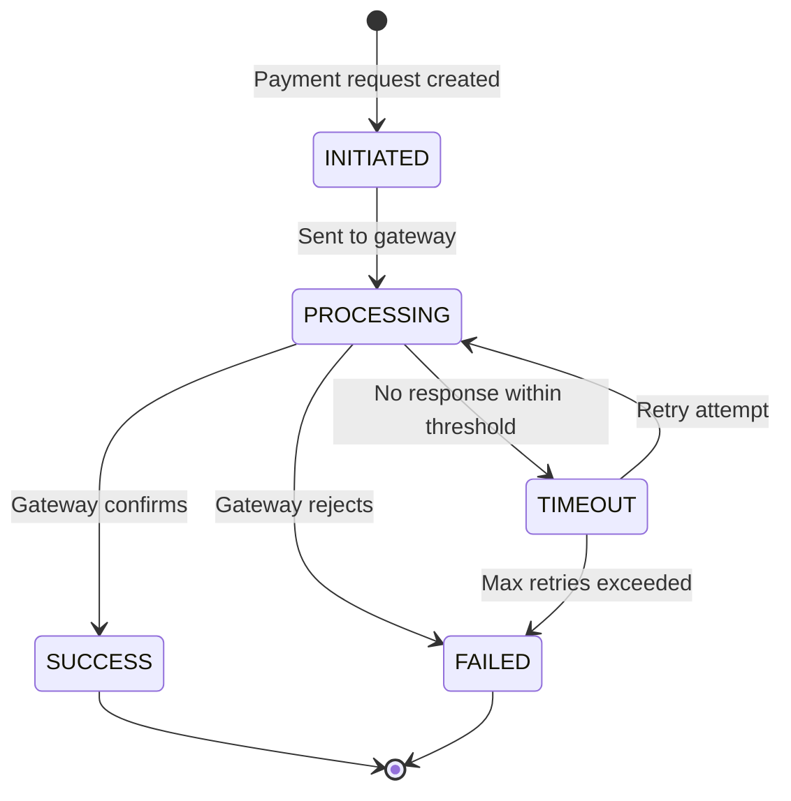
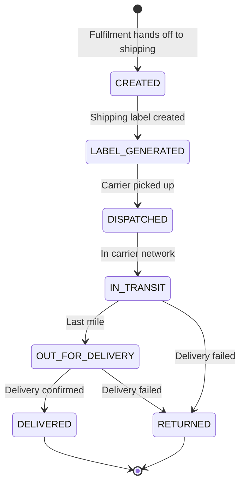
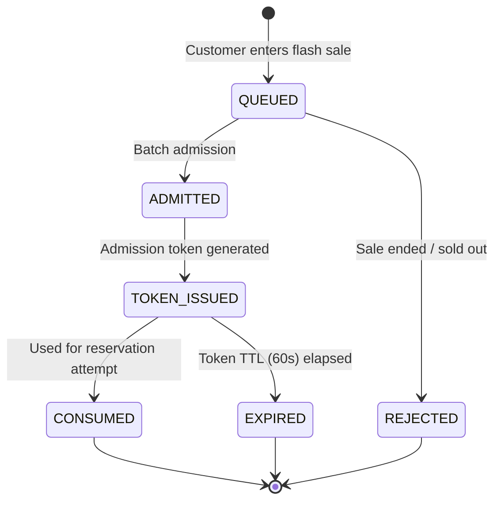
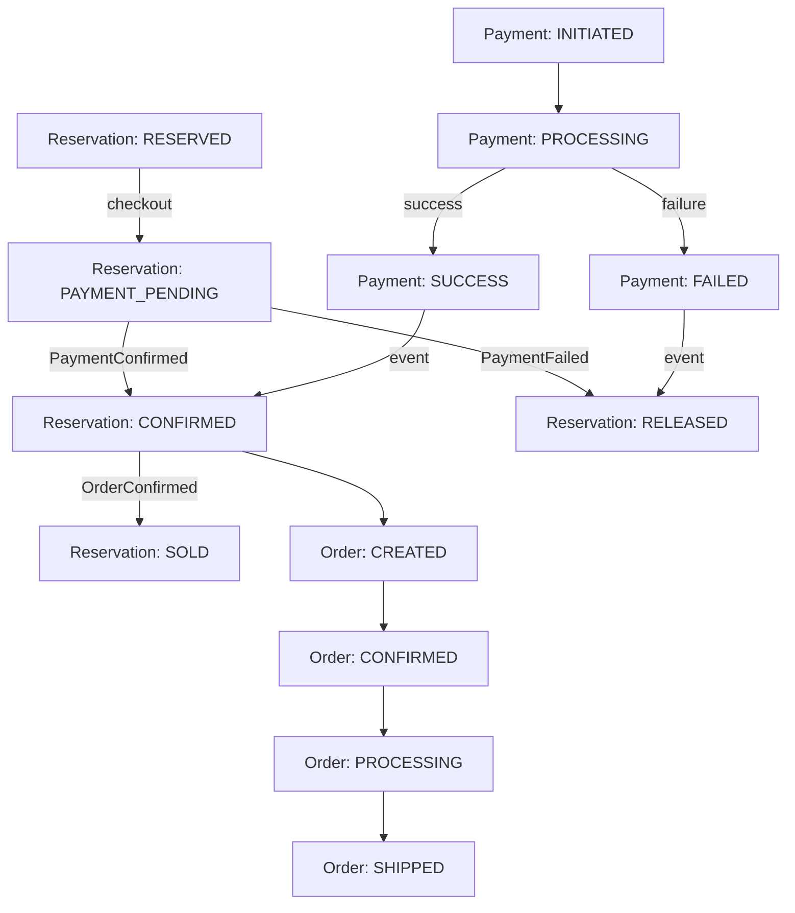

# GlowRush — Domain States

> **Version:** 1.0 | **Status:** FROZEN | **Owner:** Student 1

---

## Purpose

This document defines all canonical state machines for the GlowRush platform. All students must use these exact states and transitions. Additional failure/cancellation states may be appended with team approval, but the successful lifecycle paths are **immucollection**.

---

## 1. Reservation States



### State Definitions

| State             | Description                                                  | Owner Service                   |
| ----------------- | ------------------------------------------------------------ | ------------------------------- |
| `RESERVED`        | Stock decremented, reservation active, awaiting checkout     | Inventory & Reservation Service |
| `PAYMENT_PENDING` | Checkout initiated, payment in progress                      | Inventory & Reservation Service |
| `CONFIRMED`       | Payment confirmed, stock transfer pending                    | Inventory & Reservation Service |
| `SOLD`            | Order created, stock permanently allocated                   | Inventory & Reservation Service |
| `RELEASED`        | Reservation cancelled/expired, stock returned to available   | Inventory & Reservation Service |

### Transition Rules

| From              | To                | Trigger                          | Side Effects                          |
| ----------------- | ----------------- | -------------------------------- | ------------------------------------- |
| — → RESERVED      | RESERVED          | Atomic MongoDB `affected_rows = 1`   | `available_quantity -= 1`, `reserved_quantity += 1` |
| RESERVED          | PAYMENT_PENDING   | Checkout confirms reservation    | None (status update only)             |
| PAYMENT_PENDING   | CONFIRMED         | `PaymentConfirmed` event         | None (status update only)             |
| CONFIRMED         | SOLD              | `OrderConfirmed` event           | `reserved_quantity -= 1`, `sold_quantity += 1` |
| RESERVED          | RELEASED          | TTL expiry / customer cancel     | `available_quantity += 1`, `reserved_quantity -= 1`, publish `ReservationReleased` |
| PAYMENT_PENDING   | RELEASED          | `PaymentFailed` event / TTL      | `available_quantity += 1`, `reserved_quantity -= 1`, publish `ReservationReleased` |

---

## 2. Order States



### State Definitions

| State              | Description                                              | Owner Service    |
| ------------------ | -------------------------------------------------------- | ---------------- |
| `CREATED`          | Order record persisted, pending payment reconciliation   | Order Service    |
| `PAYMENT_PENDING`  | Awaiting final payment confirmation                      | Order Service    |
| `CONFIRMED`        | Payment verified, ready for fulfilment                   | Order Service    |
| `PROCESSING`       | Fulfilment in progress (picking, packing)                | Order Service    |
| `SHIPPED`          | Handed to carrier, tracking number assigned              | Order Service    |
| `OUT_FOR_DELIVERY` | Last-mile delivery in progress                           | Order Service    |
| `DELIVERED`        | Customer received the package                            | Order Service    |
| `CANCELLED`        | Order cancelled (only from pre-shipment states)          | Order Service    |

---

## 3. Payment States



### State Definitions

| State        | Description                                        | Owner Service    |
| ------------ | -------------------------------------------------- | ---------------- |
| `INITIATED`  | Payment record created with idempotency key        | Payment Service  |
| `PROCESSING` | Request sent to external payment gateway           | Payment Service  |
| `SUCCESS`    | Gateway confirmed payment                          | Payment Service  |
| `FAILED`     | Gateway rejected or max retries exceeded           | Payment Service  |
| `TIMEOUT`    | No gateway response within threshold               | Payment Service  |

---

## 4. Shipment States



---

## 5. StormShield Queue States



| State          | Description                                    | Storage |
| -------------- | ---------------------------------------------- | ------- |
| `QUEUED`       | Customer in waiting room, has queue position    | Redis   |
| `ADMITTED`     | Selected for current batch                      | Redis   |
| `TOKEN_ISSUED` | Short-lived JWT issued (60s TTL)               | Redis   |
| `CONSUMED`     | Token used to attempt inventory reservation    | Redis   |
| `EXPIRED`      | Token TTL elapsed without use                  | Redis   |
| `REJECTED`     | Sale ended or all stock depleted               | Redis   |

---

## 6. Invariants

These must hold true at ALL times:

```
available_quantity >= 0                          -- NEVER negative
reserved_quantity >= 0                           -- NEVER negative
sold_quantity >= 0                               -- NEVER negative
available_quantity + reserved_quantity + sold_quantity = initial_stock
count(successful_sales) <= initial_stock         -- NEVER oversold
```

---

## 7. Cross-State Dependencies


