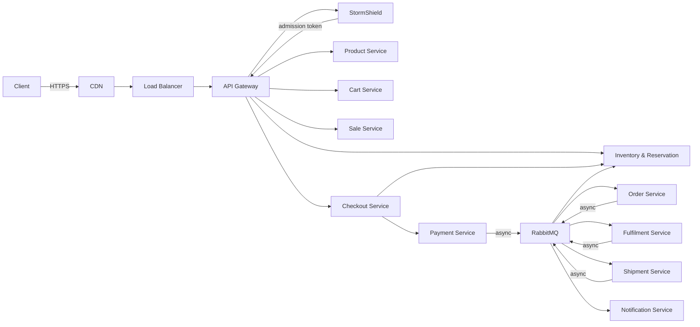

# GlowRush — Service Catalog

> **Version:** 1.0 | **Status:** FROZEN | **Owner:** Student 1

---

## Overview

This catalog defines every service in the GlowRush platform, its purpose, owned data, high-level APIs, dependencies, events, scaling strategy, and failure strategy. Students 2 and 3 must design their LLDs within these boundaries.

---

## 1. API Gateway

| Attribute              | Detail                                                              |
| ---------------------- | ------------------------------------------------------------------- |
| **Purpose**            | Single entry point for all client requests; routing, auth, rate limiting |
| **Owned Data**         | None (stateless)                                                    |
| **Main APIs**          | Routes all `/api/v1/*` to downstream services                      |
| **Sync Dependencies**  | All downstream services                                             |
| **Async Events**       | None                                                                |
| **Scaling Strategy**   | Horizontal — multiple instances behind ALB                          |
| **Failure Strategy**   | Health checks remove unhealthy instances; circuit breaker on downstream calls |

**Key Responsibilities:**
- JWT validation (verify signature, expiry, claims)
- Generate `X-Correlation-ID` if absent
- Route requests to correct service
- Global rate limiting (Redis-backed)
- Request/response logging
- CORS enforcement
- Request size limits

---

## 2. StormShield

| Attribute              | Detail                                                              |
| ---------------------- | ------------------------------------------------------------------- |
| **Purpose**            | Virtual waiting room — controls admission rate during flash sales   |
| **Owned Data**         | Queue positions, admission tokens (Redis only — ephemeral)         |
| **Main APIs**          | `POST /stormshield/enter` — join queue; `GET /stormshield/status` — check position; `POST /stormshield/admit` — internal batch admit |
| **Sync Dependencies**  | Redis                                                               |
| **Async Events**       | Subscribes to `ReservationReleased` (to open slots for next batch) |
| **Scaling Strategy**   | Horizontal — stateless workers + Redis for shared state            |
| **Failure Strategy**   | If Redis is down, fail open with aggressive rate limiting at API Gateway; degrade to direct pass-through with lower limits |

**Key Responsibilities:**
- Enqueue users in Redis sorted set (score = timestamp)
- Admit users in controlled batches (configurable: 20–50 per batch)
- Issue short-lived admission tokens (JWT, 60s TTL)
- Track queue length and estimated wait time
- Signal "Currently Sold Out" when Inventory reports zero stock
- **Does NOT own or check inventory**

**Admission Token Payload:**
```json
{
  "sub": "<customer_id>",
  "type": "admission",
  "sale_id": "<sale_id>",
  "iat": 1696500000,
  "exp": 1696500060
}
```

---

## 3. Product Service

| Attribute              | Detail                                                              |
| ---------------------- | ------------------------------------------------------------------- |
| **Purpose**            | Product catalog management — CRUD, search, categories              |
| **Owned Data**         | Products, categories, images, descriptions, pricing                |
| **Main APIs**          | `GET /products` — list/search; `GET /products/:id` — detail; `POST/PUT/DELETE /products` — admin CRUD |
| **Sync Dependencies**  | PostgreSQL (read), Redis (cache)                                   |
| **Async Events**       | Publishes `ProductUpdated` when catalog changes                    |
| **Scaling Strategy**   | Horizontal — read-heavy, Redis-cached, PostgreSQL read replicas    |
| **Failure Strategy**   | Serve from Redis cache if PostgreSQL is unavailable; stale data acceptable for catalog |

**Key Responsibilities:**
- Product CRUD (admin)
- Product listing with pagination, filtering, search
- Product detail with images and descriptions
- Redis cache with 5-minute TTL for product data
- Category management

---

## 4. Cart Service

| Attribute              | Detail                                                              |
| ---------------------- | ------------------------------------------------------------------- |
| **Purpose**            | Shopping cart management — add, remove, update items               |
| **Owned Data**         | Cart records (customer → items mapping)                            |
| **Main APIs**          | `GET /cart` — view cart; `POST /cart/items` — add item; `PUT /cart/items/:id` — update quantity; `DELETE /cart/items/:id` — remove item |
| **Sync Dependencies**  | Redis (active cart), PostgreSQL (persisted cart), Product Service    |
| **Async Events**       | None                                                                |
| **Scaling Strategy**   | Horizontal — Redis for hot cart data, PostgreSQL for persistence   |
| **Failure Strategy**   | Redis miss falls back to PostgreSQL; cart data is reconstructible  |

**Key Responsibilities:**
- Cart CRUD operations
- Cart validation (product existence, quantity limits)
- Cart persistence across sessions
- Cart → Checkout handoff

---

## 5. Sale Service

| Attribute              | Detail                                                              |
| ---------------------- | ------------------------------------------------------------------- |
| **Purpose**            | Flash sale configuration — schedules, pricing rules, sale metadata |
| **Owned Data**         | Sale records (sale_id, product_id, start_time, end_time, sale_price, total_units) |
| **Main APIs**          | `GET /sales/active` — current flash sale; `GET /sales/:id` — sale detail; `POST /sales` — admin create sale |
| **Sync Dependencies**  | PostgreSQL, Redis (cache sale config)                               |
| **Async Events**       | Publishes `SaleStarted`, `SaleEnded`                               |
| **Scaling Strategy**   | Horizontal — read-heavy, heavily cached                            |
| **Failure Strategy**   | Serve from Redis cache; sale config is immutable once started      |

**Key Responsibilities:**
- Flash sale CRUD (admin)
- Active sale resolution
- Sale schedule management
- Cache sale configuration in Redis

---

## 6. Inventory & Reservation Service *(LLD owned by Student 2)*

| Attribute              | Detail                                                              |
| ---------------------- | ------------------------------------------------------------------- |
| **Purpose**            | **Single source of truth** for stock levels and reservations       |
| **Owned Data**         | `inventory` table, `inventory_reservation` table                   |
| **Main APIs**          | `POST /inventory/reserve` — atomic reservation; `GET /inventory/:productId/availability` — stock check; `POST /inventory/release` — manual release; `POST /inventory/confirm` — mark as sold |
| **Sync Dependencies**  | PostgreSQL (transactional), Redis (stock cache)                    |
| **Async Events**       | Subscribes to `PaymentConfirmed`, `PaymentFailed`; Publishes `ReservationExpired`, `ReservationReleased`, `InventoryDepleted` |
| **Scaling Strategy**   | **Limited horizontal** — write contention on inventory row; use connection pooling + atomic SQL; read replicas for availability checks |
| **Failure Strategy**   | PostgreSQL transaction rollback ensures consistency; reservation expiry cron handles orphans |

**Key Responsibilities:**
- Atomic conditional inventory reservation (the canonical UPDATE)
- Reservation TTL enforcement (5-minute expiry)
- Idempotent reservation via `idempotency_key`
- Stock release on payment failure or TTL expiry
- Confirm reservation → sold on payment success
- Publish events for downstream consumers
- **This service is the FINAL AUTHORITY for inventory consistency**

**Critical Constraint:** This is the hottest service during flash sales. Student 2 must design for:
- Row-level contention on `inventory` table
- Connection pool exhaustion
- Reservation expiry race conditions

---

## 7. Checkout Service *(LLD owned by Student 3)*

| Attribute              | Detail                                                              |
| ---------------------- | ------------------------------------------------------------------- |
| **Purpose**            | Orchestrate the checkout flow — validate reservation, collect shipping info, initiate payment |
| **Owned Data**         | Checkout session state (Redis, short-lived)                        |
| **Main APIs**          | `POST /checkout/initiate` — start checkout; `POST /checkout/confirm` — confirm and proceed to payment |
| **Sync Dependencies**  | Inventory & Reservation Service, Payment Service                    |
| **Async Events**       | None (synchronous orchestrator)                                     |
| **Scaling Strategy**   | Horizontal — stateless with Redis session                          |
| **Failure Strategy**   | Checkout session expires with reservation; idempotent initiation   |

---

## 8. Payment Service *(LLD owned by Student 3)*

| Attribute              | Detail                                                              |
| ---------------------- | ------------------------------------------------------------------- |
| **Purpose**            | Process payments via external gateway; ensure idempotency          |
| **Owned Data**         | Payment records (payment_id, reservation_id, amount, status, idempotency_key, gateway_ref) |
| **Main APIs**          | `POST /payments/initiate` — create payment; `GET /payments/:id` — status; `POST /payments/webhook` — gateway callback |
| **Sync Dependencies**  | External Payment Gateway, PostgreSQL                                |
| **Async Events**       | Publishes `PaymentConfirmed`, `PaymentFailed`                      |
| **Scaling Strategy**   | Horizontal — but limited by external gateway rate limits           |
| **Failure Strategy**   | Idempotency key prevents duplicates; retry with backoff; circuit breaker to gateway; DLQ for unprocessable webhooks |

---

## 9. Order Service *(LLD owned by Student 3)*

| Attribute              | Detail                                                              |
| ---------------------- | ------------------------------------------------------------------- |
| **Purpose**            | Create and manage orders; track order lifecycle                    |
| **Owned Data**         | Order records, order items, order status history                   |
| **Main APIs**          | `GET /orders` — list orders; `GET /orders/:id` — order detail; `POST /orders` — create (internal) |
| **Sync Dependencies**  | PostgreSQL                                                          |
| **Async Events**       | Subscribes to `PaymentConfirmed`; Publishes `OrderCreated`, `OrderConfirmed` |
| **Scaling Strategy**   | Horizontal — event-driven creation reduces sync pressure           |
| **Failure Strategy**   | Idempotent order creation (one order per reservation_id); DLQ for failed event processing |

---

## 10. Fulfilment Service *(LLD owned by Student 3)*

| Attribute              | Detail                                                              |
| ---------------------- | ------------------------------------------------------------------- |
| **Purpose**            | Manage order fulfilment — picking, packing, handoff to shipping    |
| **Owned Data**         | Fulfilment records, packing state                                  |
| **Main APIs**          | `GET /fulfilment/:orderId` — status; `POST /fulfilment/process` — internal |
| **Sync Dependencies**  | PostgreSQL                                                          |
| **Async Events**       | Subscribes to `OrderConfirmed`; Publishes `ShipmentCreated`       |
| **Scaling Strategy**   | Horizontal — not flash-sale critical                               |
| **Failure Strategy**   | Retry event processing; manual intervention queue                  |

---

## 11. Shipment Service *(LLD owned by Student 3)*

| Attribute              | Detail                                                              |
| ---------------------- | ------------------------------------------------------------------- |
| **Purpose**            | Manage shipping — carrier integration, tracking, delivery updates  |
| **Owned Data**         | Shipment records, tracking numbers, carrier responses              |
| **Main APIs**          | `GET /shipments/:id` — tracking; `POST /shipments/webhook` — carrier callback |
| **Sync Dependencies**  | External Shipping Provider, PostgreSQL                              |
| **Async Events**       | Subscribes to `ShipmentCreated`; Publishes `ShipmentDispatched`, `ShipmentDelivered` |
| **Scaling Strategy**   | Horizontal — not flash-sale critical                               |
| **Failure Strategy**   | Retry carrier API; fallback tracking via polling                   |

---

## 12. Notification Service

| Attribute              | Detail                                                              |
| ---------------------- | ------------------------------------------------------------------- |
| **Purpose**            | Send notifications — email, SMS, push — for all system events      |
| **Owned Data**         | Notification logs, templates, delivery status                      |
| **Main APIs**          | `POST /notifications/send` — internal; `GET /notifications` — user history |
| **Sync Dependencies**  | External email/SMS/push providers                                   |
| **Async Events**       | Subscribes to `OrderConfirmed`, `ShipmentDispatched`, `ShipmentDelivered`, `ReservationExpired`, `PaymentFailed` |
| **Scaling Strategy**   | Horizontal — high throughput, no ordering requirement              |
| **Failure Strategy**   | Retry with backoff; DLQ for failed deliveries; at-least-once semantics |

---

## Service Interaction Summary


