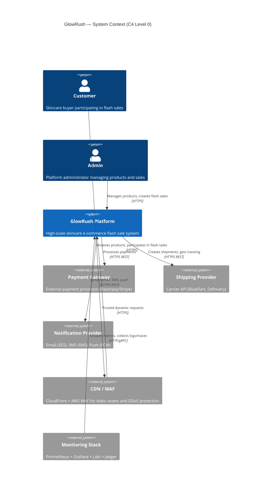
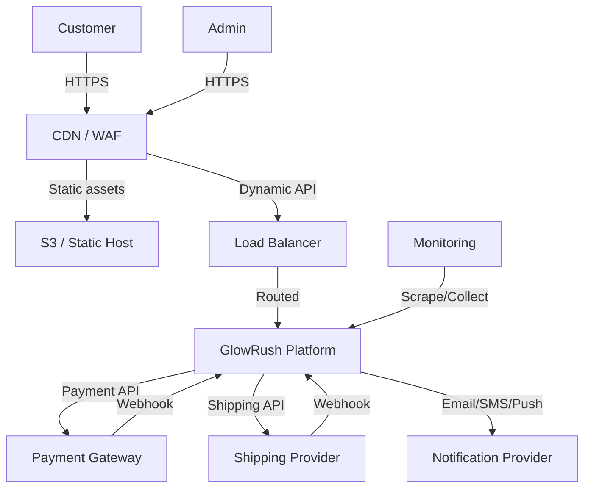

# GlowRush — System Context Diagram

> **Version:** 1.0 | **Owner:** Student 1 (System Architect)

---

## 1. Overview

The System Context diagram shows GlowRush as a single system box surrounded by its external actors and third-party systems. This is the highest level of abstraction — the C4 Level 0 view.

---

## 2. System Context Diagram

---

## 3. External Actors

| Actor                | Type     | Interaction                                                |
| -------------------- | -------- | ---------------------------------------------------------- |
| **Customer**         | Person   | Browses products, joins flash sale queue, purchases items  |
| **Admin**            | Person   | Manages product catalog, creates flash sales, views analytics |
| **Payment Gateway**  | System   | Processes card/UPI payments, sends webhook confirmations   |
| **Shipping Provider**| System   | Generates shipping labels, provides tracking updates       |
| **Notification Provider** | System | Delivers email (SES), SMS (SNS), push (FCM)          |
| **CDN / WAF**        | System   | Caches static assets, blocks malicious traffic             |
| **Monitoring Stack** | System   | Collects metrics, logs, traces for observability           |

---

## 4. System Boundary

Everything inside the "GlowRush Platform" box:

- API Gateway
- StormShield (virtual waiting room)
- Product Service, Cart Service, Sale Service
- Inventory & Reservation Service
- Checkout Service, Payment Service, Order Service
- Fulfilment Service, Shipment Service, Notification Service
- PostgreSQL database cluster
- Redis cluster
- RabbitMQ cluster

---

## 5. Data Flow Summary

---

## 6. Trust Boundaries

| Boundary               | Inside                                          | Outside                          |
| ---------------------- | ----------------------------------------------- | -------------------------------- |
| Internet ↔ CDN/WAF     | CDN, WAF rules                                  | Customer browsers, bots          |
| CDN/WAF ↔ Load Balancer| Load Balancer, API Gateway                      | Public internet                  |
| API Gateway ↔ Services | All microservices, databases                    | Unauthenticated traffic          |
| Platform ↔ Payment GW  | Payment Service                                 | External payment processor       |
| Platform ↔ Shipping    | Shipment Service                                | External carrier                 |
| Platform ↔ Notification| Notification Service                            | External email/SMS/push provider |
