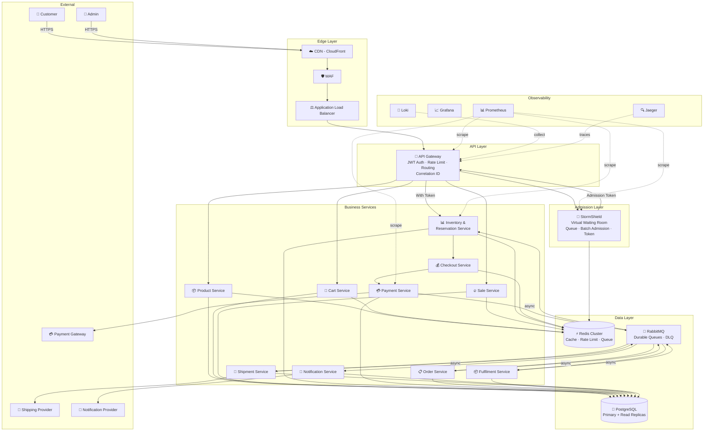
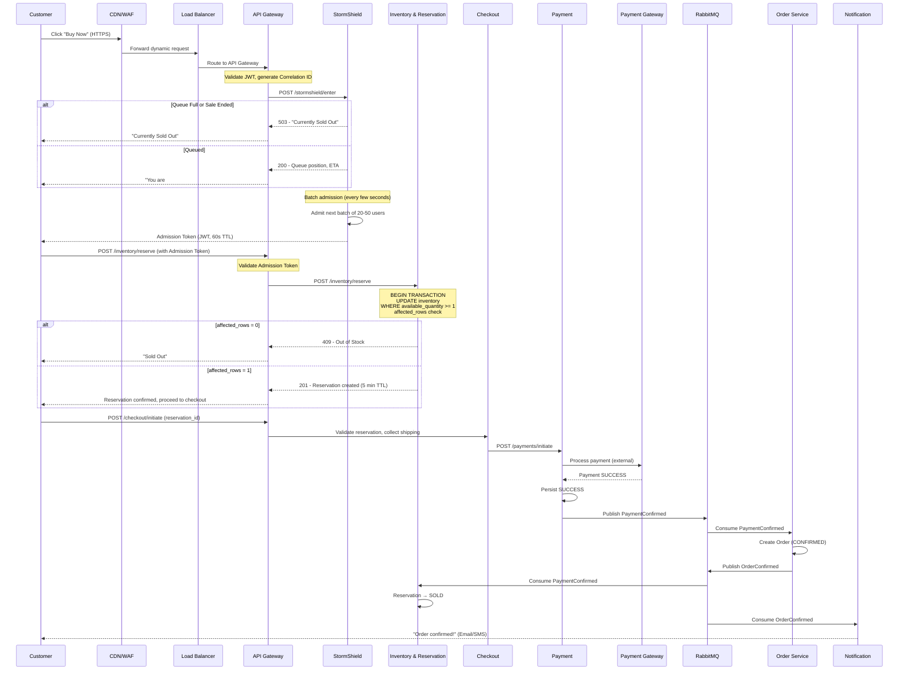

# GlowRush — High-Level Design (HLD) Architecture

> **Version:** 1.0 | **Owner:** Student 1 (System Architect)

---

## 1. Architecture Overview

GlowRush uses a **microservices architecture** with 12 canonical services, communicating via **synchronous REST** for user-facing flows and **asynchronous RabbitMQ events** for background workflows. The architecture is designed to handle a **10,000:100 contention ratio** during flash sales.

---

## 2. HLD Architecture Diagram



---

## 3. Architectural Layers

### Layer 1 — Edge Layer
**Components:** CDN (CloudFront), WAF, Application Load Balancer

**Purpose:**
- **CDN**: Cache static assets (React SPA, images, CSS/JS), reduce origin load by ~80%
- **WAF**: Block OWASP Top 10 attacks, bot detection, geo-blocking, IP reputation
- **ALB**: Distribute traffic across API Gateway instances, health checks, SSL termination

**Flash Sale Impact:** CDN absorbs ~80% of page-load traffic. WAF rate-limits abusive IPs. ALB distributes remaining ~20% dynamic requests across API Gateway instances.

---

### Layer 2 — API Layer
**Components:** API Gateway (multiple instances)

**Purpose:**
- JWT authentication and validation
- Generate/propagate `X-Correlation-ID`
- Global rate limiting (Redis token bucket)
- Request routing to downstream services
- Request/response logging
- CORS enforcement

**Flash Sale Impact:** First line of defense against overload. Rejects unauthenticated requests before they reach StormShield.

---

### Layer 3 — Admission Layer
**Components:** StormShield (multiple instances)

**Purpose:**
- Virtual waiting room during flash sales
- Queue management via Redis sorted sets
- Controlled batch admission (20–50 users per batch)
- Issue short-lived admission tokens (JWT, 60s TTL)
- Observe `ReservationReleased` events to admit next batch

**Flash Sale Impact:** Converts the thundering herd (10,000 concurrent) into a manageable stream (~50 users per admission batch). This is the **critical traffic shaping** component.

---

### Layer 4 — Business Services Layer
**Components:** All 10 business microservices

**Synchronous Path (Flash Sale):**
```
StormShield → Inventory & Reservation → Checkout → Payment
```

**Asynchronous Path (Post-Payment):**
```
Payment → [RabbitMQ] → Order → [RabbitMQ] → Fulfilment → [RabbitMQ] → Shipment → [RabbitMQ] → Notification
```

---

### Layer 5 — Data Layer
**Components:** PostgreSQL, Redis, RabbitMQ

| Component   | Role                                                              |
| ----------- | ----------------------------------------------------------------- |
| PostgreSQL  | Source of truth for all business data; ACID transactions          |
| Redis       | Cache (products, sale config), rate limiting, StormShield queues, checkout sessions |
| RabbitMQ    | Durable async event bus; topic exchange; dead-letter queues       |

---

### Layer 6 — Observability Layer
**Components:** Prometheus, Grafana, Loki, Jaeger

| Component   | Purpose                                           |
| ----------- | ------------------------------------------------- |
| Prometheus  | Metrics collection (request rate, latency, errors)|
| Grafana     | Dashboards and alerting                           |
| Loki        | Structured log aggregation                        |
| Jaeger      | Distributed tracing with correlation IDs          |

---

## 4. Flash Sale Request Flow — Detailed



---

## 5. Key Architectural Principles

| Principle                       | Application                                              |
| ------------------------------- | -------------------------------------------------------- |
| **Single Responsibility**       | Each service owns exactly one business domain            |
| **Database per Service**        | No shared database tables; data access via APIs/events   |
| **Fail Fast at the Edge**       | StormShield + API Gateway reject overflow immediately    |
| **Fail Safe at the Core**       | Atomic SQL ensures inventory can never go negative       |
| **Eventual Consistency**        | Post-payment flow is async; order creation is eventual   |
| **Idempotency Everywhere**      | Every write operation supports safe retry                |
| **Observability by Default**    | Correlation ID, structured logs, metrics, traces         |
| **Defense in Depth**            | CDN → WAF → Rate Limit → Auth → StormShield → Atomic SQL|
