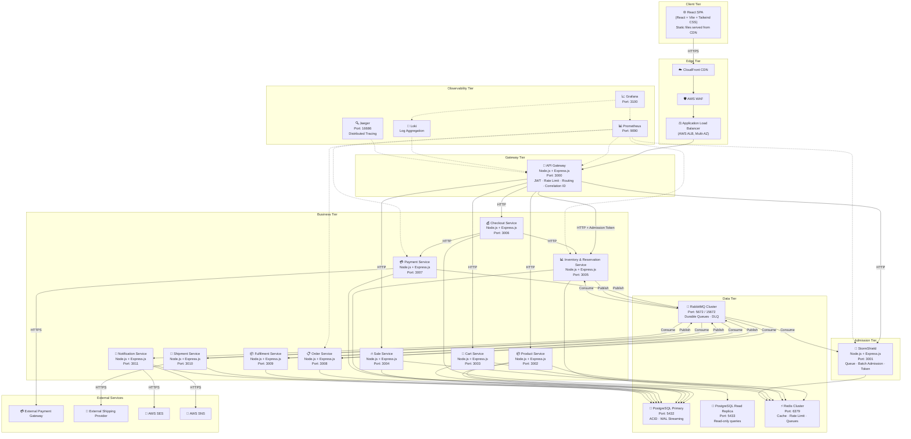

# GlowRush — Container Diagram (C4 Level 2)

> **Version:** 1.0 | **Owner:** Student 1 (System Architect)

---

## 1. Overview

This document provides the C4 Container-level view of the GlowRush platform, showing every deployable container, the technology it uses, and its connections. Each box represents a separately deployable unit (Docker container).

---

## 2. Container Diagram

---

## 3. Container Inventory

| #  | Container                       | Technology           | Port  | Instances (Normal) | Instances (Flash) | Database Access      |
| -- | ------------------------------- | -------------------- | ----- | ------------------- | ------------------- | -------------------- |
| 1  | React SPA                       | React + Vite         | —     | CDN (static)        | CDN (static)        | None                 |
| 2  | API Gateway                     | Node.js + Express    | 3000  | 3                   | 10                  | Redis (rate limit)   |
| 3  | StormShield                     | Node.js + Express    | 3001  | 2                   | 5                   | Redis (queue)        |
| 4  | Product Service                 | Node.js + Express    | 3002  | 2                   | 3                   | PG (R/W), Redis      |
| 5  | Cart Service                    | Node.js + Express    | 3003  | 2                   | 3                   | PG (R/W), Redis      |
| 6  | Sale Service                    | Node.js + Express    | 3004  | 2                   | 3                   | PG (R/W), Redis      |
| 7  | Inventory & Reservation Service | Node.js + Express    | 3005  | 2                   | 5                   | PG (R/W), Redis      |
| 8  | Checkout Service                | Node.js + Express    | 3006  | 2                   | 5                   | Redis                |
| 9  | Payment Service                 | Node.js + Express    | 3007  | 2                   | 5                   | PG (R/W)             |
| 10 | Order Service                   | Node.js + Express    | 3008  | 2                   | 3                   | PG (R/W)             |
| 11 | Fulfilment Service              | Node.js + Express    | 3009  | 2                   | 2                   | PG (R/W)             |
| 12 | Shipment Service                | Node.js + Express    | 3010  | 2                   | 2                   | PG (R/W)             |
| 13 | Notification Service            | Node.js + Express    | 3011  | 2                   | 5                   | PG (R/W)             |
| 14 | PostgreSQL Primary              | PostgreSQL 16        | 5432  | 1                   | 1                   | —                    |
| 15 | PostgreSQL Read Replica         | PostgreSQL 16        | 5433  | 1                   | 2                   | —                    |
| 16 | Redis Cluster                   | Redis 7              | 6379  | 3 nodes             | 6 nodes             | —                    |
| 17 | RabbitMQ Cluster                | RabbitMQ 3.13        | 5672  | 3 nodes             | 3 nodes             | —                    |
| 18 | Prometheus                      | Prometheus           | 9090  | 1                   | 1                   | —                    |
| 19 | Grafana                         | Grafana              | 3100  | 1                   | 1                   | —                    |
| 20 | Loki                            | Grafana Loki         | 3200  | 1                   | 1                   | —                    |
| 21 | Jaeger                          | Jaeger               | 16686 | 1                   | 1                   | —                    |

---

## 4. Container Communication Protocols

| From                     | To                        | Protocol  | Port  | Auth            |
| ------------------------ | ------------------------- | --------- | ----- | --------------- |
| CDN                      | ALB                       | HTTPS     | 443   | TLS             |
| ALB                      | API Gateway               | HTTP      | 3000  | Internal VPC    |
| API Gateway              | All services              | HTTP      | 300x  | Internal + JWT  |
| Any service              | PostgreSQL                | TCP       | 5432  | Username/Pass   |
| Any service              | Redis                     | TCP       | 6379  | AUTH password   |
| Any service              | RabbitMQ                  | AMQP      | 5672  | Username/Pass   |
| Payment Service          | Payment Gateway           | HTTPS     | 443   | API Key         |
| Shipment Service         | Shipping Provider         | HTTPS     | 443   | API Key         |
| Notification Service     | SES/SNS                   | HTTPS     | 443   | IAM Role        |

---

## 5. Data Storage Allocation

### 5.1 PostgreSQL Schemas (Logical Separation)

Each service operates on its own schema within PostgreSQL. No cross-schema queries are permitted.

| Schema                    | Service                         | Key Tables                              |
| ------------------------- | ------------------------------- | --------------------------------------- |
| `product`                 | Product Service                 | `products`, `categories`                |
| `cart`                    | Cart Service                    | `carts`, `cart_items`                   |
| `sale`                    | Sale Service                    | `sales`, `sale_products`                |
| `inventory`               | Inventory & Reservation Service | `inventory`, `inventory_reservations`   |
| `payment`                 | Payment Service                 | `payments`, `payment_events`            |
| `ordering`                | Order Service                   | `orders`, `order_items`, `order_history`|
| `fulfilment`              | Fulfilment Service              | `fulfilments`, `fulfilment_items`       |
| `shipment`                | Shipment Service                | `shipments`, `tracking_events`          |
| `notification`            | Notification Service            | `notifications`, `templates`            |

### 5.2 Redis Key Namespaces

| Namespace                | Service                  | Purpose                     | TTL          |
| ------------------------ | ------------------------ | --------------------------- | ------------ |
| `rl:*`                   | API Gateway              | Rate limiting counters      | 60s          |
| `ss:queue:*`             | StormShield              | Queue positions (sorted set)| Sale duration|
| `ss:token:*`             | StormShield              | Admission tokens            | 60s          |
| `ss:admitted:*`          | StormShield              | Admitted user set           | 300s         |
| `cache:product:*`        | Product Service          | Product detail cache        | 300s         |
| `cache:sale:*`           | Sale Service             | Active sale config cache    | 60s          |
| `cart:*`                 | Cart Service             | Active cart state           | 24h          |
| `checkout:session:*`     | Checkout Service         | Checkout session            | 300s         |
| `inv:available:*`        | Inventory & Reservation  | Stock count cache (read)    | 10s          |
