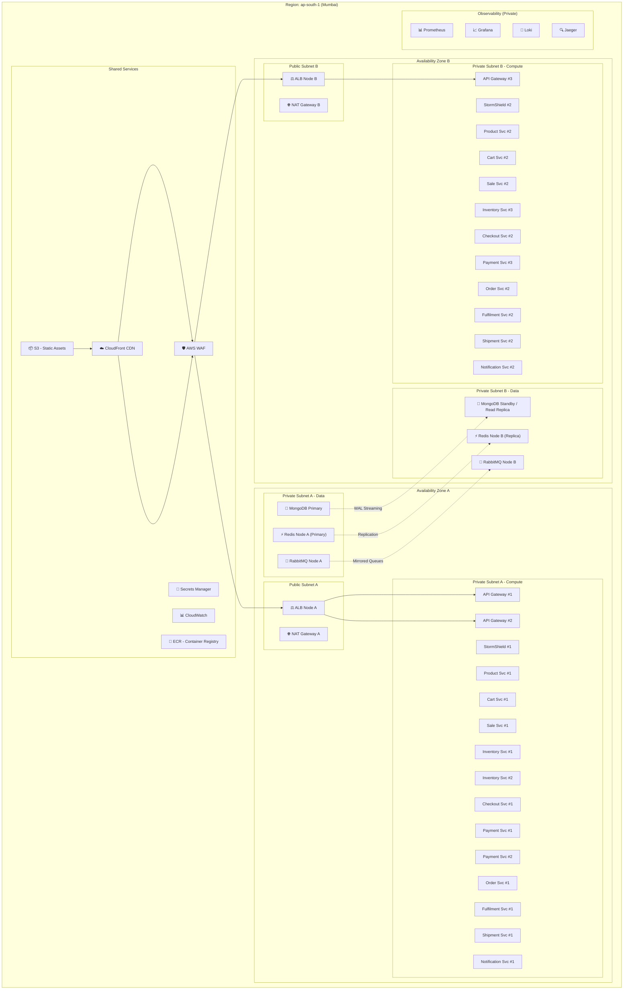
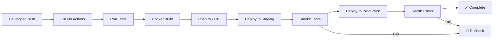

# GlowRush — Deployment Architecture

> **Version:** 1.0 | **Owner:** Student 1 (System Architect)

---

## 1. Overview

GlowRush deploys on an **AWS-style cloud architecture** using Docker containers orchestrated via ECS/EKS. The deployment is designed for **multi-AZ availability**, **auto-scaling** during flash sales, and **zero-downtime deployments**.

---

## 2. Deployment Diagram



---

## 3. Infrastructure Components

### 3.1 Network Architecture

| Component             | Type               | Subnet    | Purpose                                    |
| --------------------- | ------------------ | --------- | ------------------------------------------ |
| VPC                   | `10.0.0.0/16`      | —         | Isolated network                           |
| Public Subnet A       | `10.0.1.0/24`      | AZ-A      | ALB, NAT Gateway                           |
| Public Subnet B       | `10.0.2.0/24`      | AZ-B      | ALB, NAT Gateway                           |
| Private Subnet A      | `10.0.10.0/24`     | AZ-A      | Compute containers                         |
| Private Subnet B      | `10.0.20.0/24`     | AZ-B      | Compute containers                         |
| Private Data Subnet A | `10.0.100.0/24`    | AZ-A      | MongoDB, Redis, RabbitMQ                |
| Private Data Subnet B | `10.0.200.0/24`    | AZ-B      | Replicas                                   |

### 3.2 Security Groups

| Security Group        | Inbound                                | Outbound               |
| --------------------- | -------------------------------------- | ---------------------- |
| `sg-alb`              | 443 from `0.0.0.0/0`                  | All to `sg-gateway`    |
| `sg-gateway`          | 3000 from `sg-alb`                     | All to `sg-services`   |
| `sg-services`         | 3001-3011 from `sg-gateway`            | All to `sg-data`       |
| `sg-data`             | 5432, 6379, 5672 from `sg-services`   | None                   |
| `sg-monitoring`       | 9090, 3100, 16686 from VPC             | All to VPC             |

---

## 4. Auto-Scaling Configuration

### 4.1 ECS Service Auto-Scaling

| Service                         | Min | Max | Scale-Up Trigger            | Scale-Down Trigger        | Cooldown |
| ------------------------------- | --- | --- | --------------------------- | ------------------------- | -------- |
| API Gateway                     | 3   | 15  | CPU > 60% OR RPS > 5000     | CPU < 30% AND RPS < 2000 | 60s      |
| StormShield                     | 2   | 10  | Queue length > 1000         | Queue length < 100        | 60s      |
| Inventory & Reservation Service | 2   | 8   | CPU > 70% OR latency > 100ms| CPU < 30%                 | 120s     |
| Checkout Service                | 2   | 8   | CPU > 60%                   | CPU < 30%                 | 60s      |
| Payment Service                 | 2   | 8   | CPU > 60%                   | CPU < 30%                 | 60s      |
| Order Service                   | 2   | 5   | Queue depth > 500           | Queue depth < 50          | 120s     |
| Notification Service            | 2   | 10  | Queue depth > 1000          | Queue depth < 100         | 60s      |
| Other services                  | 2   | 4   | CPU > 70%                   | CPU < 30%                 | 120s     |

### 4.2 Scheduled Scaling (Flash Sale)

Pre-scale 15 minutes before a known flash sale:

```yaml
# Example: Scale up at 09:45 for 10:00 flash sale
schedule:
  - name: flash-sale-pre-scale
    cron: "45 9 * * *"
    actions:
      api-gateway: { min: 10, desired: 10 }
      stormshield: { min: 5, desired: 5 }
      inventory-reservation-service: { min: 5, desired: 5 }
      checkout-service: { min: 5, desired: 5 }
      payment-service: { min: 5, desired: 5 }
  - name: flash-sale-scale-down
    cron: "30 10 * * *"
    actions:
      api-gateway: { min: 3, desired: 3 }
      stormshield: { min: 2, desired: 2 }
      inventory-reservation-service: { min: 2, desired: 2 }
```

---

## 5. Database Deployment

### 5.1 MongoDB (RDS Multi-AZ)

| Parameter              | Value                                   |
| ---------------------- | --------------------------------------- |
| Engine                 | MongoDB 16                           |
| Instance class (normal)| `db.r6g.large` (2 vCPU, 16 GB RAM)     |
| Instance class (flash) | `db.r6g.xlarge` (4 vCPU, 32 GB RAM)    |
| Storage                | 100 GB gp3 (3000 IOPS, 125 MB/s)       |
| Multi-AZ               | Yes (synchronous standby)              |
| Read replicas          | 1 (normal), 2 (flash sale)             |
| Backup retention       | 7 days                                 |
| WAL streaming          | Continuous to standby + replica        |
| Connection pooling     | PgBouncer (max 200 connections per pool)|
| Max connections        | 400                                    |

### 5.2 Redis (ElastiCache)

| Parameter              | Value                                   |
| ---------------------- | --------------------------------------- |
| Engine                 | Redis 7.x                              |
| Node type              | `cache.r6g.large` (13 GB)              |
| Cluster mode           | Enabled (3 shards, 1 replica each)     |
| Eviction policy        | `allkeys-lru`                           |
| Persistence            | AOF + RDB snapshots                    |
| Max memory             | 10 GB per shard                        |

### 5.3 RabbitMQ (Amazon MQ)

| Parameter              | Value                                   |
| ---------------------- | --------------------------------------- |
| Engine                 | RabbitMQ 3.13                           |
| Instance type          | `mq.m5.large`                           |
| Deployment             | Cluster (3 nodes)                       |
| Queue mirroring        | Quorum queues (replicated to all nodes) |
| Disk                   | 200 GB EBS                              |
| Message persistence    | Durable + persistent delivery           |

---

## 6. CI/CD Pipeline



**Deployment Strategy:** Rolling update (ECS) — one instance at a time, with health checks. Zero-downtime guaranteed.

---

## 7. Disaster Recovery

| Scenario               | Recovery Strategy                              | RTO       | RPO       |
| ---------------------- | ---------------------------------------------- | --------- | --------- |
| Single instance crash  | Auto-restart + ALB health check removes        | < 30s     | 0         |
| AZ failure             | Multi-AZ failover (ALB routes to healthy AZ)   | < 60s     | 0         |
| MongoDB primary down| Automatic failover to standby                  | < 2 min   | < 1 min   |
| Redis node failure     | Replica promoted to primary                    | < 30s     | < 1s      |
| RabbitMQ node failure  | Quorum queues survive with 2/3 nodes           | 0         | 0         |
| Full region failure    | Manual failover (out of scope for hackathon)   | Hours     | < 1 min   |
