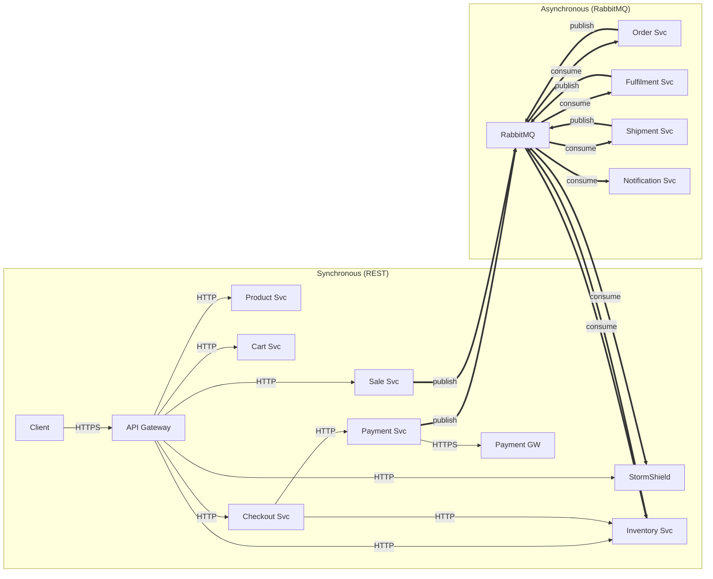

# GlowRush — Communication Matrix

> **Version:** 1.0 | **Owner:** Student 1 (System Architect)

---

## 1. Synchronous Communication Matrix (REST HTTP)

| #  | Source                          | Target                          | Method | Path (High-Level)              | Auth             | Timeout | Circuit Breaker | Notes                         |
| -- | ------------------------------- | ------------------------------- | ------ | ------------------------------ | ---------------- | ------- | --------------- | ----------------------------- |
| 1  | Client                          | API Gateway                     | *      | `/api/v1/*`                    | JWT              | 30s     | N/A             | All client traffic enters here|
| 2  | API Gateway                     | StormShield                     | POST   | `/stormshield/enter`           | Internal         | 5s      | Yes             | Flash sale admission          |
| 3  | API Gateway                     | StormShield                     | GET    | `/stormshield/status`          | Internal         | 3s      | Yes             | Queue position check          |
| 4  | API Gateway                     | Product Service                 | GET    | `/products/*`                  | Internal         | 5s      | Yes             | Product listing/detail        |
| 5  | API Gateway                     | Cart Service                    | *      | `/cart/*`                      | Internal + JWT   | 5s      | Yes             | Cart CRUD                     |
| 6  | API Gateway                     | Sale Service                    | GET    | `/sales/*`                     | Internal         | 5s      | Yes             | Sale metadata                 |
| 7  | API Gateway                     | Inventory & Reservation         | POST   | `/inventory/reserve`           | Internal + Token | 10s     | Yes             | Reservation attempt           |
| 8  | API Gateway                     | Inventory & Reservation         | GET    | `/inventory/:productId`        | Internal         | 3s      | Yes             | Availability check            |
| 9  | API Gateway                     | Checkout Service                | POST   | `/checkout/*`                  | Internal + JWT   | 10s     | Yes             | Checkout flow                 |
| 10 | Checkout Service                | Inventory & Reservation         | GET    | `/inventory/validate`          | Internal         | 5s      | Yes             | Validate reservation active   |
| 11 | Checkout Service                | Payment Service                 | POST   | `/payments/initiate`           | Internal         | 15s     | Yes             | Initiate payment              |
| 12 | Payment Service                 | External Payment Gateway        | POST   | Gateway-specific               | API Key          | 30s     | Yes             | Process payment               |
| 13 | Shipment Service                | External Shipping Provider      | POST   | Provider-specific              | API Key          | 30s     | Yes             | Create shipment               |
| 14 | Notification Service            | AWS SES / SNS                   | POST   | AWS API                        | IAM Role         | 10s     | Yes             | Send email/SMS                |

---

## 2. Asynchronous Communication Matrix (RabbitMQ Events)

| #  | Event                   | Publisher                       | Consumer(s)                           | Exchange         | Routing Key            | Queue                              |
| -- | ----------------------- | ------------------------------- | ------------------------------------- | ---------------- | ---------------------- | ---------------------------------- |
| 1  | PaymentConfirmed        | Payment Service                 | Order Service                         | glowrush.events  | payment.confirmed      | order.payment-confirmed            |
| 2  | PaymentConfirmed        | Payment Service                 | Inventory & Reservation Service       | glowrush.events  | payment.confirmed      | inventory.payment-confirmed        |
| 3  | PaymentFailed           | Payment Service                 | Inventory & Reservation Service       | glowrush.events  | payment.failed         | inventory.payment-failed           |
| 4  | PaymentFailed           | Payment Service                 | Notification Service                  | glowrush.events  | payment.failed         | notification.payment-failed        |
| 5  | ReservationExpired      | Inventory & Reservation Service | Notification Service                  | glowrush.events  | reservation.expired    | notification.reservation-expired   |
| 6  | ReservationReleased     | Inventory & Reservation Service | StormShield                           | glowrush.events  | reservation.released   | stormshield.reservation-released   |
| 7  | ReservationReleased     | Inventory & Reservation Service | Sale Service                          | glowrush.events  | reservation.released   | sale.reservation-released          |
| 8  | InventoryDepleted       | Inventory & Reservation Service | StormShield                           | glowrush.events  | inventory.depleted     | stormshield.inventory-depleted     |
| 9  | InventoryDepleted       | Inventory & Reservation Service | Sale Service                          | glowrush.events  | inventory.depleted     | sale.inventory-depleted            |
| 10 | OrderCreated            | Order Service                   | Fulfilment Service                    | glowrush.events  | order.created          | fulfilment.order-created           |
| 11 | OrderConfirmed          | Order Service                   | Notification Service                  | glowrush.events  | order.confirmed        | notification.order-confirmed       |
| 12 | OrderConfirmed          | Order Service                   | Inventory & Reservation Service       | glowrush.events  | order.confirmed        | inventory.order-confirmed          |
| 13 | ShipmentCreated         | Fulfilment Service              | Shipment Service                      | glowrush.events  | shipment.created       | shipment.shipment-created          |
| 14 | ShipmentDispatched      | Shipment Service                | Notification Service                  | glowrush.events  | shipment.dispatched    | notification.shipment-dispatched   |
| 15 | ShipmentDispatched      | Shipment Service                | Order Service                         | glowrush.events  | shipment.dispatched    | order.shipment-dispatched          |
| 16 | ShipmentDelivered       | Shipment Service                | Notification Service                  | glowrush.events  | shipment.delivered     | notification.shipment-delivered    |
| 17 | ShipmentDelivered       | Shipment Service                | Order Service                         | glowrush.events  | shipment.delivered     | order.shipment-delivered           |
| 18 | SaleStarted             | Sale Service                    | StormShield                           | glowrush.events  | sale.started           | stormshield.sale-started           |
| 19 | SaleEnded               | Sale Service                    | StormShield                           | glowrush.events  | sale.ended             | stormshield.sale-ended             |

---

## 3. Communication Flow Visualization

---

## 4. Data Flow Classification

| Classification | Services                                                   | Characteristics                      |
| -------------- | ---------------------------------------------------------- | ------------------------------------ |
| **Hot Path**   | API Gateway → StormShield → Inventory → Checkout → Payment | Flash-sale critical, latency-sensitive|
| **Warm Path**  | Product, Cart, Sale                                        | User-interactive, cacheable          |
| **Cold Path**  | Order → Fulfilment → Shipment → Notification              | Async, eventually consistent         |

---

## 5. Circuit Breaker Configuration

| Service Pair                        | Failure Threshold | Recovery Timeout | Half-Open Requests |
| ----------------------------------- | ----------------- | ---------------- | ------------------- |
| API GW → StormShield                | 5 failures / 10s  | 30s              | 3                   |
| API GW → Inventory                  | 5 failures / 10s  | 30s              | 3                   |
| Checkout → Payment                  | 3 failures / 10s  | 60s              | 2                   |
| Payment → External Gateway          | 3 failures / 30s  | 120s             | 1                   |
| Shipment → External Provider        | 5 failures / 30s  | 120s             | 2                   |
| Notification → SES/SNS              | 10 failures / 30s | 60s              | 5                   |
