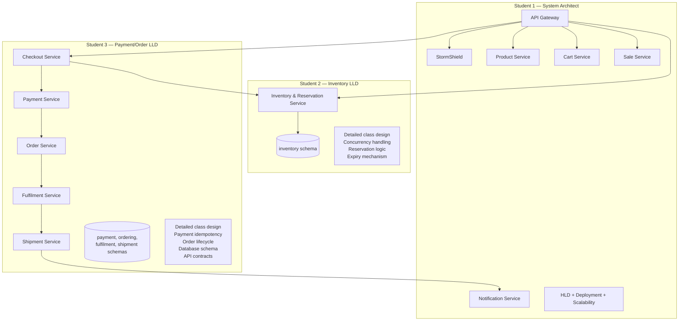

# GlowRush — Service Responsibility Table

> **Version:** 1.0 | **Owner:** Student 1 (System Architect)

---

## Service Responsibility Summary

| Service | Purpose | Owned Data | Sync Dependencies | Async Events (Pub) | Async Events (Sub) | Scaling | Failure Strategy |
|---------|---------|------------|-------------------|--------------------|--------------------|---------|------------------|
| **API Gateway** | Entry point; JWT auth, rate limiting, routing, correlation ID | None (stateless) | All downstream | None | None | Horizontal (3→15) | Health check removal; circuit breaker |
| **StormShield** | Virtual waiting room; queue, batch admission, admission tokens | Queue positions, tokens (Redis) | Redis | None | `ReservationReleased`, `InventoryDepleted`, `SaleStarted`, `SaleEnded` | Horizontal (2→10) | Fail open with rate limiting |
| **Product Service** | Product catalog CRUD, search, categories | Products, categories, images | PostgreSQL, Redis | `ProductUpdated` | None | Horizontal (2→3), Redis cache | Serve from cache |
| **Cart Service** | Shopping cart CRUD | Carts, cart items | Redis, PostgreSQL, Product Svc | None | None | Horizontal (2→3) | Redis fallback to PostgreSQL |
| **Sale Service** | Flash sale configuration, schedules, pricing | Sales, sale products | PostgreSQL, Redis | `SaleStarted`, `SaleEnded` | `ReservationReleased`, `InventoryDepleted` | Horizontal (2→3), cached | Serve from cache |
| **Inventory & Reservation** | **Source of truth** for stock; atomic reservation, TTL, release | Inventory, reservations | PostgreSQL (txn), Redis | `ReservationExpired`, `ReservationReleased`, `InventoryDepleted` | `PaymentConfirmed`, `PaymentFailed`, `OrderConfirmed` | Limited horizontal (2→8); connection pooling | Transaction rollback; expiry cron |
| **Checkout Service** | Orchestrate checkout flow; validate reservation, collect info | Checkout sessions (Redis) | Inventory Svc, Payment Svc | None | None | Horizontal (2→8) | Session expires with reservation |
| **Payment Service** | Process payments; idempotency, gateway integration | Payments, payment events | External Gateway, PostgreSQL | `PaymentConfirmed`, `PaymentFailed` | None | Horizontal (2→8); gateway rate limit | Idempotency key; retry + backoff; circuit breaker; DLQ |
| **Order Service** | Order lifecycle management | Orders, order items, history | PostgreSQL | `OrderCreated`, `OrderConfirmed` | `PaymentConfirmed`, `ShipmentDispatched`, `ShipmentDelivered` | Horizontal (2→5) | Idempotent creation; DLQ |
| **Fulfilment Service** | Picking, packing, shipping handoff | Fulfilment records | PostgreSQL | `ShipmentCreated` | `OrderConfirmed` | Horizontal (2→2) | Retry; manual queue |
| **Shipment Service** | Carrier integration, tracking, delivery | Shipments, tracking | External Provider, PostgreSQL | `ShipmentDispatched`, `ShipmentDelivered` | `ShipmentCreated` | Horizontal (2→2) | Retry carrier; polling fallback |
| **Notification Service** | Email, SMS, push notifications | Notification logs, templates | SES, SNS, FCM, PostgreSQL | None | `OrderConfirmed`, `ShipmentDispatched`, `ShipmentDelivered`, `ReservationExpired`, `PaymentFailed` | Horizontal (2→10) | Retry + backoff; DLQ; at-least-once |

---

## Ownership Boundaries



---

## Critical Service Dependencies

### Flash Sale Hot Path (latency-critical)

```
API Gateway → StormShield → Inventory & Reservation → Checkout → Payment
```

**Every service on this path must:**
- Respond within its timeout budget
- Support horizontal scaling
- Have circuit breakers configured
- Log with correlation ID
- Handle duplicates idempotently

### Post-Payment Cold Path (throughput-critical)

```
Payment → [RabbitMQ] → Order → [RabbitMQ] → Fulfilment → [RabbitMQ] → Shipment → [RabbitMQ] → Notification
```

**Every service on this path must:**
- Process events idempotently
- Use manual acknowledgement
- Handle DLQ messages
- Support at-least-once delivery
