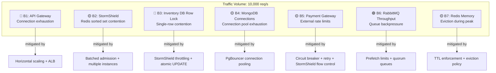

# GlowRush — Bottleneck Analysis

> **Version:** 1.0 | **Owner:** Student 1 (System Architect)

---

## 1. Overview

During a flash sale (10,000 concurrent users, 100 units), the system experiences extreme contention. This analysis identifies every bottleneck, explains why it becomes a bottleneck, and defines the mitigation strategy.

---

## 2. Bottleneck Map



**Legend:** 🔴 Critical (flash sale breaker) · 🟡 Significant (performance degrader) · 🟢 Manageable

---

## 3. Detailed Bottleneck Analysis

### B1: API Gateway — Connection Exhaustion

| Attribute          | Detail                                                          |
| ------------------ | --------------------------------------------------------------- |
| **Severity**       | 🔴 Critical                                                     |
| **When**           | 10,000 simultaneous HTTPS connections arrive within 2 seconds   |
| **Why**            | Node.js default `maxSockets` is limited; Express processes requests serially per connection on event loop |
| **Impact**         | Connection queue builds up; p99 latency spikes; timeouts        |
| **Mitigation**     |                                                                 |
| 1. Horizontal      | Scale to 10–15 instances behind ALB                            |
| 2. CDN offload     | CloudFront handles 80% of static asset requests                |
| 3. Rate limiting   | Redis token bucket (1000 req/s per client IP)                  |
| 4. Keep-alive      | HTTP keep-alive with connection reuse                          |
| 5. Pre-scaling     | Scheduled scale-up 15 min before flash sale                    |
| **Post-Mitigation**| ~1,000 req/s per instance × 10 instances = 10,000 capacity    |

---

### B2: StormShield — Redis Sorted Set Contention

| Attribute          | Detail                                                          |
| ------------------ | --------------------------------------------------------------- |
| **Severity**       | 🟡 Significant                                                   |
| **When**           | 10,000 users simultaneously call `ZADD` to join the queue       |
| **Why**            | Redis is single-threaded; `ZADD` on a large sorted set is O(log N) per operation |
| **Impact**         | Redis CPU saturates; queue insertion latency increases           |
| **Mitigation**     |                                                                 |
| 1. Redis Cluster   | Shard queues by `sale_id` across multiple Redis nodes           |
| 2. Pipelining      | Batch `ZADD` operations using Redis pipelining                  |
| 3. Pre-queue       | API Gateway rate-limits before StormShield to smooth intake     |
| 4. Lua scripts     | Atomic Lua scripts for queue + token operations                |
| **Post-Mitigation**| 50,000 ZADD/s across 3 Redis shards                           |

---

### B3: Inventory Database — Single-Row Contention (CRITICAL)

| Attribute          | Detail                                                          |
| ------------------ | --------------------------------------------------------------- |
| **Severity**       | 🔴 Critical — this is the hottest point in the entire system     |
| **When**           | Multiple concurrent `UPDATE inventory WHERE available_quantity >= 1` hit the same row |
| **Why**            | MongoDB uses document-level locking; concurrent updates on the same row serialize |
| **Impact**         | Transaction queue on the inventory row; p99 latency > 1s; connection pool exhaustion |
| **Mitigation**     |                                                                 |
| 1. StormShield     | Throttles admission to ~50 concurrent reservation attempts      |
| 2. Atomic UPDATE   | No explicit lock; `UPDATE ... WHERE available_quantity >= 1` is atomic and fast (~1-2ms) |
| 3. Short txns      | Reservation transaction does ONE update + ONE insert, then commits immediately |
| 4. Connection pool  | PgBouncer limits concurrent connections to prevent exhaustion   |
| 5. No read-before-write | Skip `SELECT` before `UPDATE`; let the `WHERE` clause handle the check |
| **Post-Mitigation**| ~500-1000 reservation attempts/sec (with 50-user batches from StormShield) |

**Why this works:** StormShield converts 10,000 simultaneous requests into ~200 batches of 50, spaced seconds apart. Each batch's 50 `UPDATE` statements complete in ~50-100ms total because each individual `UPDATE` takes ~1-2ms with document-level locking.

```
Without StormShield: 10,000 concurrent UPDATEs → row lock contention → ~10s total
With StormShield:    50 concurrent UPDATEs × ~200 batches → ~100ms per batch → ~20s total, smooth
```

---

### B4: MongoDB Connection Pool Exhaustion

| Attribute          | Detail                                                          |
| ------------------ | --------------------------------------------------------------- |
| **Severity**       | 🟡 Significant                                                   |
| **When**           | Many service instances open connections simultaneously           |
| **Why**            | MongoDB max_connections is finite (~400); each Node.js instance needs a pool |
| **Impact**         | `FATAL: too many connections` → service failures                |
| **Mitigation**     |                                                                 |
| 1. PgBouncer       | Connection multiplexing; 200 external → 50 MongoDB connections |
| 2. Pool sizing     | Each service instance: pool min=2, max=10                       |
| 3. Idle timeout    | Close idle connections after 30s                                |
| 4. Read replicas   | Route read queries to replicas                                  |
| **Post-Mitigation**| 8 Inventory instances × 10 pool = 80 connections → PgBouncer → 20 PG connections |

---

### B5: External Payment Gateway Rate Limits

| Attribute          | Detail                                                          |
| ------------------ | --------------------------------------------------------------- |
| **Severity**       | 🟡 Significant                                                   |
| **When**           | 100 successful reservations all proceed to payment within ~30 seconds |
| **Why**            | Payment gateways (Razorpay/Stripe) have API rate limits (~100-500 TPS) |
| **Impact**         | 429 Too Many Requests; payment delays; reservation TTL pressure |
| **Mitigation**     |                                                                 |
| 1. Circuit breaker | Open circuit on 3 failures / 30s; retry after 120s             |
| 2. Retry + backoff | Exponential backoff (1s, 2s, 4s) with jitter                   |
| 3. Idempotency     | Safe retries with idempotency key                               |
| 4. Flow control    | StormShield batch size calibrated to payment gateway capacity   |
| **Post-Mitigation**| ~100 payments spread over ~60-120 seconds — well within limits |

---

### B6: RabbitMQ Throughput

| Attribute          | Detail                                                          |
| ------------------ | --------------------------------------------------------------- |
| **Severity**       | 🟢 Manageable                                                    |
| **When**           | Burst of `PaymentConfirmed` events after 100 successful payments|
| **Why**            | Quorum queues have higher latency than classic queues; publisher confirms add overhead |
| **Impact**         | Event processing delay; order creation takes longer             |
| **Mitigation**     |                                                                 |
| 1. Prefetch limit  | Consumer prefetch = 10 (process 10 messages concurrently)       |
| 2. Multiple consumers | Scale Order Service to 3-5 instances during flash sale       |
| 3. Quorum queues   | Survive broker failure; 3-node cluster                          |
| 4. Lazy queues      | Store messages on disk if memory pressure                      |
| **Post-Mitigation**| RabbitMQ can handle 10,000+ msg/s; our flash sale produces ~100-200 events total |

---

### B7: Redis Memory Pressure

| Attribute          | Detail                                                          |
| ------------------ | --------------------------------------------------------------- |
| **Severity**       | 🟡 Significant                                                   |
| **When**           | 10,000 queue entries + admission tokens + rate limit counters + cache |
| **Why**            | Redis is in-memory; all StormShield state, rate limiting, and caching compete for memory |
| **Impact**         | Eviction of cache keys; potential eviction of queue state        |
| **Mitigation**     |                                                                 |
| 1. Key namespacing | Separate namespaces with different TTLs                         |
| 2. Aggressive TTLs | Admission tokens: 60s; rate limit: 60s; queue entries cleaned after sale |
| 3. Eviction policy | `allkeys-lru` — cache keys evicted first, queue keys have shorter TTL |
| 4. Redis Cluster   | 3 shards × 10 GB = 30 GB total capacity                        |
| **Post-Mitigation**| 10,000 queue entries ≈ 5 MB; well within capacity              |

---

## 4. Bottleneck Severity Summary

| Rank | Bottleneck                      | Severity | Unmitigated Impact              | Mitigated Impact          |
| ---- | ------------------------------- | -------- | ------------------------------- | ------------------------- |
| 1    | Inventory DB row contention     | 🔴       | Overselling, timeouts, crashes  | ~50 concurrent UPDATEs, smooth |
| 2    | API Gateway connections         | 🔴       | Service unavailable             | 10K+ req/s capacity      |
| 3    | MongoDB connection pool      | 🟡       | Service failures                | PgBouncer multiplexing    |
| 4    | Payment gateway rate limits     | 🟡       | Payment delays/failures         | Retry + circuit breaker   |
| 5    | StormShield Redis contention    | 🟡       | Queue insertion delays          | Redis cluster + pipeline  |
| 6    | Redis memory pressure           | 🟡       | Cache eviction                  | TTLs + cluster            |
| 7    | RabbitMQ throughput             | 🟢       | Event delay                     | Low volume; not a concern |

---

## 5. End-to-End Latency Budget (Flash Sale)

| Step                          | Budget  | Cumulative | Notes                              |
| ----------------------------- | ------- | ---------- | ---------------------------------- |
| CDN → ALB → API Gateway       | 20 ms   | 20 ms      | Edge + routing                     |
| JWT validation                | 5 ms    | 25 ms      | In-memory key verification         |
| StormShield queue check       | 10 ms   | 35 ms      | Redis `ZSCORE`                     |
| StormShield admission (if queued) | varies | varies | Queue wait time (seconds-minutes) |
| Admission token validation    | 5 ms    | 40 ms      | JWT verification                   |
| Inventory reservation (atomic)| 15 ms   | 55 ms      | DB round-trip + row lock           |
| Checkout initiation           | 10 ms   | 65 ms      | Redis session + validation         |
| Payment initiation            | 30 ms   | 95 ms      | Internal processing                |
| Payment gateway round-trip    | 2000 ms | 2095 ms    | External API                       |
| **Total (post-admission)**    |         | **~2.1s**  | Dominated by payment gateway       |
