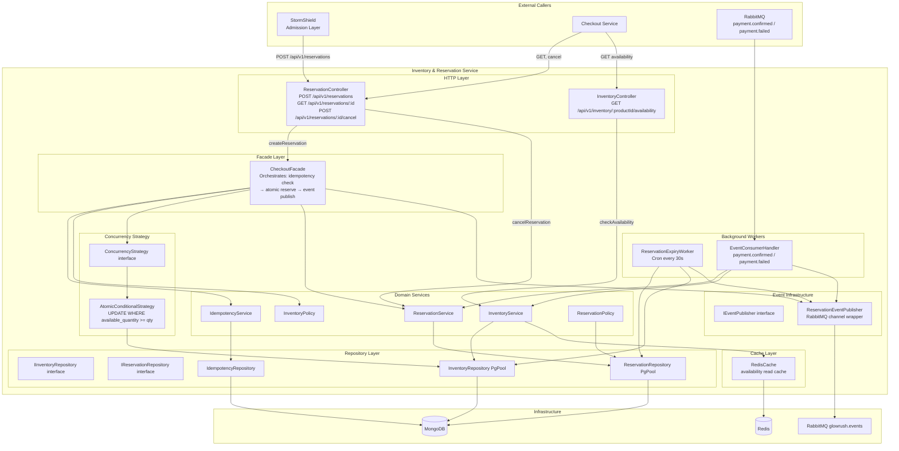

# GlowRush — Inventory & Reservation Service: Component Diagram

> **Author:** Student 2 (Inventory, Concurrency & LLD Engineer)
> **Version:** 1.0 | **Status:** FINAL
> **References:** ARCHITECTURE_CONTRACT.md §7, SERVICE_CATALOG.md §6

---

## Overview

The Inventory & Reservation Service is the single source of truth for stock counts and reservations in GlowRush. It receives admission-token-validated requests from StormShield, performs atomic inventory operations on MongoDB, and publishes lifecycle events to RabbitMQ.

---

## Component Diagram



---

## Component Responsibilities

| Component | Layer | Responsibility |
|-----------|-------|----------------|
| `InventoryController` | HTTP | Routes inventory availability checks |
| `ReservationController` | HTTP | Routes reservation CRUD, validates admission token |
| `CheckoutFacade` | Facade | Orchestrates the multi-step reservation creation flow |
| `InventoryService` | Domain | Stock checks, sold confirmation, stock release logic |
| `ReservationService` | Domain | Reservation lifecycle transitions |
| `IdempotencyService` | Domain | Deduplication via idempotency key lookup & record |
| `InventoryPolicy` | Domain | Business rules: max qty, valid product, sale active |
| `ReservationPolicy` | Domain | Valid state transitions, expiry check |
| `ConcurrencyStrategy` | Abstraction | Interface for pluggable locking strategies |
| `AtomicConditionalStrategy` | Implementation | The canonical `UPDATE … WHERE available_quantity >= 1` |
| `IInventoryRepository` | Interface | Port for stock persistence |
| `IReservationRepository` | Interface | Port for reservation persistence |
| `InventoryRepository` | Adapter | PgPool implementation of inventory port |
| `ReservationRepository` | Adapter | PgPool implementation of reservation port |
| `IdempotencyRepository` | Adapter | Processed-events collection for deduplication |
| `ReservationEventPublisher` | Infra | Wraps RabbitMQ channel, enforces event envelope |
| `ReservationExpiryWorker` | Worker | Cron every 30s: finds and releases expired reservations |
| `EventConsumerHandler` | Worker | Subscribes to PaymentConfirmed / PaymentFailed |
| `RedisCache` | Infra | Read-side availability cache; invalidated on every write |

---

## Key Interfaces

```typescript
// Concurrency Strategy (Strategy Pattern)
interface ConcurrencyStrategy {
  reserve(productId: string, quantity: number): Promise<ReservationResult>;
}

// Repository ports (Dependency Inversion)
interface IInventoryRepository {
  findByProductId(productId: string): Promise<Inventory | null>;
  atomicReserve(productId: string, quantity: number): Promise<number>; // affected rows
  releaseStock(productId: string, quantity: number): Promise<void>;
  confirmSold(productId: string, quantity: number): Promise<void>;
}

interface IReservationRepository {
  findById(id: string): Promise<Reservation | null>;
  findByIdempotencyKey(key: string): Promise<Reservation | null>;
  save(reservation: Reservation): Promise<Reservation>;
  findExpired(): Promise<Reservation[]>;
  updateStatus(id: string, status: ReservationStatus): Promise<void>;
}

// Event publisher port
interface IEventPublisher {
  publish(event: DomainEvent): Promise<void>;
}
```

---

> [!IMPORTANT]
> All writes to `inventory` and `inventory_reservation` collections happen inside a single MongoDB transaction in `CheckoutFacade`. If the reservation INSERT fails after the inventory UPDATE, the entire transaction rolls back.
