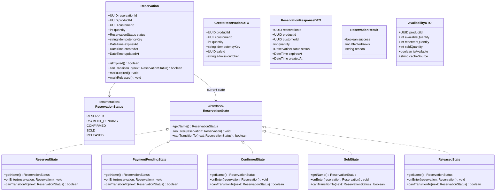

# GlowRush — Inventory & Reservation Service: Class Diagrams

> **Author:** Student 2 (Inventory, Concurrency & LLD Engineer)
> **Version:** 1.0 | **Status:** FINAL
> **References:** ARCHITECTURE_CONTRACT.md §7–8, NAMING_RULES.md §6

---

## 1. Inventory Class Diagram

```mermaid
classDiagram
    %% ─── Domain Models ───────────────────────────────────────────
    class Inventory {
        +UUID inventoryId
        +UUID productId
        +int availableQuantity
        +int reservedQuantity
        +int soldQuantity
        +int version
        +DateTime updatedAt
        +isAvailable(qty: int) boolean
        +totalStock() int
        +validateInvariant() void
    }

    class ReservationStatus {
        <<enumeration>>
        RESERVED
        PAYMENT_PENDING
        CONFIRMED
        SOLD
        RELEASED
    }

    class Reservation {
        +UUID reservationId
        +UUID productId
        +UUID customerId
        +int quantity
        +ReservationStatus status
        +string idempotencyKey
        +DateTime expiresAt
        +DateTime createdAt
        +DateTime updatedAt
        +isExpired() boolean
        +canTransitionTo(status: ReservationStatus) boolean
    }

    Reservation --> ReservationStatus

    %% ─── Interfaces ──────────────────────────────────────────────
    class IInventoryRepository {
        <<interface>>
        +findByProductId(productId: string) Promise~Inventory~
        +atomicReserve(productId: string, qty: int) Promise~int~
        +releaseStock(productId: string, qty: int) Promise~void~
        +confirmSold(productId: string, qty: int) Promise~void~
    }

    class IReservationRepository {
        <<interface>>
        +findById(id: string) Promise~Reservation~
        +findByIdempotencyKey(key: string) Promise~Reservation~
        +save(reservation: Reservation) Promise~Reservation~
        +findExpired() Promise~Reservation[]~
        +updateStatus(id: string, status: ReservationStatus) Promise~void~
    }

    class IEventPublisher {
        <<interface>>
        +publish(event: DomainEvent) Promise~void~
    }

    class ConcurrencyStrategy {
        <<interface>>
        +reserve(productId: string, qty: int) Promise~ReservationResult~
    }

    %% ─── Policy Layer ────────────────────────────────────────────
    class InventoryPolicy {
        +MAX_QUANTITY_PER_RESERVATION: int = 1
        +canReserve(qty: int, available: int) boolean
        +isValidQuantity(qty: int) boolean
        +isSaleActive(saleId: string) boolean
    }

    class ReservationPolicy {
        +VALID_TRANSITIONS: Map
        +canTransition(from: ReservationStatus, to: ReservationStatus) boolean
        +isExpired(reservation: Reservation) boolean
        +computeExpiresAt() DateTime
    }

    %% ─── Services ────────────────────────────────────────────────
    class InventoryService {
        -inventoryRepo: IInventoryRepository
        -cache: RedisCache
        -policy: InventoryPolicy
        +checkAvailability(productId: string) Promise~AvailabilityDTO~
        +releaseStock(productId: string, qty: int) Promise~void~
        +confirmSold(productId: string, qty: int) Promise~void~
    }

    class ReservationService {
        -reservationRepo: IReservationRepository
        -policy: ReservationPolicy
        +createReservation(dto: CreateReservationDTO) Promise~Reservation~
        +cancelReservation(id: string, customerId: string) Promise~void~
        +confirmReservation(id: string) Promise~void~
        +processPaymentFailure(id: string) Promise~void~
        +transitionTo(id: string, status: ReservationStatus) Promise~void~
    }

    class IdempotencyService {
        -repo: IdempotencyRepository
        +check(key: string) Promise~IdempotencyResult~
        +record(key: string, result: object) Promise~void~
    }

    %% ─── Facade ──────────────────────────────────────────────────
    class CheckoutFacade {
        -idempotencyService: IdempotencyService
        -inventoryPolicy: InventoryPolicy
        -concurrencyStrategy: ConcurrencyStrategy
        -reservationService: ReservationService
        -eventPublisher: IEventPublisher
        +reserve(dto: ReservationRequestDTO) Promise~ReservationResponseDTO~
    }

    %% ─── Concurrency Strategy ────────────────────────────────────
    class AtomicConditionalStrategy {
        -inventoryRepo: IInventoryRepository
        +reserve(productId: string, qty: int) Promise~ReservationResult~
        -executeAtomicUpdate(productId: string, qty: int) Promise~int~
    }

    %% ─── Repository Implementations ─────────────────────────────
    class InventoryRepository {
        -pgPool: Pool
        +findByProductId(productId: string) Promise~Inventory~
        +atomicReserve(productId: string, qty: int) Promise~int~
        +releaseStock(productId: string, qty: int) Promise~void~
        +confirmSold(productId: string, qty: int) Promise~void~
    }

    class ReservationRepository {
        -pgPool: Pool
        +findById(id: string) Promise~Reservation~
        +findByIdempotencyKey(key: string) Promise~Reservation~
        +save(reservation: Reservation) Promise~Reservation~
        +findExpired() Promise~Reservation[]~
        +updateStatus(id: string, status: ReservationStatus) Promise~void~
    }

    class IdempotencyRepository {
        -pgPool: Pool
        +findByKey(key: string) Promise~ProcessedEvent~
        +save(key: string, result: object) Promise~void~
    }

    %% ─── Event Publisher ─────────────────────────────────────────
    class ReservationEventPublisher {
        -channel: Channel
        -exchange: string = "glowrush.events"
        +publish(event: DomainEvent) Promise~void~
        -buildEnvelope(type: string, data: object) DomainEvent
    }

    class DomainEvent {
        +UUID eventId
        +string eventType
        +string source
        +DateTime timestamp
        +UUID correlationId
        +string version
        +object data
    }

    %% ─── Controllers ─────────────────────────────────────────────
    class InventoryController {
        -inventoryService: InventoryService
        +getAvailability(req, res) void
        +getInventoryStatus(req, res) void
    }

    class ReservationController {
        -checkoutFacade: CheckoutFacade
        -reservationService: ReservationService
        +createReservation(req, res) void
        +getReservation(req, res) void
        +cancelReservation(req, res) void
    }

    %% ─── Background Workers ──────────────────────────────────────
    class ReservationExpiryWorker {
        -reservationRepo: IReservationRepository
        -inventoryRepo: IInventoryRepository
        -eventPublisher: IEventPublisher
        +run() Promise~void~
        -scanExpired() Promise~Reservation[]~
        -releaseInventoryBatch(reservations: Reservation[]) Promise~void~
        -publishExpiryEvents(reservations: Reservation[]) Promise~void~
    }

    class EventConsumerHandler {
        -reservationService: ReservationService
        -inventoryService: InventoryService
        -eventPublisher: IEventPublisher
        -idempotencyService: IdempotencyService
        +onPaymentConfirmed(event: DomainEvent) Promise~void~
        +onPaymentFailed(event: DomainEvent) Promise~void~
    }

    %% ─── Cache ───────────────────────────────────────────────────
    class RedisCache {
        -client: RedisClient
        +getAvailability(productId: string) Promise~int~
        +setAvailability(productId: string, qty: int, ttl: int) Promise~void~
        +invalidate(productId: string) Promise~void~
    }

    %% ─── Relationships ───────────────────────────────────────────
    InventoryController --> InventoryService
    ReservationController --> CheckoutFacade
    ReservationController --> ReservationService

    CheckoutFacade --> IdempotencyService
    CheckoutFacade --> InventoryPolicy
    CheckoutFacade --> ConcurrencyStrategy
    CheckoutFacade --> ReservationService
    CheckoutFacade --> IEventPublisher

    InventoryService --> IInventoryRepository
    InventoryService --> RedisCache
    InventoryService --> InventoryPolicy
    ReservationService --> IReservationRepository
    ReservationService --> ReservationPolicy
    IdempotencyService --> IdempotencyRepository

    ConcurrencyStrategy <|.. AtomicConditionalStrategy
    AtomicConditionalStrategy --> IInventoryRepository

    IInventoryRepository <|.. InventoryRepository
    IReservationRepository <|.. ReservationRepository
    IEventPublisher <|.. ReservationEventPublisher

    ReservationEventPublisher --> DomainEvent

    ReservationExpiryWorker --> IReservationRepository
    ReservationExpiryWorker --> IInventoryRepository
    ReservationExpiryWorker --> IEventPublisher

    EventConsumerHandler --> ReservationService
    EventConsumerHandler --> InventoryService
    EventConsumerHandler --> IEventPublisher
    EventConsumerHandler --> IdempotencyService
```

---

## 2. Reservation Class Diagram (Detail)

---

## 3. State Transition Rules (Tabular)

| From | To | Trigger | Inventory Side Effect |
|------|----|---------|----------------------|
| — | `RESERVED` | `atomicReserve()` affected_rows = 1 | `available -= 1`, `reserved += 1` |
| `RESERVED` | `PAYMENT_PENDING` | Checkout Service initiates checkout | None |
| `RESERVED` | `RELEASED` | TTL expired or customer cancel | `available += 1`, `reserved -= 1` |
| `PAYMENT_PENDING` | `CONFIRMED` | `PaymentConfirmed` event received | None |
| `PAYMENT_PENDING` | `RELEASED` | `PaymentFailed` event or TTL expired | `available += 1`, `reserved -= 1` |
| `CONFIRMED` | `SOLD` | `OrderConfirmed` event received | `reserved -= 1`, `sold += 1` |

> [!CAUTION]
> No backward transitions are allowed. A `SOLD` or `RELEASED` reservation is terminal. Any attempt to transition from these states must be rejected with a domain error.
