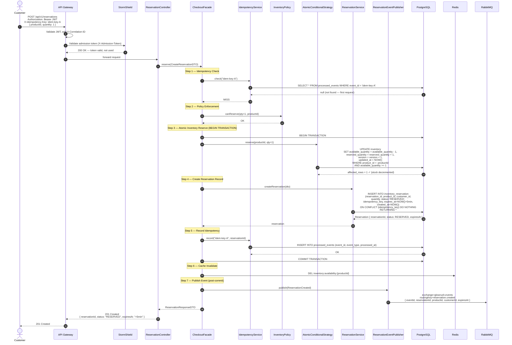
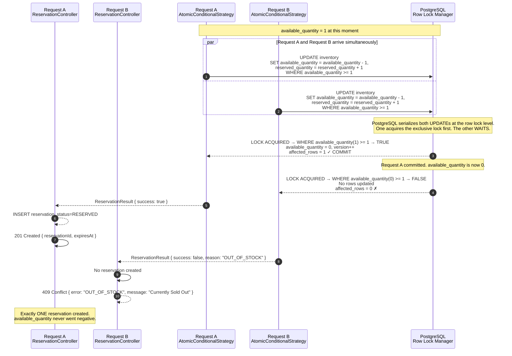
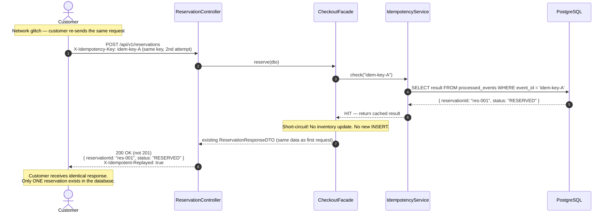
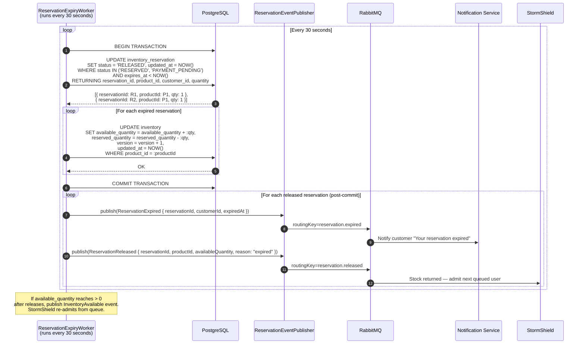
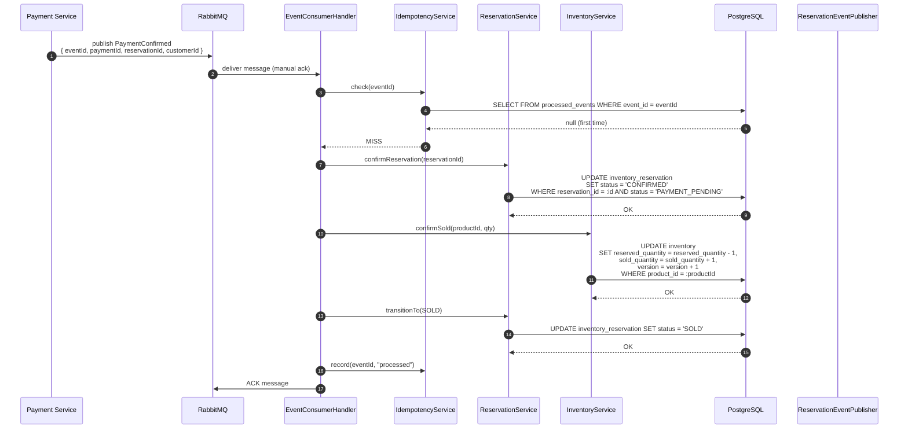
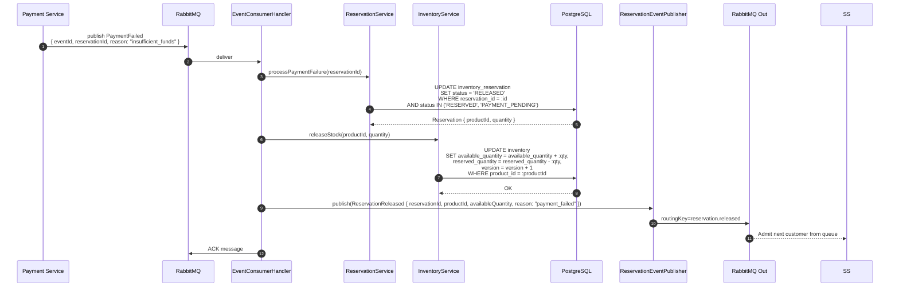

# GlowRush — Inventory & Reservation Service: Sequence Diagrams

> **Author:** Student 2 (Inventory, Concurrency & LLD Engineer)
> **Version:** 1.0 | **Status:** FINAL

---

## 1. Purchase / Reservation Sequence — Happy Path

This diagram shows a single successful reservation through the full system, from the customer's "Buy Now" click to a confirmed reservation with TTL.

---

## 2. Reservation Sequence — Sold Out (Last Item Race)

This is the critical failure scenario: **Customer A and Customer B** simultaneously attempt to reserve the **last remaining unit** (available_quantity = 1).

---

## 3. Duplicate Request (Idempotency) Sequence

---

## 4. Reservation Expiry Worker Sequence

---

## 5. Payment Confirmed — Reservation → SOLD

---

## 6. Payment Failed — Stock Released

