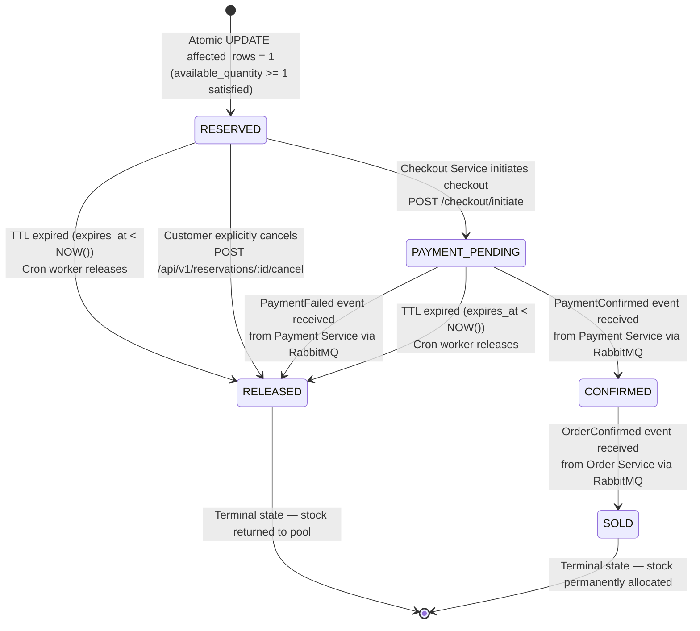
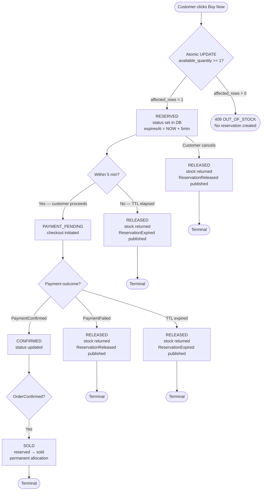

# GlowRush — Reservation State Diagram

> **Author:** Student 2 (Inventory, Concurrency & LLD Engineer)
> **Version:** 1.0 | **Status:** FINAL
> **Source of truth:** ARCHITECTURE_CONTRACT.md §9, DOMAIN_STATES.md §1

---

## 1. State Diagram



---

## 2. State Definitions

| State | Description | Stock Effect | Who Triggers |
|-------|-------------|-------------|--------------|
| `RESERVED` | Stock decremented, holding active. Customer has 5 min to pay. | `available -= 1`, `reserved += 1` | `AtomicConditionalStrategy` |
| `PAYMENT_PENDING` | Checkout initiated, payment in flight. | No change | `CheckoutService` via HTTP |
| `CONFIRMED` | Payment gateway confirmed success. Order being created. | No change | `PaymentConfirmed` event |
| `SOLD` | Order confirmed. Stock permanently moved to sold. | `reserved -= 1`, `sold += 1` | `OrderConfirmed` event |
| `RELEASED` | Reservation cancelled, expired, or payment failed. Stock returned. | `available += 1`, `reserved -= 1` | Cron worker / event handler |

---

## 3. Transition Rules



---

## 4. Transition Collection with Side Effects

| Transition | Trigger | Inventory Update | Events Published |
|------------|---------|-----------------|-----------------|
| `→ RESERVED` | `affected_rows = 1` from atomic MongoDB | `available -= qty`, `reserved += qty` | `ReservationCreated` |
| `RESERVED → PAYMENT_PENDING` | HTTP call from Checkout Service | None | None |
| `RESERVED → RELEASED` | TTL expired (cron) | `available += qty`, `reserved -= qty` | `ReservationExpired`, `ReservationReleased` |
| `RESERVED → RELEASED` | Customer cancel (HTTP) | `available += qty`, `reserved -= qty` | `ReservationReleased` |
| `PAYMENT_PENDING → CONFIRMED` | `PaymentConfirmed` RabbitMQ event | None | None |
| `PAYMENT_PENDING → RELEASED` | `PaymentFailed` RabbitMQ event | `available += qty`, `reserved -= qty` | `ReservationReleased` |
| `PAYMENT_PENDING → RELEASED` | TTL expired (cron) | `available += qty`, `reserved -= qty` | `ReservationExpired`, `ReservationReleased` |
| `CONFIRMED → SOLD` | `OrderConfirmed` RabbitMQ event | `reserved -= qty`, `sold += qty` | None |

---

## 5. Invariant Checks at Each Transition

```
INVARIANT at all times:
  available_quantity >= 0       (enforced by: WHERE available_quantity >= qty)
  reserved_quantity  >= 0       (enforced by: never decrement without matching reserve)
  sold_quantity      >= 0       (enforced by: only increment from CONFIRMED state)
  available_quantity + reserved_quantity + sold_quantity = initial_stock (100)
```

**How each transition preserves the invariant:**

- `→ RESERVED`: Atomic MongoDB decrements `available` and increments `reserved` in same statement. MongoDB row lock ensures serialization. The `WHERE available_quantity >= qty` prevents going below 0.
- `→ RELEASED`: Always increments `available` by exactly what was decremented at reservation. Conservation holds.
- `→ SOLD`: Always decrements `reserved` by exactly what was reserved. `sold` increments by same amount. Conservation holds.
- `RESERVED → PAYMENT_PENDING`: No inventory change. Conservation trivially holds.
- `PAYMENT_PENDING → CONFIRMED`: No inventory change. Conservation trivially holds.

---

## 6. Terminal State Handling

```
RELEASED:
  - Reservation record stays in DB (for audit)
  - status = RELEASED, updated_at = NOW()
  - Inventory row updated (stock restored)
  - Events published post-commit

SOLD:
  - Reservation record stays in DB (for order traceability)
  - status = SOLD, updated_at = NOW()
  - Inventory: reserved_quantity -= qty, sold_quantity += qty
  - No further transitions possible
```

> [!WARNING]
> Attempting to transition from `SOLD` or `RELEASED` to any other state is a domain error and must be rejected by `ReservationPolicy.canTransition()`. These states are immucollection once entered.

---

## 7. Browser Back Behavior

```
Customer A → RESERVED → clicks browser Back button
                              ↓
              Reservation remains RESERVED in DB
              TTL clock continues running
              No automatic cancellation
              
If customer returns to checkout within 5min:
    → reservation still valid → proceed to PAYMENT_PENDING

If 5 minutes elapse:
    → ReservationExpiryWorker marks RELEASED
    → Stock returned to pool
    → Customer notified: "Your reservation expired"
```

> [!IMPORTANT]
> The backend is the authority on reservation validity. The browser state has no bearing on the server-side TTL. This prevents circumventing the reservation system by repeatedly clicking Back and re-entering.
