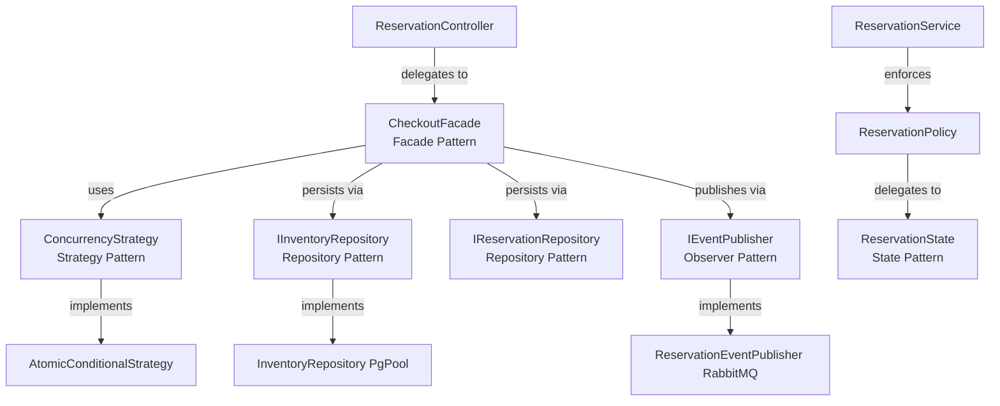

# GlowRush — Design Patterns: Inventory & Reservation Service

> **Author:** Student 2 (Inventory, Concurrency & LLD Engineer)
> **Version:** 1.0 | **Status:** FINAL

---

## Overview

Each pattern chosen here solves a specific, real problem in the Inventory & Reservation Service. No pattern is included for academic completeness — every one has a concrete justification and trade-off analysis.

---

## 1. Strategy Pattern → `ConcurrencyStrategy`

### Problem

How should the service select the mechanism for atomically decrementing inventory? The correct approach for production (atomic MongoDB) differs from what a developer might use in integration tests (pessimistic lock) or what a future team might evaluate (Redis Lua script). Hardcoding a single approach into `CheckoutFacade` makes it impossible to test or evolve without modifying the facade.

### Solution

```typescript
// Strategy interface
interface ConcurrencyStrategy {
  reserve(productId: string, quantity: number): Promise<ReservationResult>;
}

// Production strategy
class AtomicConditionalStrategy implements ConcurrencyStrategy {
  async reserve(productId: string, quantity: number): Promise<ReservationResult> {
    const result = await this.inventoryRepo.atomicReserve(productId, quantity);
    return {
      success: result.affectedRows === 1,
      affectedRows: result.affectedRows,
      reason: result.affectedRows === 0 ? 'OUT_OF_STOCK' : undefined,
    };
  }
}

// Test strategy (for integration tests)
class PessimisticLockStrategy implements ConcurrencyStrategy {
  async reserve(productId: string, quantity: number): Promise<ReservationResult> {
    // SELECT FOR UPDATE logic
  }
}

// Facade — depends only on the interface
class CheckoutFacade {
  constructor(private strategy: ConcurrencyStrategy) {}

  async reserve(dto: CreateReservationDTO) {
    const result = await this.strategy.reserve(dto.productId, dto.quantity);
    if (!result.success) throw new OutOfStockError();
    // ...
  }
}
```

### Why Chosen

The concurrency mechanism is the single most critical decision in this service. Treating it as a pluggable strategy:
1. Allows unit testing `CheckoutFacade` with a mock strategy
2. Allows benchmarking alternative strategies without touching production code
3. Documents the concurrency decision explicitly as a named concept

### Trade-off

- **Benefit:** Decouples facade from MongoDB implementation; tescollection; swappable
- **Cost:** Minor indirection overhead. The factory/DI container must be configured to inject the correct strategy.
- **Mitigation:** In production, only `AtomicConditionalStrategy` is ever injected. The overhead is one extra method call — negligible.

---

## 2. Repository Pattern → `IInventoryRepository`, `IReservationRepository`

### Problem

`InventoryService` and `ReservationService` need to persist and retrieve domain objects. If they directly use `mongoose.model(...)`, they are coupled to MongoDB's API, MongoDB query syntax, and connection management. Unit testing becomes impossible without a real database. Swapping the storage engine requires changes across the entire domain layer.

### Solution

```typescript
// Port (interface)
interface IInventoryRepository {
  findByProductId(productId: string): Promise<Inventory | null>;
  atomicReserve(productId: string, quantity: number): Promise<number>;
  releaseStock(productId: string, quantity: number): Promise<void>;
  confirmSold(productId: string, quantity: number): Promise<void>;
}

// Adapter (MongoDB implementation)
class InventoryRepository implements IInventoryRepository {
  constructor(private pgPool: Pool) {}

  async atomicReserve(productId: string, quantity: number): Promise<number> {
    const result = await this.mongoose.model(
      `UPDATE inventory
       SET available_quantity = available_quantity - $1,
           reserved_quantity  = reserved_quantity + $1,
           version            = version + 1,
           updated_at         = NOW()
       WHERE product_id = $2 AND available_quantity >= $1`,
      [quantity, productId]
    );
    return result.rowCount;
  }
  // ...
}

// Mock for unit tests
class MockInventoryRepository implements IInventoryRepository {
  private stock = 100;
  async atomicReserve(productId, quantity) {
    if (this.stock >= quantity) { this.stock -= quantity; return 1; }
    return 0;
  }
  // ...
}
```

### Why Chosen

- **Testability:** Unit tests inject `MockInventoryRepository`. No database needed for domain logic tests.
- **Persistence agnosticism:** Domain services never see MongoDB. If MongoDB is sharded or moved, only the adapter changes.
- **Matches architecture contract:** ARCHITECTURE_CONTRACT.md §14 mandates that no service reads another service's database. Repository encapsulates all raw DB access.

### Trade-off

- **Benefit:** Clean separation between domain logic and persistence
- **Cost:** Additional file/class per domain entity. Repository interfaces must be kept aligned with actual DB schema.
- **Mitigation:** TypeScript interfaces generate compile-time errors if implementations are incomplete.

---

## 3. State Pattern → `ReservationState`

### Problem

A `Reservation` object transitions through: `RESERVED → PAYMENT_PENDING → CONFIRMED → SOLD`, with failure paths to `RELEASED`. Each state has different:
- Allowed next states (can't go SOLD → RESERVED)
- Side effects on entry (RELEASED triggers stock restoration)

Without the State pattern, `ReservationService` would need a giant `if/switch` for every transition:

```typescript
// WITHOUT State pattern (BAD)
function transition(reservation, to) {
  if (reservation.status === 'RESERVED' && to === 'PAYMENT_PENDING') { ... }
  else if (reservation.status === 'RESERVED' && to === 'RELEASED') { ... }
  else if (reservation.status === 'PAYMENT_PENDING' && to === 'CONFIRMED') { ... }
  // ... 10+ branches, growing with every new state
}
```

### Solution

```typescript
interface ReservationState {
  getName(): ReservationStatus;
  canTransitionTo(next: ReservationStatus): boolean;
  onEnter(reservation: Reservation): void;
}

class ReservedState implements ReservationState {
  getName() { return ReservationStatus.RESERVED; }

  canTransitionTo(next: ReservationStatus): boolean {
    return [ReservationStatus.PAYMENT_PENDING, ReservationStatus.RELEASED].includes(next);
  }

  onEnter(reservation: Reservation): void {
    // Set expires_at = NOW() + 5 minutes
    reservation.expiresAt = new Date(Date.now() + 5 * 60 * 1000);
  }
}

class ReleasedState implements ReservationState {
  getName() { return ReservationStatus.RELEASED; }

  canTransitionTo(next: ReservationStatus): boolean {
    return false; // Terminal state — no further transitions
  }

  onEnter(reservation: Reservation): void {
    // Side effect: stock restoration is triggered by ReservationService
    reservation.updatedAt = new Date();
  }
}

// ReservationPolicy uses state objects to validate transitions
class ReservationPolicy {
  private states: Map<ReservationStatus, ReservationState> = new Map([
    [ReservationStatus.RESERVED, new ReservedState()],
    [ReservationStatus.PAYMENT_PENDING, new PaymentPendingState()],
    // ...
  ]);

  canTransition(from: ReservationStatus, to: ReservationStatus): boolean {
    return this.states.get(from)?.canTransitionTo(to) ?? false;
  }
}
```

### Why Chosen

- **Open/Closed:** Adding a new state (e.g., `FRAUD_HOLD`) means creating a new class, not modifying existing ones
- **Eliminates invalid transitions at the type level:** `ReleasedState.canTransitionTo()` always returns `false` — no runtime check needed elsewhere
- **State-specific behaviour:** Each state encapsulates its own `onEnter` logic

### Trade-off

- **Benefit:** Explicit, audicollection, tescollection transition logic. No giant switch statements.
- **Cost:** More classes. State map must be kept synchronised with `ReservationStatus` enum.
- **Mitigation:** TypeScript's exhaustive checking and unit tests per state class catch mismatches.

---

## 4. Observer Pattern → `ReservationEventPublisher`

### Problem

After a reservation is created, expired, or released, multiple downstream services need to react:
- `ReservationExpired` → Notification Service sends email
- `ReservationReleased` → StormShield admits next queued customer
- `InventoryDepleted` → StormShield shows "Sold Out"

If `ReservationService` directly called each downstream service's API, it would be tightly coupled to Notification Service, StormShield, and Sale Service. A change to any notification format would force changes in `ReservationService`.

### Solution

```typescript
// Observer interface
interface IEventPublisher {
  publish(event: DomainEvent): Promise<void>;
}

// Concrete observer — RabbitMQ topic exchange
class ReservationEventPublisher implements IEventPublisher {
  async publish(event: DomainEvent): Promise<void> {
    const routingKey = this.toRoutingKey(event.eventType);
    await this.channel.publish(
      'glowrush.events',
      routingKey,
      Buffer.from(JSON.stringify(event)),
      { persistent: true, contentType: 'application/json' }
    );
  }

  private toRoutingKey(eventType: string): string {
    const map = {
      ReservationCreated:  'reservation.created',
      ReservationExpired:  'reservation.expired',
      ReservationReleased: 'reservation.released',
      InventoryDepleted:   'inventory.depleted',
    };
    return map[eventType] ?? 'reservation.unknown';
  }
}

// Usage — CheckoutFacade does not know who subscribes
await this.eventPublisher.publish({
  eventId: uuidv4(),
  eventType: 'ReservationCreated',
  source: 'inventory-reservation-service',
  timestamp: new Date().toISOString(),
  correlationId: ctx.correlationId,
  version: '1.0',
  data: { reservationId, productId, customerId, expiresAt }
});
```

**RabbitMQ topic exchange acts as the event bus:**
```
glowrush.events (topic exchange)
   reservation.expired  → notification.reservation-expired queue → Notification Service
   reservation.released → stormshield.reservation-released queue → StormShield
   inventory.depleted   → stormshield.inventory-depleted queue   → StormShield
```

### Why Chosen

- **Decoupling:** Inventory Service does not know who subscribes. Adding a new subscriber (e.g., analytics) requires zero changes to Inventory Service.
- **At-least-once delivery:** RabbitMQ durable queues + manual ACK ensures events survive restarts.
- **Pattern alignment:** Architecture contract (§5.2) mandates RabbitMQ for all async communication. Observer via topic exchange is the natural implementation.

### Trade-off

- **Benefit:** Publishers and subscribers are fully decoupled. Extremely scalable.
- **Cost:** Eventual consistency — subscribers process events asynchronously. StormShield may take milliseconds to update "Sold Out" status after depletion.
- **Mitigation:** 5-minute TTL window means even a few seconds of delay is inconsequential for customer experience.

---

## 5. Facade Pattern → `CheckoutFacade`

### Problem

Creating a reservation involves multiple steps in a specific order:
1. Check idempotency key (return early if duplicate)
2. Enforce inventory policy (max quantity, sale active)
3. Run atomic concurrency strategy (decrement stock)
4. Create reservation record in DB
5. Record idempotency
6. Invalidate cache
7. Publish event

If `ReservationController` orchestrated all of this directly, the controller would be a multi-hundred-line god class. Any step change would require understanding the entire flow.

### Solution

```typescript
class CheckoutFacade {
  constructor(
    private idempotency: IdempotencyService,
    private policy: InventoryPolicy,
    private strategy: ConcurrencyStrategy,
    private reservationService: ReservationService,
    private eventPublisher: IEventPublisher,
    private cache: RedisCache,
  ) {}

  async reserve(dto: CreateReservationDTO): Promise<ReservationResponseDTO> {
    // 1. Idempotency
    const existing = await this.idempotency.check(dto.idempotencyKey);
    if (existing) return this.toDTO(existing.result);

    // 2. Policy
    this.policy.canReserve(dto.quantity, dto.productId);  // throws if invalid

    // 3. Atomic reserve + reservation record (single transaction)
    const reservation = await this.reserveWithTransaction(dto);

    // 4. Cache invalidation
    await this.cache.invalidate(dto.productId);

    // 5. Event publish (post-commit)
    await this.eventPublisher.publish(this.buildEvent(reservation));

    return this.toDTO(reservation);
  }

  private async reserveWithTransaction(dto): Promise<Reservation> {
    const client = await pgPool.connect();
    try {
      await client.query('BEGIN');
      const affectedRows = await this.strategy.reserve(dto.productId, dto.quantity);
      if (affectedRows === 0) throw new OutOfStockError();
      const reservation = await this.reservationService.createReservation(dto, client);
      await this.idempotency.record(dto.idempotencyKey, reservation.reservationId, client);
      await client.query('COMMIT');
      return reservation;
    } catch (err) {
      await client.query('ROLLBACK');
      throw err;
    } finally {
      client.release();
    }
  }
}
```

### Why Chosen

- **Controller simplicity:** `ReservationController` calls one method: `facade.reserve(dto)`. It handles validation, routing, and response — not orchestration.
- **Transaction boundary ownership:** The facade is the natural place to own the `BEGIN/COMMIT/ROLLBACK` because it knows all the operations that must be atomic.
- **Testability:** Each collaborator is independently tescollection. The facade can be tested with mocks for all five dependencies.

### Trade-off

- **Benefit:** Clean separation between routing (controller) and business orchestration (facade). Single place to understand the reservation flow.
- **Cost:** One more indirection layer. Facade can grow if too many operations are added.
- **Mitigation:** Facade's responsibility is scoped to "reservation creation flow only." Other flows (cancel, confirm) go directly through `ReservationService`.

---

## Pattern Map



| Pattern | Applied To | Problem Solved |
|---------|-----------|----------------|
| Strategy | `ConcurrencyStrategy` | Pluggable locking mechanism |
| Repository | `IInventoryRepository`, `IReservationRepository` | DB decoupling, testability |
| State | `ReservationState` | Valid transition enforcement, state-specific behaviour |
| Observer | `IEventPublisher` / RabbitMQ | Downstream notification decoupling |
| Facade | `CheckoutFacade` | Orchestration hiding from controller |
