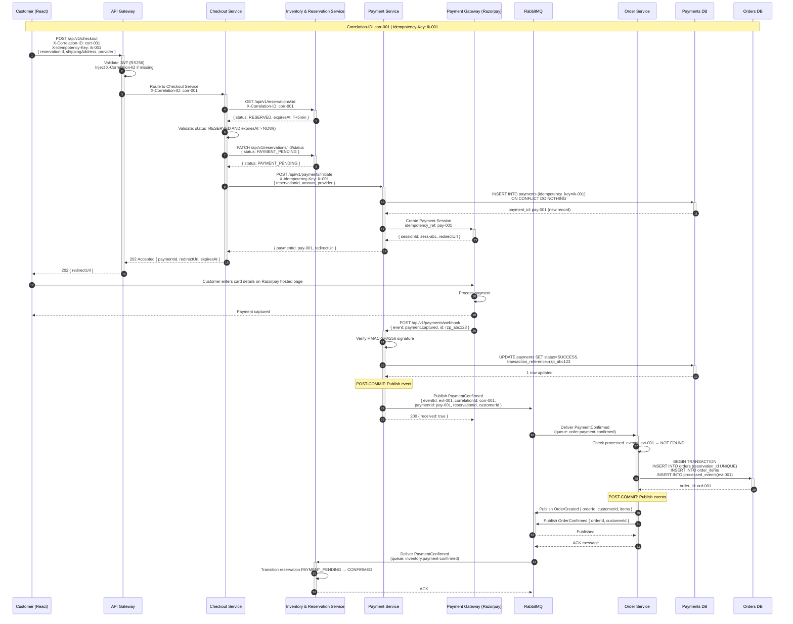
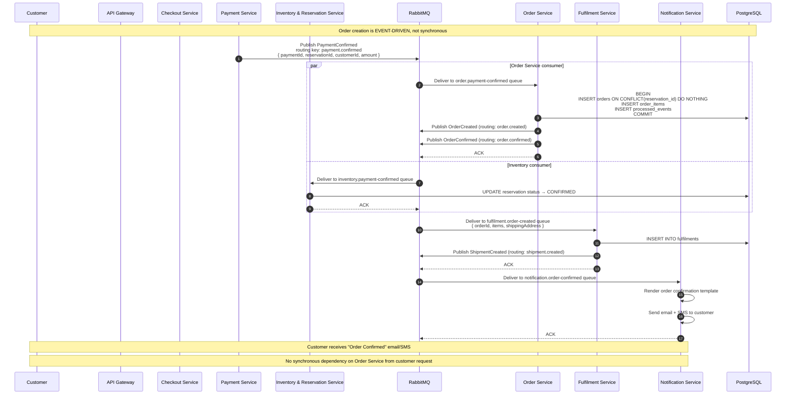
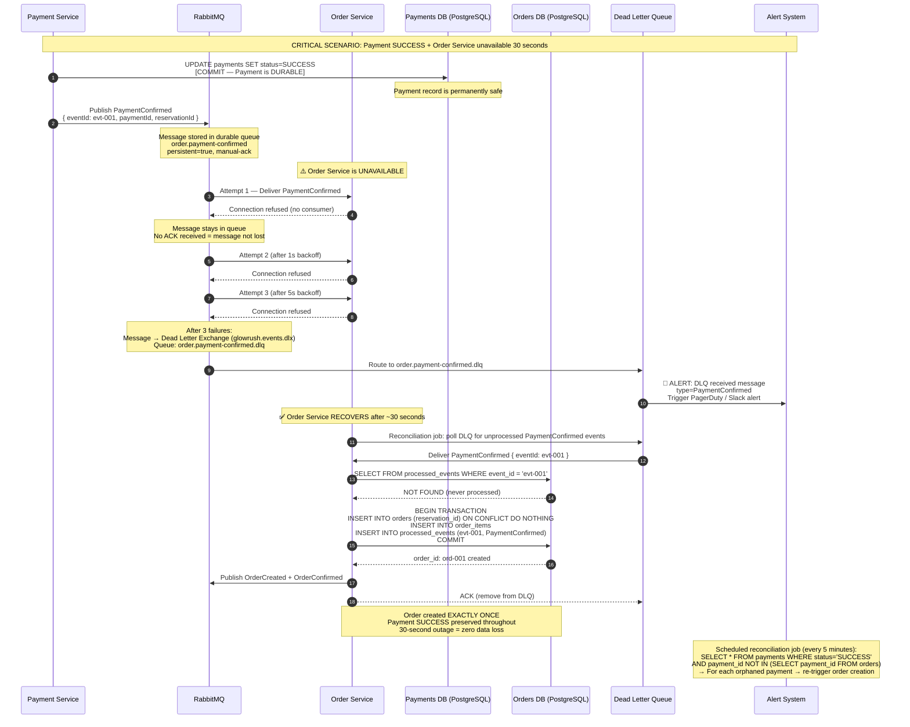
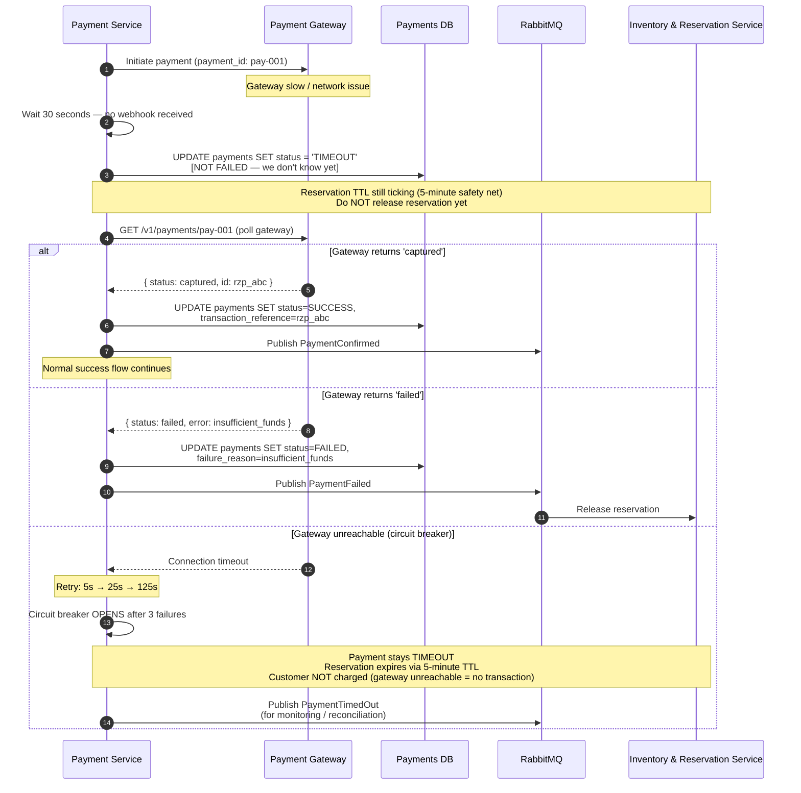

# GlowRush — Payment, Order & Recovery Sequence Diagrams

> **Owner:** Student 3
> **Version:** 1.0 | **Status:** FINAL

---

## Diagram 1 — Payment Sequence (Happy Path)

---

## Diagram 2 — Order Creation Sequence (With Full Actors)

---

## Diagram 3 — Order Recovery Sequence (Payment Succeeds + Order Service DOWN)

---

## Diagram 4 — Payment Timeout & Reconciliation

