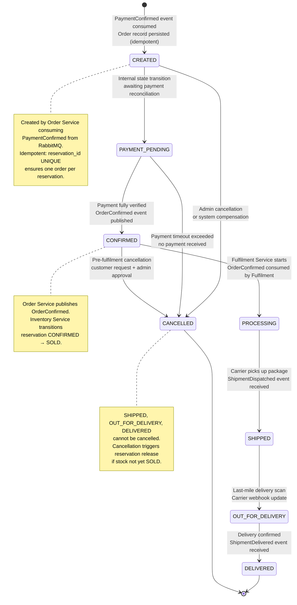

# GlowRush — Order Architecture & State Diagram

> **Owner:** Student 3
> **Version:** 1.0 | **Status:** FINAL
> **States FROZEN per:** ARCHITECTURE_CONTRACT §9.2 and DOMAIN_STATES.md §2

---

## 1. Order State Diagram



---

## 2. State Definitions

| State | Description | Event/Trigger | Side Effects |
|-------|-------------|---------------|-------------|
| `CREATED` | Order record persisted; payment reconciliation pending | `PaymentConfirmed` RabbitMQ event | Inventory reservation transitions to `CONFIRMED` |
| `PAYMENT_PENDING` | Internal transition state after CREATED | Immediate (same flow) | None |
| `CONFIRMED` | Payment verified, ready for fulfilment | Order Service internal | Publish `OrderConfirmed`; Inventory → `SOLD` |
| `PROCESSING` | Fulfilment in progress (picking, packing) | `OrderConfirmed` consumed by Fulfilment | Fulfilment record created |
| `SHIPPED` | Carrier has picked up | `ShipmentDispatched` event | Update order status; notify customer |
| `OUT_FOR_DELIVERY` | Last-mile delivery active | Carrier webhook → `ShipmentDelivered` event | Notify customer |
| `DELIVERED` | Customer received package | `ShipmentDelivered` event | Mark terminal; update sold analytics |
| `CANCELLED` | Order cancelled (pre-shipment only) | Admin/system/timeout | Publish `PaymentRefund` if payment was captured |

---

## 3. Valid Transitions Table

| From | To | Allowed? | Mechanism |
|------|----|----------|-----------|
| `[initial]` | `CREATED` | ✅ | `PaymentConfirmed` event consumed |
| `CREATED` | `PAYMENT_PENDING` | ✅ | Internal |
| `CREATED` | `CANCELLED` | ✅ | Admin action |
| `PAYMENT_PENDING` | `CONFIRMED` | ✅ | Payment verified |
| `PAYMENT_PENDING` | `CANCELLED` | ✅ | Payment timeout |
| `CONFIRMED` | `PROCESSING` | ✅ | Fulfilment starts |
| `CONFIRMED` | `CANCELLED` | ✅ | Pre-fulfilment cancel |
| `PROCESSING` | `SHIPPED` | ✅ | `ShipmentDispatched` event |
| `PROCESSING` | `CANCELLED` | ❌ | **INVALID** — goods already packed |
| `SHIPPED` | `OUT_FOR_DELIVERY` | ✅ | Last-mile scan |
| `SHIPPED` | `CANCELLED` | ❌ | **INVALID** — goods in transit |
| `OUT_FOR_DELIVERY` | `DELIVERED` | ✅ | Delivery confirmed |
| `OUT_FOR_DELIVERY` | `CANCELLED` | ❌ | **INVALID** — delivery in progress |
| `DELIVERED` | any | ❌ | **TERMINAL — no further transitions** |
| `CANCELLED` | any | ❌ | **TERMINAL — no further transitions** |

---

## 4. Invalid Transition Enforcement

```javascript
// Order Service — State Machine Guard
class OrderStateMachine {
  static VALID_TRANSITIONS = {
    CREATED:           ['PAYMENT_PENDING', 'CANCELLED'],
    PAYMENT_PENDING:   ['CONFIRMED', 'CANCELLED'],
    CONFIRMED:         ['PROCESSING', 'CANCELLED'],
    PROCESSING:        ['SHIPPED'],
    SHIPPED:           ['OUT_FOR_DELIVERY'],
    OUT_FOR_DELIVERY:  ['DELIVERED'],
    DELIVERED:         [],   // terminal
    CANCELLED:         [],   // terminal
  };

  static transition(currentStatus, newStatus) {
    const allowed = this.VALID_TRANSITIONS[currentStatus] || [];
    if (!allowed.includes(newStatus)) {
      throw new InvalidOrderTransitionError(
        `Cannot transition order from ${currentStatus} to ${newStatus}`
      );
    }
    return newStatus;
  }
}
```

---

## 5. Order Architecture

### 5.1 Order Service Responsibilities

| Responsibility | Implementation |
|---------------|---------------|
| Create orders | Consume `PaymentConfirmed` events idempotently |
| Manage order lifecycle | State machine with transition validation |
| Respond to queries | `GET /api/v1/orders/:id` |
| Publish order events | `OrderCreated`, `OrderConfirmed` to RabbitMQ |
| Handle cancellations | Admin API + compensation if payment captured |
| Reconciliation | Nightly job to find orphaned payments without orders |

### 5.2 Idempotent Order Creation

```sql
-- Order creation is triggered by PaymentConfirmed event
-- Even if the event is delivered twice, only one order is created

BEGIN;
  -- Step 1: Check if event already processed
  SELECT event_id FROM processed_events WHERE event_id = :payment_confirmed_event_id;
  -- If found → skip everything → COMMIT → ACK

  -- Step 2: Insert order (guarded by UNIQUE reservation_id)
  INSERT INTO orders (order_id, customer_id, reservation_id, payment_id, status, total_amount, ...)
  VALUES (gen_random_uuid(), :customer_id, :reservation_id, :payment_id, 'CREATED', :total_amount, ...)
  ON CONFLICT (reservation_id) DO NOTHING
  RETURNING order_id;

  -- Step 3: Insert order items
  INSERT INTO order_items (order_item_id, order_id, product_id, quantity, unit_price)
  SELECT gen_random_uuid(), :order_id, ...;

  -- Step 4: Record event as processed
  INSERT INTO processed_events (event_id, event_type, result, processed_at)
  VALUES (:payment_confirmed_event_id, 'PaymentConfirmed', '{}', NOW());
COMMIT;
-- POST-COMMIT: Publish OrderCreated + OrderConfirmed
```

### 5.3 Flash Sale Context

During the GlowRush flash sale with 10,000 concurrent attempts and 100 units:
- Only 100 `PaymentConfirmed` events will ever be published (one per successful reservation + payment)
- Each `PaymentConfirmed` event creates exactly one order
- The `reservation_id UNIQUE` constraint on `orders` makes this mathematically impossible to violate

### 5.4 Cancellation & Compensation

```
Order CANCELLED (pre-shipment)
    ↓
Order Service:
    UPDATE orders SET status = 'CANCELLED'
    ↓
If payment was SUCCESS:
    POST /api/v1/payments/:id/refund  (internal)
    → Payment Service initiates gateway refund
    → Publishes PaymentRefunded event
    ↓
Publish PaymentFailed (for reservation release):
    → Inventory Service: reservation → RELEASED
    → Stock returned to available pool
    → StormShield: ReservationReleased → may admit new users
```

---

## 6. Order Service — Class Structure

```javascript
// Repository Pattern
class OrderRepository {
  async create(orderData, client) { ... }
  async findById(orderId) { ... }
  async findByCustomerId(customerId) { ... }
  async findByReservationId(reservationId) { ... }
  async updateStatus(orderId, newStatus, client) { ... }
}

// State Pattern (Order entity)
class Order {
  constructor(data) { this.data = data; }

  get status() { return this.data.status; }

  transitionTo(newStatus) {
    OrderStateMachine.transition(this.status, newStatus);
    this.data.status = newStatus;
    this.data.updatedAt = new Date();
    return this;
  }

  isTerminal() {
    return ['DELIVERED', 'CANCELLED'].includes(this.status);
  }
}

// Service (Facade Pattern)
class OrderService {
  constructor(orderRepo, eventBus, idempotencyStore) {
    this.orderRepo = orderRepo;
    this.eventBus  = eventBus;
    this.idempotencyStore = idempotencyStore;
  }

  async createFromPaymentConfirmed(event) {
    const { eventId, data } = event;

    // Idempotency check
    if (await this.idempotencyStore.hasProcessed(eventId)) return;

    const order = await this.orderRepo.create({
      customerId:    data.customerId,
      reservationId: data.reservationId,
      paymentId:     data.paymentId,
      status:        'CREATED',
      totalAmount:   data.amount,
    });

    await this.idempotencyStore.markProcessed(eventId, { orderId: order.id });

    await this.eventBus.publish('order.created', {
      orderId:       order.id,
      customerId:    order.customerId,
      reservationId: order.reservationId,
    });
  }
}
```
