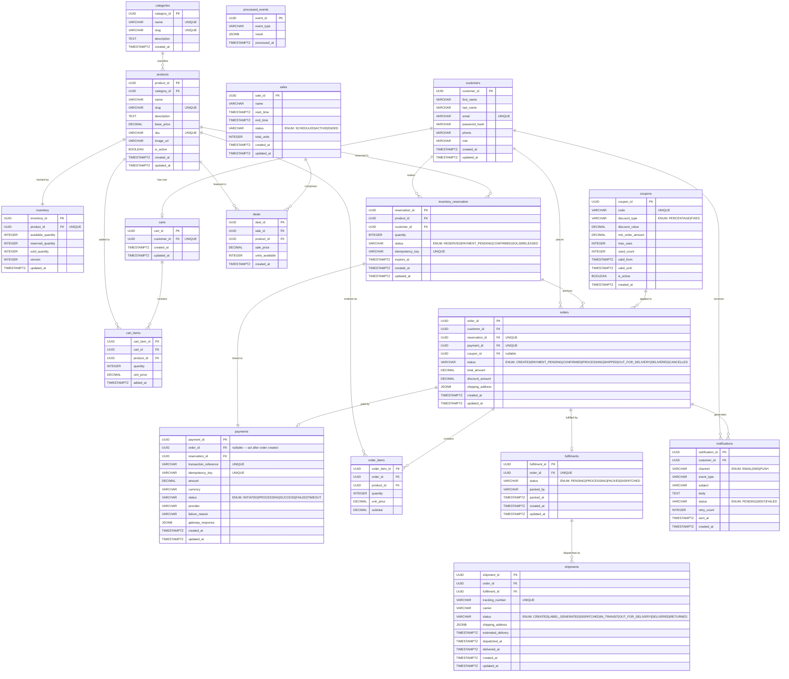

# GlowRush — Master ER Diagram

> **Owner:** Student 3 (Data, API, Payment, Order & Reliability Engineer)
> **Version:** 1.0 | **Status:** FINAL
> **Contracts followed:** ARCHITECTURE_CONTRACT v1.0, INVENTORY_CONTRACT v1.0, NAMING_RULES v1.0

---

## 1. Entity Relationship Diagram

---

## 2. Data Ownership Map

| Entity | Owning Service | Storage | Consistency Model |
|--------|---------------|---------|-------------------|
| `customers` | Auth Service (API Gateway) | MongoDB | **Strong — ACID** |
| `categories` | Product Service | MongoDB + Redis cache | Strong |
| `products` | Product Service | MongoDB + Redis cache (5 min TTL) | Strong write, Eventually consistent read |
| `inventory` | **Inventory & Reservation Service** | MongoDB | **Strongly consistent — atomic conditional UPDATE** |
| `inventory_reservation` | **Inventory & Reservation Service** | MongoDB | **Strongly consistent — idempotency key UNIQUE** |
| `carts` | Cart Service | Redis (hot) + MongoDB (persist) | **Eventually consistent** |
| `cart_items` | Cart Service | Redis (hot) + MongoDB (persist) | **Eventually consistent** |
| `sales` | Sale Service | MongoDB + Redis cache | Strong write, Eventually consistent read |
| `deals` | Sale Service | MongoDB + Redis cache | Strong write, Eventually consistent read |
| `coupons` | Sale Service | MongoDB | **Strong** |
| `payments` | **Payment Service** | MongoDB | **Strongly consistent — dual UNIQUE constraint** |
| `orders` | **Order Service** | MongoDB | **Strongly consistent** |
| `order_items` | **Order Service** | MongoDB | **Strongly consistent** |
| `fulfilments` | Fulfilment Service | MongoDB | **Eventually consistent** |
| `shipments` | Shipment Service | MongoDB | **Eventually consistent** |
| `notifications` | Notification Service | MongoDB | **Eventually consistent** |
| `processed_events` | Every service (own copy) | MongoDB | **Strong — idempotency fence** |

---

## 3. Strongly Consistent vs Eventually Consistent

### Strongly Consistent (ACID Transactions Required)

These entities represent money, stock, and legal records. Any failure must roll back completely.

| Entity | Why Strong Consistency |
|--------|----------------------|
| `inventory` | Oversell prevention — atomic MongoDB is the single consistency point |
| `inventory_reservation` | Guarantees one-reservation-per-idempotency-key |
| `payments` | Financial record — duplicate gateway charges are catastrophic |
| `orders` | Business contract with customer |
| `order_items` | Legal record of what was sold |
| `coupons.used_count` | Prevents coupon abuse |

### Eventually Consistent (Accepcollection Lag)

| Entity | Why Eventual Consistency OK |
|--------|---------------------------|
| `carts` | Shopping cart state is reconstructible; brief staleness accepcollection |
| `notifications` | Best-effort delivery; user accepts retries |
| `fulfilments` | Warehouse ops don't require real-time accuracy |
| `shipments` | Carrier updates are inherently delayed |
| Product/Sale Redis caches | Stale catalog data accepcollection for seconds |

---

## 4. Cross-Service Access Rules

> [!IMPORTANT]
> No service reads or writes another service's database collections directly.
> All cross-service access is via REST APIs or RabbitMQ events.

| Accessing Service | Target Data | Mechanism |
|------------------|-------------|-----------|
| Checkout Service | Reservation status | `GET /api/v1/reservations/:id` |
| Payment Service | Reservation ID | Passed in request body at checkout |
| Order Service | Payment confirmation | `PaymentConfirmed` RabbitMQ event |
| Fulfilment Service | Order details | `GET /api/v1/orders/:orderId` |
| Shipment Service | Fulfilment info | `ShipmentCreated` RabbitMQ event |
| Notification Service | Customer info | Event payload carries `customerId` |
| Inventory Service | Payment result | `PaymentConfirmed` / `PaymentFailed` events |

---

## 5. Audit & Concurrency Fields

| Field | Collections | Purpose |
|-------|--------|---------|
| `created_at` | All business entities | Immucollection creation timestamp |
| `updated_at` | All mucollection entities | Tracks last modification (trigger-maintained) |
| `version` | `inventory` only | Optimistic concurrency version (incremented on every UPDATE) |
| `idempotency_key` | `inventory_reservation`, `payments` | Prevents duplicate operations |
| `transaction_reference` | `payments` | Gateway's unique reference; prevents double-charge |
