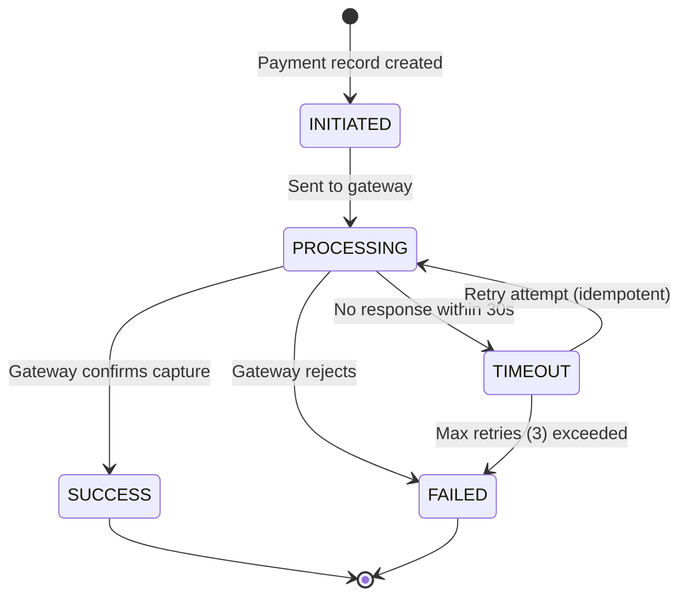

# GlowRush — Payment Architecture

> **Owner:** Student 3
> **Version:** 1.0 | **Status:** FINAL

---

## 1. Payment Flow Overview

```
Customer (React)
    ↓  POST /api/v1/checkout  [X-Idempotency-Key: ik-001]
API Gateway (JWT validation, X-Correlation-ID injection)
    ↓
Checkout Service
    ├── GET /api/v1/reservations/:id  →  validate RESERVED + not expired
    ├── Transition reservation → PAYMENT_PENDING  (Inventory Service)
    └── POST /api/v1/payments/initiate  [X-Idempotency-Key: ik-001]
            ↓
Payment Service
    ├── INSERT INTO payments (idempotency_key=ik-001) ON CONFLICT DO NOTHING
    ├── Call External Payment Gateway (Razorpay/Stripe)
    │       ↓  (async — gateway redirect / sync charge)
    │   Payment Gateway
    │       ↓  POST /api/v1/payments/webhook (HMAC verified)
    ├── UPDATE payments SET status, transaction_reference, gateway_response
    └── Publish event to RabbitMQ (PaymentConfirmed | PaymentFailed)
            ↓
    ┌───────────────────────────────────┐
    │         RabbitMQ                 │
    │  payment.confirmed → Order Svc   │
    │  payment.confirmed → Inventory   │
    │  payment.failed    → Inventory   │
    └───────────────────────────────────┘
```

---

## 2. Payment States (FROZEN — DOMAIN_STATES.md)



| State | Description | Next Steps |
|-------|-------------|-----------|
| `INITIATED` | Record created, idempotency key committed | → Call gateway |
| `PROCESSING` | Request sent to gateway, awaiting callback | → Webhook arrives |
| `SUCCESS` | Gateway confirmed payment capture | → Publish `PaymentConfirmed` |
| `FAILED` | Gateway rejected or max retries exceeded | → Publish `PaymentFailed` |
| `TIMEOUT` | No webhook after 30s | → Retry with idempotency key; poll gateway |

---

## 3. Payment Idempotency — Two-Layer Design

### Layer 1: Client-side (`idempotency_key`)

The `idempotency_key` is generated by the React client (UUID v4) before calling checkout and is forwarded through Checkout Service → Payment Service in the `X-Idempotency-Key` header.

```sql
-- Payment Service inserts:
INSERT INTO payments (payment_id, idempotency_key, reservation_id, amount, ...)
ON CONFLICT (idempotency_key) DO NOTHING
RETURNING *;

-- If 0 rows returned → payment already exists → SELECT and return it
-- If 1 row returned → new record → proceed to gateway
```

**This prevents:**
- Customer double-clicking the Pay button
- Network retry creating two records
- Flash sale load spike causing 10,000 duplicate payment attempts all creating records

### Layer 2: Gateway-side (`transaction_reference`)

The `transaction_reference` is assigned by the external gateway. Stored with a UNIQUE constraint.

```sql
UPDATE payments
SET transaction_reference = :gateway_ref,
    status = 'SUCCESS',
    gateway_response = :raw_response,
    updated_at = NOW()
WHERE payment_id = :payment_id
  AND status IN ('INITIATED', 'PROCESSING', 'TIMEOUT')
  -- Guard: only update payments that are not yet terminal
```

**This prevents:**
- A webhook arriving twice for the same gateway transaction
- If the same `transaction_reference` arrives a second time, the UNIQUE constraint rejects the UPDATE

### Combined Algorithm

```
RECEIVE POST /payments with X-Idempotency-Key = ik-001

1. SELECT * FROM payments WHERE idempotency_key = 'ik-001'
   ├── FOUND AND status = terminal (SUCCESS/FAILED)
   │     → Return existing record immediately (200 OK)
   │     → NO gateway call
   ├── FOUND AND status = INITIATED/PROCESSING/TIMEOUT
   │     → Return existing record (200 OK — in-flight, poll for result)
   │     → NO new gateway call
   └── NOT FOUND
         → INSERT new payment record
         → Call gateway with payment_id as idempotency reference
         → Return 201 Created
```

---

## 4. Handling TIMEOUT — Do NOT assume FAILED

### Why TIMEOUT ≠ FAILED

A payment timeout means **we do not know** the gateway's decision. The payment may have:
- Succeeded at the gateway but the webhook was delayed
- Failed at the gateway silently
- Still be processing (gateway queue backlog)

**If we treat TIMEOUT as FAILED and release the reservation:**
- Customer's card may have been charged
- We released the stock
- Customer is left with a charge and no order → Legal liability

### Correct TIMEOUT Handling

```
1. Gateway call timeout (>30s with no webhook):
   → UPDATE payments SET status = 'TIMEOUT'
   → Do NOT publish PaymentFailed yet
   → Do NOT release reservation yet
   → Start reconciliation timer (60s)

2. Reconciliation (Payment Service polling the gateway):
   GET https://gateway.razorpay.com/v1/payments/:gateway_ref
   ├── status = 'captured'  → Update to SUCCESS → publish PaymentConfirmed
   ├── status = 'failed'    → Update to FAILED  → publish PaymentFailed
   └── status = 'pending'   → Retry (exponential backoff: 5s, 25s, 125s)

3. After 3 reconciliation retries all return 'pending':
   → Mark payment FAILED (conservative approach after 10+ minutes)
   → Publish PaymentFailed
   → Reservation TTL will release stock naturally (within 5 min)

4. If gateway is unreachable during reconciliation:
   → Circuit breaker opens
   → Payment stays TIMEOUT
   → Reservation expires via TTL (5 min safety net)
   → Customer is NOT charged (gateway unreachable = transaction never reached)
```

---

## 5. Payment Failure Flow

```
Payment Gateway rejects payment
    ↓
Webhook: POST /api/v1/payments/webhook
    ↓
Payment Service:
    UPDATE payments SET status = 'FAILED', failure_reason = :reason
    (within MongoDB transaction)
    ↓
POST-COMMIT:
    Publish PaymentFailed to RabbitMQ
    routing key: payment.failed
    ↓
RabbitMQ fans out to:
    ┌─────────────────────────────────────┐
    │  inventory.payment-failed queue     │
    │  → Inventory & Reservation Service  │
    │  → Transition PAYMENT_PENDING →     │
    │    RELEASED                         │
    │  → available_quantity += 1          │
    │  → Publish ReservationReleased      │
    └─────────────────────────────────────┘
    ┌─────────────────────────────────────┐
    │  notification.payment-failed queue  │
    │  → Notification Service             │
    │  → Email/SMS to customer            │
    └─────────────────────────────────────┘
```

> [!IMPORTANT]
> Payment Service does NOT directly call Inventory Service's database.
> It only publishes an event. Inventory Service reacts to the event.
> This maintains strict service boundary separation.

---

## 6. Payment Success + Order Service Unavailable (Critical Jury Scenario)

```
Payment Gateway confirms capture
    ↓
Webhook arrives: POST /api/v1/payments/webhook
    ↓
Payment Service:
    BEGIN TRANSACTION
      UPDATE payments SET status = 'SUCCESS',
             transaction_reference = 'rzp_live_abc123'
    COMMIT ← Payment is durably persisted HERE
    ↓
POST-COMMIT (outside transaction):
    Publish PaymentConfirmed to RabbitMQ
    {
      "eventId": "evt-uuid",
      "eventType": "PaymentConfirmed",
      "data": { "paymentId": ..., "reservationId": ..., "customerId": ... }
    }
    routing key: payment.confirmed
    ↓
RabbitMQ (durable queue, persistent messages)
    queue: order.payment-confirmed
    ↓
Order Service is DOWN (30 seconds)
    → Message STAYS in queue (RabbitMQ durability)
    → No message loss
    → No acknowledgement sent
    ↓
Order Service RECOVERS after 30 seconds
    → Reconnects to RabbitMQ
    → Consumes message from queue
    ↓
Order Service — Idempotent Consumer Algorithm:
    1. Extract eventId from message
    2. SELECT FROM processed_events WHERE event_id = :eventId
       ├── FOUND → ACK message, SKIP (already processed)
       └── NOT FOUND →
             BEGIN TRANSACTION
               INSERT INTO orders (reservation_id=...) ON CONFLICT DO NOTHING
               INSERT INTO order_items (...)
               INSERT INTO processed_events (eventId, 'PaymentConfirmed')
             COMMIT
             ACK message
    3. Publish OrderCreated, OrderConfirmed to RabbitMQ

Result: Payment SUCCESS is NEVER lost.
        Order is created EXACTLY ONCE.
        Even if Order Service was down for 30 seconds.
```

### Why This Works

| Mechanism | Protection |
|-----------|-----------|
| Payment persisted BEFORE event published | Payment is safe even if RabbitMQ publish fails |
| RabbitMQ durable queues + persistent messages | Messages survive RabbitMQ restart |
| Manual ACK (consumer confirms processing) | Message retried if Order Service crashes mid-processing |
| `processed_events` deduplication | Order created exactly once even if message delivered twice |
| `orders.reservation_id UNIQUE` | Database-level guard against duplicate orders |

---

## 7. External Payment Provider Extensibility

```javascript
// PaymentProvider interface (Strategy Pattern)
class PaymentProvider {
  async initiatePayment(params) { throw new Error('Not implemented'); }
  async getPaymentStatus(gatewayRef) { throw new Error('Not implemented'); }
  async verifyWebhookSignature(payload, signature) { throw new Error('Not implemented'); }
  async refund(gatewayRef, amount) { throw new Error('Not implemented'); }
}

// Adapters
class RazorpayPaymentAdapter extends PaymentProvider { ... }
class StripePaymentAdapter   extends PaymentProvider { ... }
class MockPaymentAdapter     extends PaymentProvider { ... }  // for testing

// Factory
class PaymentProviderFactory {
  static create(provider) {
    const providers = {
      razorpay: RazorpayPaymentAdapter,
      stripe:   StripePaymentAdapter,
      mock:     MockPaymentAdapter,
    };
    const Adapter = providers[provider];
    if (!Adapter) throw new Error(`Unknown provider: ${provider}`);
    return new Adapter();
  }
}
```

**Adding a new provider (e.g., PayU):**
1. Create `PayuPaymentAdapter extends PaymentProvider`
2. Register in `PaymentProviderFactory`
3. Zero changes to `PaymentService` core logic

---

## 8. Security — Payment Data

> [!CAUTION]
> **Raw card details (PAN, CVV, expiry) are NEVER stored in GlowRush's database.**

| Data | Storage | Protection |
|------|---------|-----------|
| Card number | Never stored | Tokenized by gateway (Razorpay vault) |
| CVV | Never stored | One-time use, not persisted anywhere |
| Card expiry | Never stored | Tokenized |
| `transaction_reference` | `payments.transaction_reference` | Gateway's reference — safe to store |
| `gateway_response` | `payments.gateway_response` (JSONB) | Sanitized — no card data |
| `idempotency_key` | `payments.idempotency_key` | UUID only — no card data |

**PCI-DSS Scope:** GlowRush is out-of-scope for PCI-DSS at the application layer because all card capture and processing happens on the gateway's hosted payment page. GlowRush only receives a `transaction_reference`.
