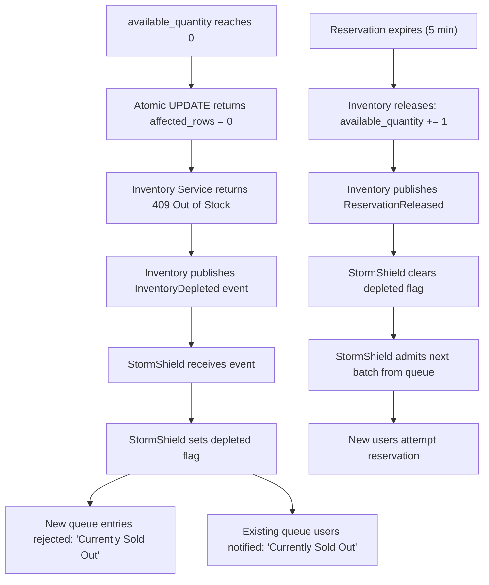

# GlowRush — Flash Sale Concurrency Design

> **Version:** 1.0 | **Owner:** Student 1 (System Architect)

---

## The Question

> What exactly happens when **10,000 customers** simultaneously click "Buy Now" for a product with **100 available units**?

This document answers the 11 critical concurrency questions.

---

## 1. How Traffic Enters

```
10,000 browsers
    ↓ HTTPS (TLS 1.3)
CloudFront CDN
    ↓ (static assets served from cache — ~80% of requests)
    ↓ (dynamic API requests forwarded)
AWS WAF
    ↓ (block bots, rate-limit IPs at 1000 req/min)
    ↓ (~9,500 requests pass WAF)
Application Load Balancer
    ↓ (round-robin across API Gateway instances)
API Gateway (10 instances)
    ↓ (~950 req/s per instance)
```

**Key point:** The first 3 layers (CDN, WAF, ALB) reduce and distribute the raw flood before any application code runs.

---

## 2. How Requests Are Distributed

```
ALB distributes across 10 API Gateway instances:
    GW-1: ~1,000 req/s
    GW-2: ~1,000 req/s
    ...
    GW-10: ~1,000 req/s

Each GW instance validates JWT → checks rate limit → forwards to StormShield.
StormShield has 5 instances (all sharing Redis state):
    SS-1: ~2,000 req/s
    SS-2: ~2,000 req/s
    ...
    SS-5: ~2,000 req/s
```

**Key point:** Load balancing is round-robin (stateless). All StormShield instances share queue state via Redis, so any instance can serve any user.

---

## 3. Where Rate Limiting Occurs

| Layer           | Type        | Limit                     | Mechanism                    |
| --------------- | ----------- | ------------------------- | ---------------------------- |
| WAF             | IP-based    | 1,000 req/min per IP      | AWS WAF rules                |
| API Gateway     | User-based  | 10 req/min (flash sale)   | Redis sliding window         |
| API Gateway     | Global      | 50,000 req/s total        | Redis counter                |
| StormShield     | Sale-based  | Max queue size: 50,000    | Redis `ZCARD` check          |
| Inventory       | Implicit    | `available_quantity >= 1` | MongoDB `WHERE` clause           |

**Key point:** Rate limiting is **layered**. Each layer reduces the request volume before the next layer.

---

## 4. Where Queueing Occurs

| Location        | What is queued                    | Data Structure        | Max Wait        |
| --------------- | --------------------------------- | --------------------- | --------------- |
| ALB             | TCP connections                   | Surge queue (1024)    | ~5 seconds      |
| StormShield     | Customer positions                | Redis sorted set      | Minutes         |
| PgBouncer       | Database connections              | Connection queue      | ~10 seconds     |
| RabbitMQ        | Async events                      | Durable queues        | Seconds         |

**Key point:** StormShield is the **primary queue**. It is the architectural control point that converts a thundering herd into an orderly stream.

---

## 5. How StormShield Admits Users

### Step-by-Step (T=0 to T=5min)

```
T=0s    Sale starts. 10,000 users call POST /stormshield/enter.
        StormShield: ZADD to Redis sorted set (score = arrival timestamp).
        All 10,000 get queue positions (#1 to #10,000).

T=2s    Batch Admission Engine fires (every 2 seconds).
        ZPOPMIN 30 entries from queue.
        Users #1-#30 receive admission tokens (JWT, 60s TTL).

T=4s    Batch 2: Users #31-#60 receive tokens.

T=6s    Batch 3: Users #61-#90 receive tokens.

T=8s    Batch 4: Users #91-#120 receive tokens.
        (Over-admit by ~20% to account for failures/timeouts)

T~10s   ~100 reservations attempted.
        Inventory reports available_quantity = 0.
        Inventory publishes InventoryDepleted event.

T~11s   StormShield receives InventoryDepleted.
        Sets ss:depleted:{saleId} flag.
        Stops batch admission.
        Remaining ~9,880 users told: "Currently Sold Out".

T=5min  Some reservations expire (unpaid).
        Inventory publishes ReservationReleased (e.g., 5 units).
        StormShield receives event, clears depleted flag.
        Admits next 10 users from queue (still in sorted set).
        These users get a fresh chance at the released stock.
```

**Key point:** The queue is FIFO (sorted by timestamp). Released stock goes to the next users in line, NOT to everyone.

---

## 6. How Horizontal Scaling Works

### Stateless Scaling (No Coordination Needed)

| Service         | How It Scales                                    | Shared State         |
| --------------- | ------------------------------------------------ | -------------------- |
| API Gateway     | Add instances behind ALB; no state               | Redis (rate limits)  |
| StormShield     | Add instances; all share Redis queue             | Redis (queue, tokens)|
| Product Service | Add instances; all share Redis cache             | Redis (cache)        |
| Checkout Service| Add instances; Redis sessions                    | Redis (sessions)     |

### Constrained Scaling (Database Contention)

| Service                         | Limiting Factor                              | Workaround              |
| ------------------------------- | -------------------------------------------- | ----------------------- |
| Inventory & Reservation Service | MongoDB atomic update on inventory collection     | StormShield throttling  |
| Payment Service                 | External gateway rate limit                  | Circuit breaker + retry |

**Key point:** Adding more Inventory instances does NOT increase reservation throughput because they all contend on the same MongoDB row. StormShield is the throttle.

---

## 7. Where the Exact Inventory Consistency Point Exists

**The consistency point is a single MongoDB statement:**

```sql
UPDATE inventory
SET
    available_quantity = available_quantity - 1,
    reserved_quantity  = reserved_quantity + 1,
    version            = version + 1,
    updated_at         = NOW()
WHERE product_id = :product_id
  AND available_quantity >= 1;
```

**Properties of this statement:**
- **Atomic:** MongoDB executes this as a single atomic operation
- **Row-locked:** MongoDB acquires a row-level exclusive lock for the duration of the UPDATE
- **Self-validating:** The `WHERE available_quantity >= 1` clause prevents negative inventory
- **Serialized:** Concurrent UPDATEs on the same row are serialized by MongoDB's lock manager

**Result:**
- `affected_rows = 1` → Reservation successful. Proceed.
- `affected_rows = 0` → No stock available. Reject immediately.

**Why inventory can NEVER be negative:**
```
Thread A: UPDATE WHERE available_quantity >= 1  → acquires row lock
Thread B: UPDATE WHERE available_quantity >= 1  → WAITS for row lock
Thread A: Sets available_quantity = 0           → commits, releases lock
Thread B: Acquires lock, checks WHERE clause    → available_quantity = 0 → WHERE fails → affected_rows = 0
```

**This is the ONLY place in the entire system where stock is decremented.** No other service, no Redis cache, no application-level check can override this.

---

## 8. How Duplicate Requests Are Handled

### Duplicate Reservation Requests

| Mechanism          | How It Works                                                    |
| ------------------ | --------------------------------------------------------------- |
| **Idempotency Key**| Client sends `X-Idempotency-Key` header (UUID)                 |
| **Unique Constraint**| `inventory_reservations.idempotency_key` has UNIQUE constraint|
| **Check-then-create**| Before INSERT, check if idempotency_key exists              |
| **On conflict**    | If duplicate → return existing reservation (200, not 201)      |

```sql
-- Idempotent reservation creation
INSERT INTO inventory_reservations (reservation_id, product_id, customer_id, quantity, status, idempotency_key, expires_at)
VALUES (:id, :product_id, :customer_id, 1, 'RESERVED', :idempotency_key, NOW() + INTERVAL '5 minutes')
ON CONFLICT (idempotency_key) DO NOTHING
RETURNING *;
```

### Duplicate Payment Requests

| Mechanism          | How It Works                                                    |
| ------------------ | --------------------------------------------------------------- |
| **Idempotency Key**| `payments.idempotency_key` has UNIQUE constraint               |
| **Gateway dedup**  | Payment gateway also supports idempotency keys                 |
| **Same result**    | Duplicate payment returns existing payment status              |

### Duplicate Event Processing

| Mechanism          | How It Works                                                    |
| ------------------ | --------------------------------------------------------------- |
| **Event ID**       | Every RabbitMQ message has unique `eventId`                    |
| **Processed check**| Consumer checks `processed_events` collection before processing    |
| **Idempotent ops** | All event handlers are written to be idempotent                |

---

## 9. How the System Behaves When Stock Reaches Zero



**Important behavioral distinction:**
- Stock reaching zero does NOT end the sale
- Stock reaching zero PAUSES admission
- Released stock RESUMES admission for queued users only
- Released stock is NOT re-opened to the general public

---

## 10. What Happens When Reservation Expires

**Trigger:** A cron job / scheduled task in Inventory & Reservation Service runs every 30 seconds:

```sql
-- Find and release expired reservations
UPDATE inventory_reservations
SET status = 'RELEASED', updated_at = NOW()
WHERE status IN ('RESERVED', 'PAYMENT_PENDING')
  AND expires_at < NOW()
RETURNING product_id, quantity;

-- For each released reservation, restore inventory
UPDATE inventory
SET
    available_quantity = available_quantity + :quantity,
    reserved_quantity  = reserved_quantity - :quantity,
    version            = version + 1,
    updated_at         = NOW()
WHERE product_id = :product_id;
```

**Sequence:**
1. Reservation created with `expires_at = NOW() + 5 minutes`
2. Customer has 5 minutes to complete payment
3. If no payment → expiry cron finds the reservation
4. Reservation status → `RELEASED`
5. `available_quantity` restored, `reserved_quantity` decremented
6. `ReservationExpired` event published → Notification Service informs customer
7. `ReservationReleased` event published → StormShield admits next queued user

**Browser Back ≠ cancellation.** The reservation remains active until payment, explicit cancel, or TTL expiry. The backend owns reservation validity.

---

## 11. Why Inventory Cannot Become Negative

**Five layers of protection:**

| Layer | Mechanism                                                        | Prevents                       |
| ----- | ---------------------------------------------------------------- | ------------------------------ |
| 1     | WAF rate limiting                                                | Bot floods                     |
| 2     | StormShield controlled admission (20-50 per batch)               | Thundering herd                |
| 3     | Admission token (single-use, 60s TTL)                            | Token replay                   |
| 4     | Idempotency key (UNIQUE constraint)                              | Duplicate reservations         |
| 5     | **Atomic MongoDB: `WHERE available_quantity >= 1`**                  | **Negative inventory**         |

**The ultimate guarantee is Layer 5.** Even if every other layer fails:
- StormShield crashes → All 10,000 hit Inventory directly
- Rate limiting disabled → All requests reach the database
- Idempotency bypassed → Multiple attempts per user

**The MongoDB `{ available_quantity: { $gte: 1 } }` filter still prevents negative inventory.** The worst case is that MongoDB serializes 10,000 UPDATE statements on the same row (slow, but correct). Only 100 will succeed. The rest get `affected_rows = 0`.

```
INVARIANT (enforced by MongoDB):
    available_quantity >= 0    (guaranteed by WHERE clause)
    reserved_quantity >= 0     (never decremented below 0)
    sold_quantity >= 0         (only incremented)
    available + reserved + sold = initial_stock (conservation of inventory)
```

---

## Summary Timeline

| Time      | Event                                    | Customers Affected | Stock    |
| --------- | ---------------------------------------- | ------------------- | -------- |
| T=0s      | Sale starts, 10K join queue              | 10,000              | 100/100  |
| T=2s      | Batch 1: 30 admitted                     | 30 admitted         | ~70/100  |
| T=4s      | Batch 2: 30 admitted                     | 60 admitted         | ~40/100  |
| T=6s      | Batch 3: 30 admitted                     | 90 admitted         | ~10/100  |
| T=8s      | Batch 4: 30 admitted                     | 120 admitted        | 0/100    |
| T=8s      | InventoryDepleted published              | 9,880 told sold out | 0/100    |
| T=5min    | ~5 reservations expire                   | 5 released          | 5/100    |
| T=5min+2s | Next batch: 10 admitted from queue       | 10 admitted         | ~0/100   |
| T~10min   | Sale cleanup                             | Queue cleared       | Final    |
