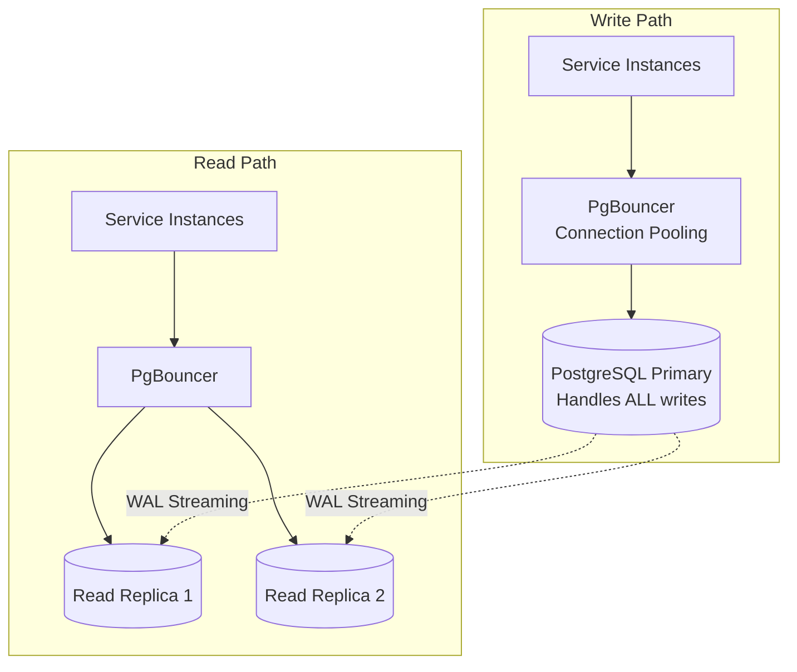

# GlowRush — Scalability Design

> **Version:** 1.0 | **Owner:** Student 1 (System Architect)

---

## 1. Traffic Profiles

### 1.1 Normal Operations

| Metric                  | Value                        |
| ----------------------- | ---------------------------- |
| Concurrent users        | ~5,000                       |
| Request rate            | ~10,000 req/sec              |
| Read:Write ratio        | 90:10                        |
| Database writes/sec     | ~1,000                       |
| Event throughput        | ~500 events/sec              |

### 1.2 Flash Sale Peak

| Metric                  | Value                        |
| ----------------------- | ---------------------------- |
| Concurrent users        | ~10,000                      |
| Request rate            | ~50,000 req/sec (dynamic)    |
| Total with CDN          | ~500,000 req/sec             |
| Read:Write ratio        | 30:70                        |
| Database writes/sec     | ~5,000                       |
| Event throughput        | ~2,000 events/sec            |

### 1.3 Extreme Scale Reasoning

| Scale   | Total Req/s | Dynamic Req/s | API GW Instances | Inventory Instances | Redis Nodes | PG Connections |
| ------- | ----------- | ------------- | ---------------- | ------------------- | ----------- | -------------- |
| 1x      | 50K         | 10K           | 3                | 2                   | 3           | 100            |
| 10x     | 500K        | 100K          | 15               | 8                   | 6           | 200            |
| 50x     | 2.5M        | 500K          | 50               | 20                  | 15          | 400            |

---

## 2. Horizontal Scaling Strategy

### 2.1 Stateless Services (Scale Freely)

These services store no local state and can be scaled horizontally without constraints:

| Service              | Normal | Flash | Max  | Constraint                        |
| -------------------- | ------ | ----- | ---- | --------------------------------- |
| API Gateway          | 3      | 10    | 15   | ALB connection limits             |
| StormShield          | 2      | 5     | 10   | Redis throughput                  |
| Product Service      | 2      | 3     | 5    | Read-heavy, Redis cached          |
| Cart Service         | 2      | 3     | 5    | Redis + PG                        |
| Sale Service         | 2      | 3     | 5    | Heavily cached                    |
| Checkout Service     | 2      | 5     | 8    | Redis session                     |
| Notification Service | 2      | 5     | 10   | External provider rate limits     |

### 2.2 Stateful-Adjacent Services (Scale Carefully)

These services have database write contention that limits effective horizontal scaling:

| Service                         | Normal | Flash | Max | Limiting Factor                       |
| ------------------------------- | ------ | ----- | --- | ------------------------------------- |
| Inventory & Reservation Service | 2      | 5     | 8   | PostgreSQL row lock on inventory      |
| Payment Service                 | 2      | 5     | 8   | External gateway rate limits          |
| Order Service                   | 2      | 3     | 5   | Low event volume (~100 during sale)   |
| Fulfilment Service              | 2      | 2     | 3   | Not flash-sale critical               |
| Shipment Service                | 2      | 2     | 3   | Not flash-sale critical               |

---

## 3. Cache Scaling

### 3.1 Redis Cluster Topology

```
Normal:   3 shards × 1 replica = 6 nodes (30 GB total)
Flash:    6 shards × 1 replica = 12 nodes (60 GB total)
```

### 3.2 Cache Strategy by Service

| Service              | Cache Type    | Key Pattern              | TTL   | Invalidation              |
| -------------------- | ------------- | ------------------------ | ----- | ------------------------- |
| Product Service      | Read-through  | `cache:product:<id>`     | 300s  | On product update         |
| Sale Service         | Read-through  | `cache:sale:<id>`        | 60s   | On sale state change      |
| Inventory (read)     | Write-through | `inv:available:<pid>`    | 10s   | On every reservation/release |
| Cart Service         | Write-behind  | `cart:<customer_id>`     | 24h   | On cart mutation           |
| StormShield          | Direct        | `ss:queue:<sale_id>`     | Sale  | Cleaned on sale end       |
| API Gateway          | Direct        | `rl:<client_ip>`         | 60s   | Auto-expire               |

### 3.3 Cache Stampede Prevention

During flash sale start, 10,000 users may simultaneously request the sale page, causing a cache stampede.

**Mitigation:**
1. **Probabilistic early expiration** — Refresh cache before TTL expires
2. **Lock-based refresh** — Only one instance refreshes; others serve stale
3. **Pre-warming** — Cache sale data 5 minutes before sale starts

---

## 4. Queue Scaling

### 4.1 RabbitMQ Cluster

```
Cluster: 3 nodes (quorum queues)
```

| Parameter            | Normal      | Flash Sale   |
| -------------------- | ----------- | ------------ |
| Publisher rate        | 500 msg/s   | 2,000 msg/s  |
| Consumer rate        | 500 msg/s   | 2,000 msg/s  |
| Queue depth (steady) | < 100       | < 1,000      |
| Prefetch per consumer| 10          | 20           |

### 4.2 Queue Backpressure

When queue depth exceeds thresholds:

| Queue Depth | Action                                                     |
| ----------- | ---------------------------------------------------------- |
| < 1,000     | Normal processing                                          |
| 1,000–5,000 | Alert; scale consumers up                                  |
| 5,000–10,000| Warning; throttle publishers if possible                   |
| > 10,000    | Critical alert; investigate consumer failures              |

---

## 5. Database Scaling

### 5.1 PostgreSQL Scaling Strategy



### 5.2 Connection Pooling (PgBouncer)

| Parameter                    | Value                        |
| ---------------------------- | ---------------------------- |
| Mode                         | Transaction pooling          |
| Max client connections       | 500                          |
| Default pool size            | 20 per database              |
| Reserve pool size            | 5                            |
| Max DB connections (total)   | 200                          |
| Server idle timeout          | 30s                          |
| Client idle timeout          | 60s                          |

### 5.3 Read Replica Usage

| Query Type                         | Target          | Example                                    |
| ---------------------------------- | --------------- | ------------------------------------------ |
| Product listing/search             | Read Replica    | `SELECT * FROM products WHERE ...`         |
| Sale configuration                 | Read Replica    | `SELECT * FROM sales WHERE active = true`  |
| Order history                      | Read Replica    | `SELECT * FROM orders WHERE customer_id =` |
| Inventory availability check       | Read Replica    | `SELECT available_quantity FROM inventory`  |
| **Inventory reservation (atomic)** | **Primary ONLY**| `UPDATE inventory SET ... WHERE ...`       |
| **Payment record creation**        | **Primary ONLY**| `INSERT INTO payments ...`                 |
| **Order creation**                 | **Primary ONLY**| `INSERT INTO orders ...`                   |

### 5.4 Database Partitioning (Future Scale)

If flash sales scale beyond 10x:

| Table                   | Partition Strategy | Key              |
| ----------------------- | ------------------ | ---------------- |
| `orders`                | Range by month     | `created_at`     |
| `payments`              | Range by month     | `created_at`     |
| `inventory_reservations`| Range by month     | `created_at`     |
| `notifications`         | Range by month     | `created_at`     |

---

## 6. Rate Limiting

### 6.1 Multi-Layer Rate Limiting

```
Layer 1: WAF          → IP-level    → 1000 req/min per IP
Layer 2: API Gateway  → User-level  → 100 req/min per user (normal), 10 req/min (flash sale)
Layer 3: StormShield  → Sale-level  → Batch admission (20-50 users)
Layer 4: Inventory    → Implicit    → Atomic UPDATE limits to available stock
```

### 6.2 Redis Token Bucket Implementation

```
Key: rl:<client_ip>:<window>
Algorithm: Sliding window counter
Window: 60 seconds
Limit: Configurable per endpoint
Response: 429 Too Many Requests + Retry-After header
```

---

## 7. Backpressure Mechanisms

| Layer              | Mechanism                                          | Trigger                        |
| ------------------ | -------------------------------------------------- | ------------------------------ |
| CDN                | Connection queuing                                 | Origin overload                |
| ALB                | Surge queue (1024 requests)                       | Backend saturation             |
| API Gateway        | Rate limit → 429 response                         | Exceeds threshold              |
| StormShield        | Queue → wait for admission                        | Flash sale active              |
| Inventory Service  | `affected_rows = 0` → fast rejection             | Out of stock                   |
| Payment Service    | Circuit breaker → fast failure                    | Gateway unavailable            |
| RabbitMQ           | Consumer prefetch limit                            | Consumer busy                  |
| PostgreSQL         | PgBouncer queue                                   | All connections busy           |

---

## 8. Load Balancing

### 8.1 ALB Configuration

| Parameter              | Value                              |
| ---------------------- | ---------------------------------- |
| Algorithm              | Round Robin (default)              |
| Health check path      | `GET /health`                      |
| Health check interval  | 15 seconds                         |
| Healthy threshold      | 2 consecutive passes               |
| Unhealthy threshold    | 3 consecutive failures             |
| Deregistration delay   | 30 seconds                         |
| Sticky sessions        | Disabled (stateless services)      |
| Cross-AZ enabled       | Yes                                |

### 8.2 Service-Level Health Checks

Every service exposes:

```
GET /health → 200 { "status": "ok", "uptime": 12345, "version": "1.0.0" }
GET /health/ready → 200 (can accept traffic) or 503 (not ready)
GET /health/live → 200 (process alive) or 503 (deadlocked)
```

---

## 9. Flash Sale Scaling Timeline

```mermaid
gantt
    title Flash Sale Scaling Timeline
    dateFormat HH:mm
    axisFormat %H:%M

    section Pre-Scale
    Scheduled scale-up (T-15min)    :09:45, 5m
    Cache warming                   :09:48, 2m
    Health check verification       :09:50, 5m

    section Flash Sale
    StormShield active              :10:00, 5m
    Peak traffic (10K concurrent)   :10:00, 2m
    Inventory exhausted (~100s)     :10:00, 2m
    Payment processing              :10:00, 5m

    section Post-Sale
    Scale down begins (T+30min)     :10:30, 5m
    Normal operations resumed       :10:35, 5m
```


