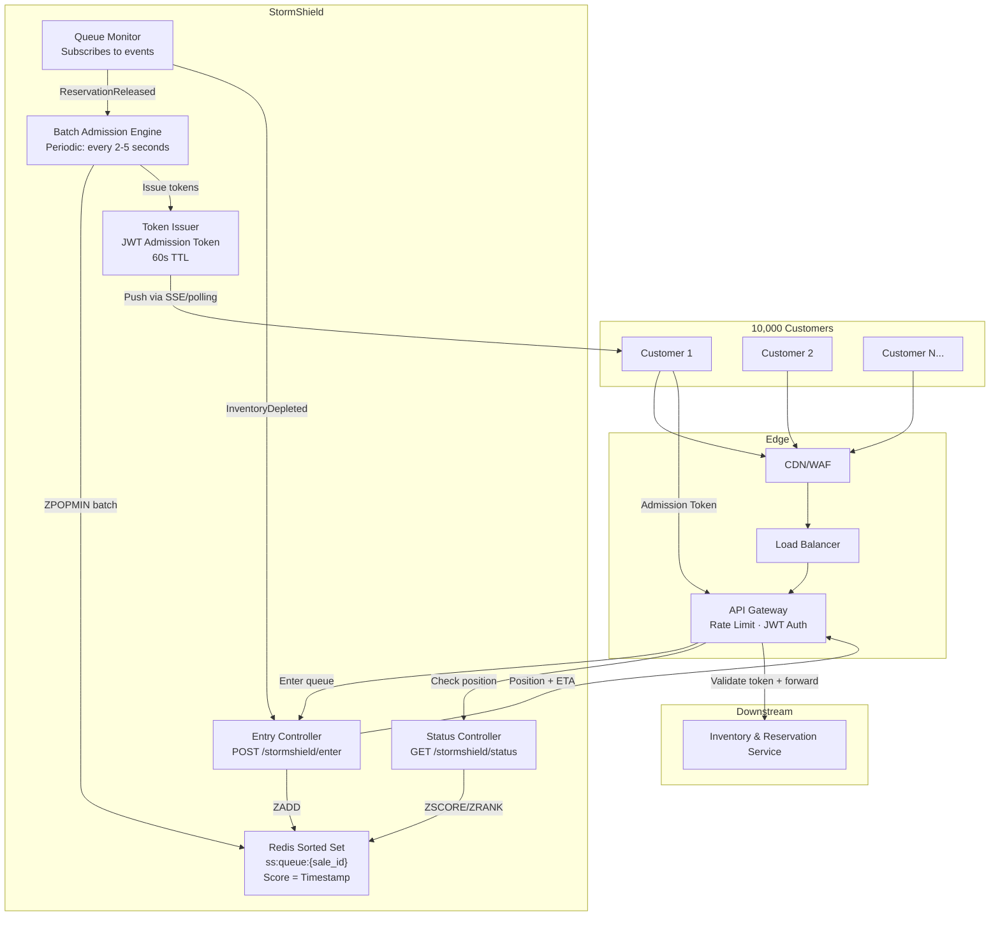
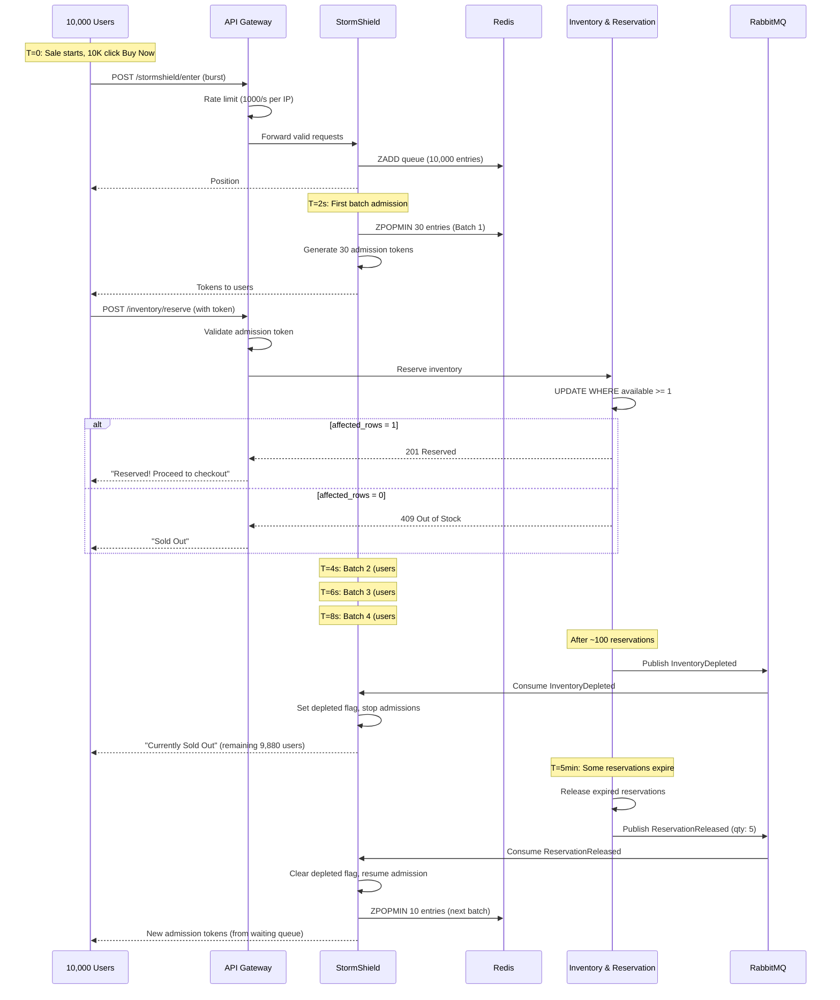

# GlowRush — StormShield Design

> **Version:** 1.0 | **Owner:** Student 1 (System Architect)

---

## 1. Purpose

StormShield is the **virtual waiting room and controlled admission layer** for GlowRush flash sales. It converts a thundering herd of 10,000 simultaneous users into a manageable stream of batched admissions, protecting downstream services (especially Inventory & Reservation Service) from overwhelming concurrency.

> [!IMPORTANT]
> **StormShield does NOT own or guarantee inventory.** It controls *traffic flow*, not *stock counts*. A user with a valid admission token may still receive "Out of Stock" from the Inventory & Reservation Service.

---

## 2. Architecture



---

## 3. Core Components

### 3.1 Entry Controller

**Endpoint:** `POST /api/v1/stormshield/enter`

**Request:**
```json
{
  "saleId": "uuid",
  "customerId": "uuid"
}
```

**Logic:**
1. Check if sale is active (Redis cache: `cache:sale:<saleId>`)
2. Check if customer already in queue (`ZSCORE ss:queue:<saleId> <customerId>`)
3. If already queued → return existing position
4. If sale marked as `DEPLETED` → return `"Currently Sold Out"`
5. Add to queue: `ZADD ss:queue:<saleId> <timestamp_ms> <customerId>`
6. Get position: `ZRANK ss:queue:<saleId> <customerId>`
7. Return position and estimated wait time

**Response (queued):**
```json
{
  "status": "queued",
  "position": 457,
  "estimatedWaitSeconds": 120,
  "saleId": "uuid",
  "message": "You are in the waiting queue"
}
```

**Response (sold out):**
```json
{
  "status": "sold_out",
  "message": "Currently Sold Out"
}
```

### 3.2 Batch Admission Engine

**Runs:** Periodic timer — every **2–5 seconds** (configurable, tuned to downstream capacity)

**Algorithm:**
```
FUNCTION admitNextBatch(saleId):
    IF inventory_depleted_flag[saleId] == true:
        RETURN  // No admission when sold out

    batchSize = calculateBatchSize()  // 20-50, based on current capacity
    
    // Atomically pop the next batch from the queue
    customers = ZPOPMIN ss:queue:{saleId} {batchSize}
    
    FOR EACH customer IN customers:
        token = generateAdmissionToken(customer, saleId)
        SETEX ss:token:{customer.id}:{saleId} 60 token
        SET ss:admitted:{customer.id}:{saleId} "admitted" EX 300
        pushTokenToCustomer(customer, token)  // SSE or next poll
```

**Batch Size Calculation:**
```
baseBatchSize = 30
currentQueueLength = ZCARD ss:queue:{saleId}
inventoryRemaining = GET inv:available:{productId}  // Redis cache, not authoritative
recentFailureRate = getRecentReservationFailureRate()

IF inventoryRemaining <= 0:
    batchSize = 0
ELSE IF recentFailureRate > 0.5:
    batchSize = baseBatchSize / 2  // Slow down if many failures
ELSE:
    batchSize = MIN(baseBatchSize, inventoryRemaining * 2)  // Admit ~2x remaining stock
```

### 3.3 Admission Token

**Format:** JWT (signed with service-specific secret)

**Payload:**
```json
{
  "sub": "customer_uuid",
  "type": "admission",
  "saleId": "sale_uuid",
  "batchId": "batch_uuid",
  "iat": 1696500000,
  "exp": 1696500060
}
```

**Properties:**
| Property    | Value   | Reason                                          |
| ----------- | ------- | ----------------------------------------------- |
| TTL         | 60s     | Short enough to limit abuse; long enough for reservation |
| Single-use  | Yes     | Tracked in Redis `ss:token:used:<token_hash>`   |
| Revocable   | Yes     | Delete Redis key to revoke                      |

**Validation (at API Gateway):**
1. Verify JWT signature
2. Check `type === "admission"`
3. Check `exp > now`
4. Check not already used: `GET ss:token:used:<hash>` returns null
5. Mark as used: `SETEX ss:token:used:<hash> 300 "used"`

### 3.4 Status Controller

**Endpoint:** `GET /api/v1/stormshield/status?saleId=<uuid>`

**Logic:**
1. Check if customer has been admitted: `EXISTS ss:admitted:<customerId>:<saleId>`
2. If admitted → return admission token
3. Check queue position: `ZRANK ss:queue:<saleId> <customerId>`
4. Calculate estimated wait: `position / batchSize * batchInterval`

**Response:**
```json
{
  "status": "queued",
  "position": 123,
  "estimatedWaitSeconds": 60,
  "totalInQueue": 4567
}
```

### 3.5 Queue Monitor

**Subscribes to:**
- `ReservationReleased` → Triggers batch admission for released slots
- `InventoryDepleted` → Sets `inventory_depleted_flag`, stops admissions, notifies remaining queue
- `SaleStarted` → Initializes queue structures
- `SaleEnded` → Cleans up queue, rejects remaining users

---

## 4. Flow: 10,000 Users → 100 Units



---

## 5. Queue Data Structures (Redis)

| Key                                 | Type       | Purpose                                | TTL        |
| ----------------------------------- | ---------- | -------------------------------------- | ---------- |
| `ss:queue:<saleId>`                 | Sorted Set | Queue positions (score=timestamp)      | Sale end   |
| `ss:token:<customerId>:<saleId>`    | String     | Pending admission token                | 60s        |
| `ss:token:used:<tokenHash>`         | String     | Used token tracking                    | 300s       |
| `ss:admitted:<customerId>:<saleId>` | String     | Admitted user flag                     | 300s       |
| `ss:depleted:<saleId>`              | String     | Inventory depleted flag                | Sale end   |
| `ss:stats:<saleId>`                 | Hash       | Queue length, admitted count, etc.     | 24h        |
| `ss:batch:<saleId>:counter`         | String     | Batch sequence counter                 | Sale end   |

---

## 6. Configuration

| Parameter              | Default | Flash Sale | Description                              |
| ---------------------- | ------- | ---------- | ---------------------------------------- |
| `BATCH_SIZE`           | 30      | 20–50      | Users per admission batch                |
| `BATCH_INTERVAL_MS`    | 3000    | 2000–5000  | Time between batch admissions            |
| `TOKEN_TTL_SECONDS`    | 60      | 60         | Admission token lifetime                 |
| `MAX_QUEUE_SIZE`       | 50000   | 50000      | Maximum queue length before rejection    |
| `QUEUE_CLEANUP_AFTER`  | 3600    | 3600       | Seconds after sale end to clean queue    |

---

## 7. Failure Scenarios

| Scenario                       | Behavior                                                    |
| ------------------------------ | ----------------------------------------------------------- |
| Redis unavailable              | Fail open — API Gateway applies aggressive rate limiting; StormShield returns 503 |
| StormShield instance crashes   | ALB routes to surviving instances; queue state persists in Redis |
| Admission token expired        | Customer re-enters queue (but maintains position if still in sorted set) |
| Customer abandons queue        | Token expires; position remains until cleaned (no harm)     |
| False `InventoryDepleted`      | Batch admission resumes on next `ReservationReleased` event |
| All stock reserved, all pay    | Queue remains; users see "Sold Out"; clean up on sale end   |

---

## 8. StormShield Metrics

| Metric                      | Type      | Alert Threshold      |
| --------------------------- | --------- | -------------------- |
| `ss_queue_length`           | Gauge     | > 10,000             |
| `ss_queue_wait_time_p95`    | Histogram | > 300 seconds        |
| `ss_batch_size`             | Gauge     | < 5 (throttled)      |
| `ss_tokens_issued_total`    | Counter   | —                    |
| `ss_tokens_expired_total`   | Counter   | > 20% of issued      |
| `ss_tokens_consumed_total`  | Counter   | —                    |
| `ss_admission_latency_ms`   | Histogram | p99 > 100ms          |
| `ss_depleted_flag`          | Gauge     | 1 = sold out         |
