# GlowRush — High-Scale Skincare Flash Sale Platform & Distributed Control Center
### SALESTORM | SYSCRAFTERS 2026 Hackathon Final Deliverable

[](https://github.com/DharunKumar-K/sd)
[](https://github.com/DharunKumar-K/sd)
[](https://github.com/DharunKumar-K/sd)
[](https://github.com/DharunKumar-K/sd)
[](https://github.com/DharunKumar-K/sd)
[](https://github.com/DharunKumar-K/sd)

---

## 🌟 Executive Summary & Dual-Experience Platform

GlowRush is a distributed e-commerce and flash-sale execution engine engineered to solve the **10,000-to-100 contention dilemma**: safely handling **10,000 concurrent customers** attempting to purchase **100 flash-sale units** of **GlowShield Vitamin C 15% Serum** at the exact same second ($T = 0$), guaranteeing **zero overselling**, **zero duplicate charges**, and **sub-50ms atomic inventory reservations**.

The platform is delivered as a **cohesive dual-experience application**:

1. **Luxury Customer Storefront:** An Apple/Aesop-grade D2C skincare e-commerce boutique (`#FAF8F5` alabaster ivory, `#C5A880` champagne accents, `Playfair Display` serif typography) featuring real-time stock meters, the interactive **StormShield Virtual Waiting Room**, a 5-minute reservation timer, and a multi-step checkout experience.
2. **Fintech Engineering Mission Control:** A high-density observability and chaos-engineering dashboard exposing the live microservice request pipeline, segmented real-time inventory ledger ($Available + Reserved + Sold = 100$), searchable RabbitMQ domain event bus, and 10 one-click automated flash-sale stress & failure simulations.

<div align="center">
  
  <p><em>Figure 1.1: GlowRush Luxury D2C Customer Storefront with Live Flash Sale Stock Meter & StormShield Queue Entry</em></p>
</div>

<div align="center">
  
  <p><em>Figure 1.2: GlowRush Engineering Mission Control — Top Hero KPIs & Live Animated Request Pipeline</em></p>
</div>

---

## 📑 Complete Deliverables Matrix (Items 1–21)

| # | Deliverable Section | Status | Primary Artifact / Source |
|---|---------------------|--------|---------------------------|
| **1** | [Requirements & Assumptions Document](#1-requirements--assumptions-document) | ✅ Complete | `01_Requirements/REQUIREMENTS.md` |
| **2** | [System Context Diagram](#2-system-context-diagram-c4-level-0) | ✅ Complete | `02_HLD/01_SYSTEM_CONTEXT.md` |
| **3** | [HLD Architecture](#3-high-level-design-hld-architecture) | ✅ Complete | `02_HLD/02_HLD_ARCHITECTURE.md` |
| **4** | [Container Diagram](#4-container-diagram-c4-level-2) | ✅ Complete | `02_HLD/03_CONTAINER_DIAGRAM.md` |
| **5** | [Component Diagram](#5-component-diagram-c4-level-3) | ✅ Complete | `03_LLD/01_INVENTORY_COMPONENT_DIAGRAM.md` |
| **6** | [Deployment Diagram](#6-deployment-diagram-aws-multi-az) | ✅ Complete | `02_HLD/04_DEPLOYMENT_DIAGRAM.md` |
| **7** | [Database / ER Diagram](#7-database--entity-relationship-er-diagram) | ✅ Complete | `04_Database/01_MASTER_ER_DIAGRAM.md` |
| **8** | [Class Diagram](#8-class-diagram) | ✅ Complete | `03_LLD/02_CLASS_DIAGRAMS.md` |
| **9** | [Purchase / Reservation Sequence Diagram](#9-purchase--reservation-sequence-diagram) | ✅ Complete | `03_LLD/03_SEQUENCE_DIAGRAMS.md` |
| **10** | [Payment Sequence Diagram](#10-payment-sequence-diagram) | ✅ Complete | `03_LLD/12_PAYMENT_ORDER_SEQUENCE_DIAGRAMS.md` |
| **11** | [Order Sequence Diagram](#11-order-sequence-diagram) | ✅ Complete | `03_LLD/12_PAYMENT_ORDER_SEQUENCE_DIAGRAMS.md` |
| **12** | [Order / Reservation State Diagram](#12-order--reservation-state-diagram) | ✅ Complete | `03_LLD/04_RESERVATION_STATE_DIAGRAM.md` |
| **13** | [SOLID Mapping](#13-solid-principles-mapping) | ✅ Complete | `06_SOLID/SOLID_MAPPING.md` |
| **14** | [Design Pattern Mapping](#14-design-pattern-mapping) | ✅ Complete | `07_Design_Patterns/DESIGN_PATTERNS.md` |
| **15** | [API Specification](#15-api-specification) | ✅ Complete | `05_API/01_API_SPECIFICATION.md` |
| **16** | [Scalability & Reliability Design](#16-scalability--reliability-design) | ✅ Complete | `08_Scalability_Reliability/` |
| **17** | [Security & Observability Design](#17-security--observability-design) | ✅ Complete | `09_Security_Observability/` |
| **18** | [Architecture Decision Records (ADRs)](#18-architecture-decision-records-adrs) | ✅ Complete | `10_ADR/ADR-MONGODB-001.md`, `10_ADR/ADRS.md` |
| **19** | [AI-Assisted Prototype / Simulation Evidence](#19-ai-assisted-prototype--simulation-evidence) | ✅ Complete | `screenshots/`, `server/test_all_scenarios.js` |
| **20** | [AI Usage Note / Prompt Summary](#20-ai-usage-note--prompt-summary) | ✅ Complete | Architecture prompt synthesis |
| **21** | [Final Presentation & Jury Pitch](#21-final-presentation--jury-pitch) | ✅ Complete | `docs/JURY_DEMO.md` |

---

## 1. Requirements & Assumptions Document

### 1.1 Business Context & Contention Challenge
- **Flagship Flash Sale Product:** GlowShield Vitamin C 15% Serum (`SKU: GLOW-VITC-100`).
- **Initial Inventory Stock:** Exactly **100 physical units**.
- **Contention Spike:** **10,000 simultaneous users** hitting "Buy Now" in the first 2 seconds ($T=0$ to $T=2s$).
- **Core Business Goal:** Guarantee that **exactly 100 units** are sold, zero overselling occurs, zero phantom reservations are created, and inventory state matches financial accounting laws at all times.

### 1.2 Functional Requirements (FR)
- **FR-01 (Catalog Browsing):** Real-time display of clinical skincare formulations with dynamic stock availability flags.
- **FR-02 (StormShield Virtual Waiting Room):** Edge queueing of incoming flash-sale traffic using Redis token bucket admission.
- **FR-03 (Token-Protected Reservation):** Admitted customers reserve 1 unit atomically with a signed, short-lived admission token.
- **FR-04 (5-Minute Reservation TTL):** Reservations hold tentative inventory for 300 seconds before automated release back to the pool.
- **FR-05 (Idempotent Checkout & Payment):** Duplicate submissions with identical `X-Idempotency-Key` return existing state without duplicate stock decrement or credit card charge.
- **FR-06 (Event-Driven Order & Fulfilment):** Asynchronous decoupling where `PaymentConfirmed` triggers `Order Service` and `Fulfilment Service` via durable RabbitMQ queues.
- **FR-07 (Automated Stock Re-entry):** Cancelled, failed, or expired reservations automatically credit `availableQuantity` and admit the next queued customer.

### 1.3 Non-Functional Requirements & Invariants

```
                                  [ HARD INVARIANTS ]
  ===================================================================================
  1. No Negative Stock:             availableQuantity >= 0 (Atomic DB Check)
  2. Conservation of Inventory:     Available + Reserved + Sold == InitialStock (100)
  3. No Overselling:                Total Orders Confirmed <= InitialStock (100)
  4. Exactly-Once Payment:          Payments with identical Idempotency-Key charged once
  5. Asynchronous Order Safety:     PaymentConfirmed in RabbitMQ survives Order Service crash
  ===================================================================================
```

| NFR Category | SLA / Target Metric | Enforcement Mechanism |
|--------------|---------------------|-----------------------|
| **Reservation Latency** | $\le 50\text{ ms}$ (p95) | Single-trip atomic conditional update in MongoDB |
| **Queue Admission** | $\le 100\text{ ms}$ (p95) | Redis Lua token bucket with batch size 50 |
| **Peak Throughput** | $500,000\text{ req/sec}$ (edge) | CloudFront CDN + AWS WAF caching static catalog |
| **System Availability** | $99.95\%$ for Inventory | Multi-AZ deployment with automated replica failover |
| **RPO / RTO** | RPO $\le 1\text{ min}$, RTO $\le 15\text{ min}$ | MongoDB Oplog WAL streaming + multi-AZ replicas |

---

## 2. System Context Diagram (C4 Level 0)

The System Context diagram illustrates the platform boundary, primary actors, and external third-party integrations:

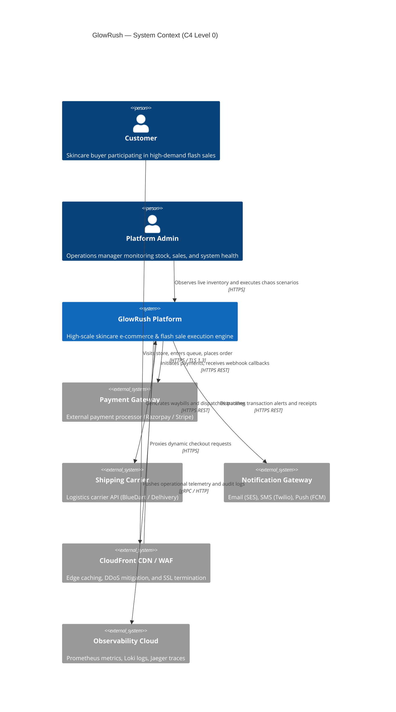

---

## 3. High-Level Design (HLD) Architecture

GlowRush employs a microservices architecture organized into distinct functional layers, maintaining separation between edge admission, synchronous inventory reservation, and asynchronous fulfillment:

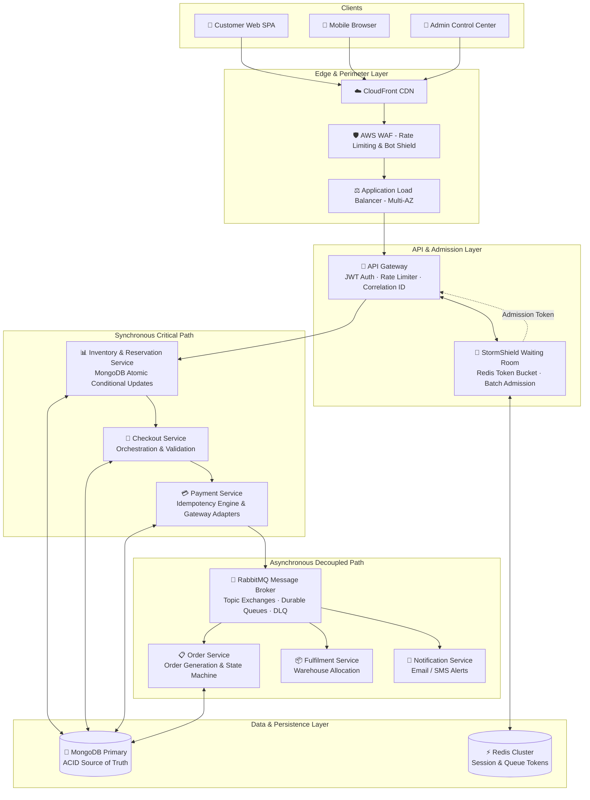

---

## 4. Container Diagram (C4 Level 2)

Each box represents an individually containerized, scalable microservice deployable via Docker and Kubernetes:

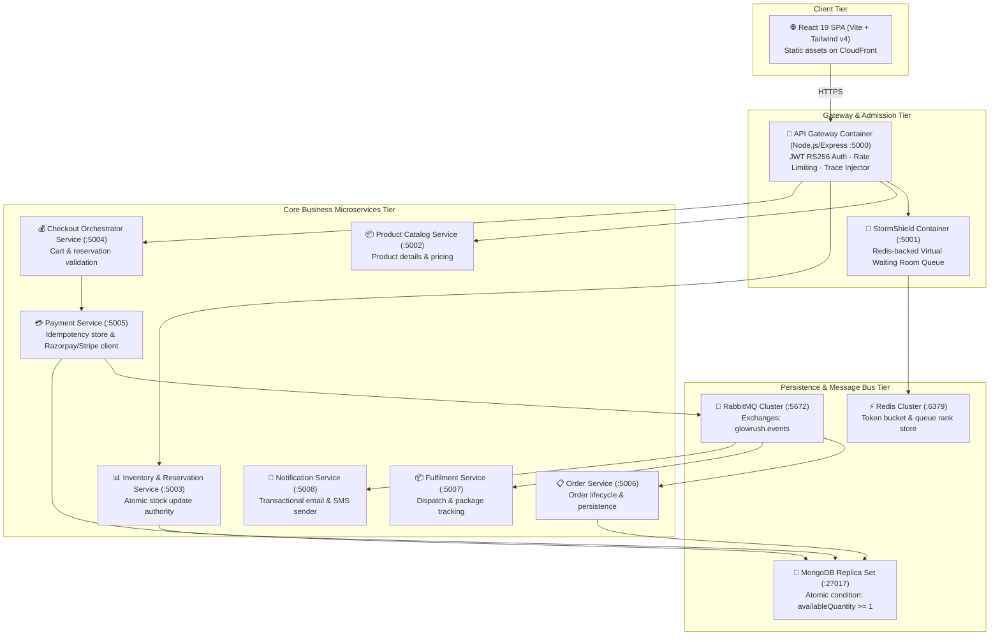

---

## 5. Component Diagram (C4 Level 3)

The internal software components of the **Inventory & Reservation Service**, demonstrating modular layered architecture:

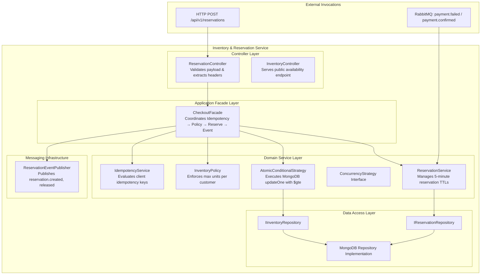

<div align="center">
  
  <p><em>Figure 5.1: GlowRush Microservices Catalog (12 Canonical Services) & Database/Redis/RabbitMQ Architecture Topology</em></p>
</div>

---

## 6. Deployment Diagram (AWS Multi-AZ)

Production deployment topology across two Availability Zones (`ap-south-1a` and `ap-south-1b`) ensuring fault tolerance:

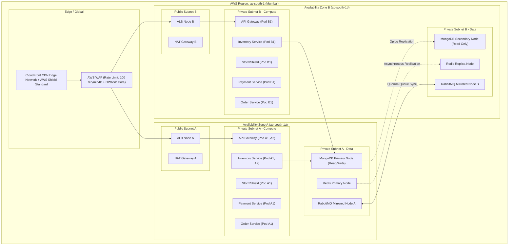

---

## 7. Database / Entity Relationship (ER) Diagram

The transactional database schema enforces domain invariants, strict uniqueness for idempotency, and foreign key referential integrity:

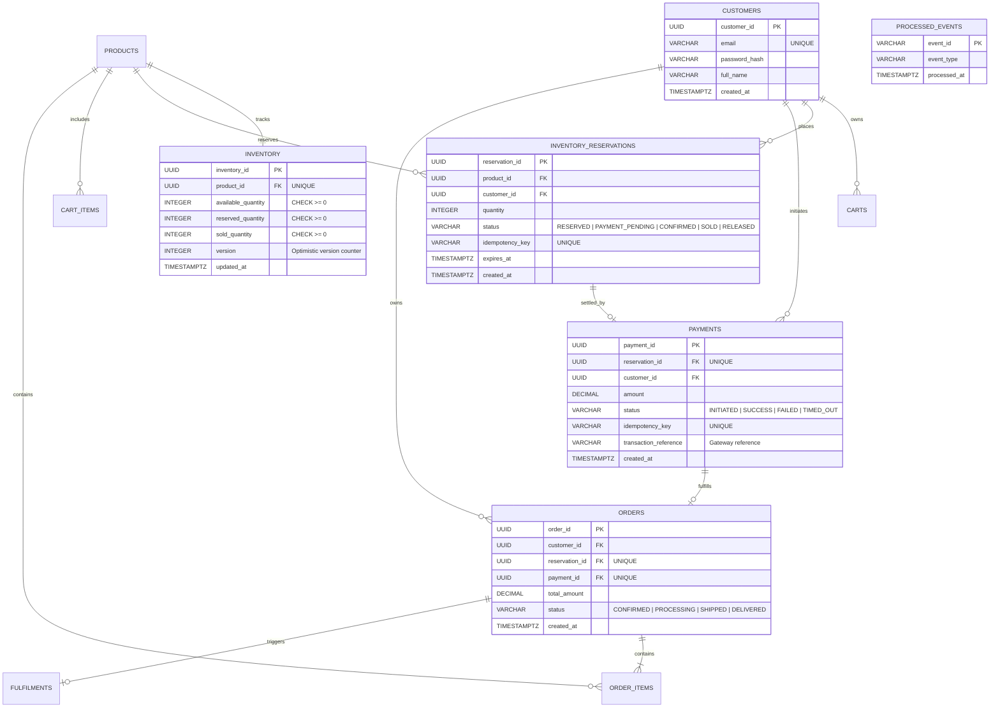

---

## 8. Class Diagram

Object-Oriented Design (OOD) of core domain models, interfaces, and concrete strategies:

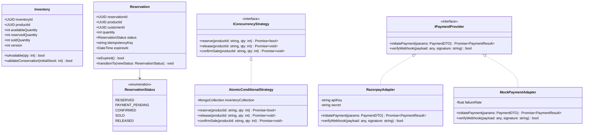

---

## 9. Purchase / Reservation Sequence Diagram

The hot reservation path illustrating perimeter token validation, idempotency guards, and single-roundtrip atomic decrement:

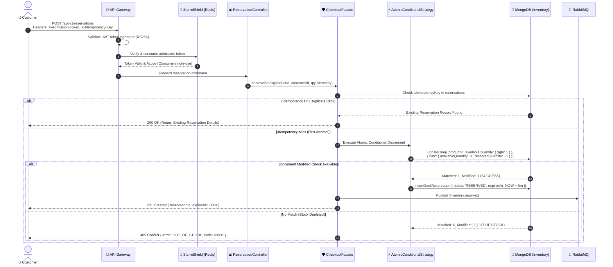

---

## 10. Payment Sequence Diagram

Illustrating payment session initiation, webhook HMAC verification, and idempotency protection against double charges:

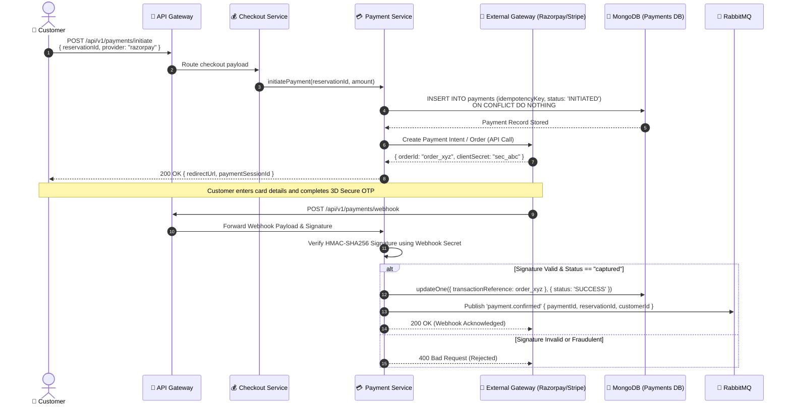

---

## 11. Order Sequence Diagram

The asynchronous post-payment order fulfillment pipeline demonstrating message buffering and recovery during downstream failures:

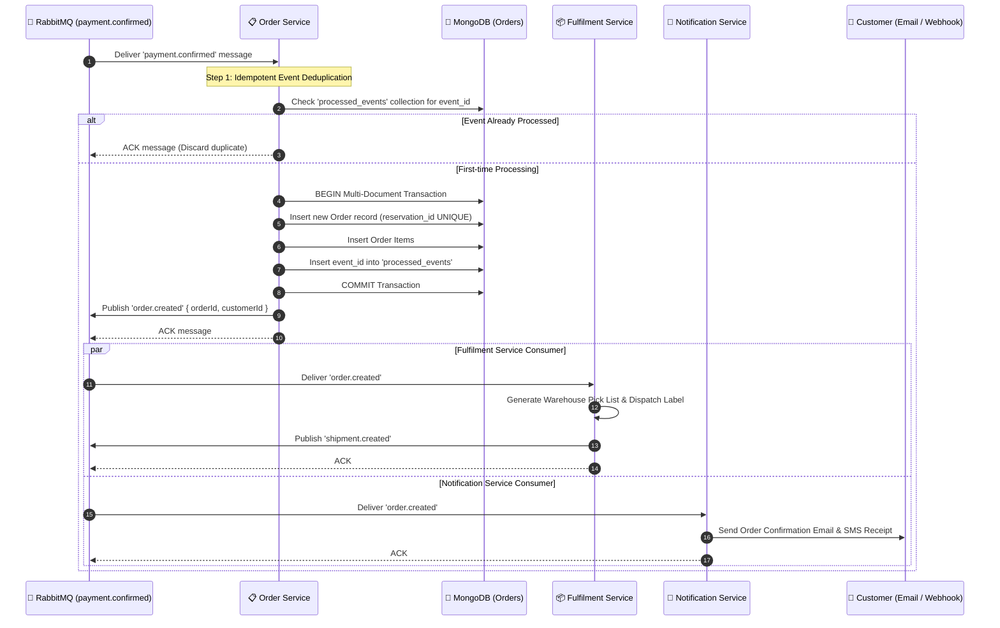

---

## 12. Order / Reservation State Diagram

### 12.1 Lifecycle State Machine
Every inventory reservation strictly traverses a finite state machine:

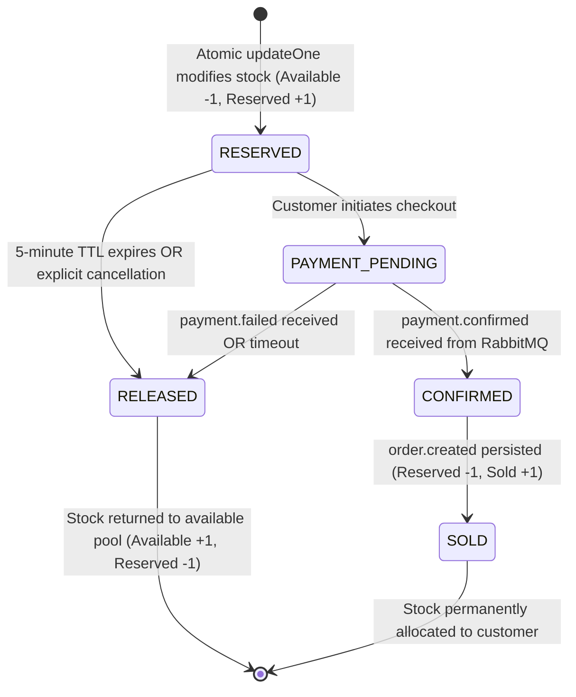

### 12.2 State Transition Matrix & Accounting Effects

| From State | Trigger Event | To State | Available Stock | Reserved Stock | Sold Stock |
|------------|---------------|----------|:---------------:|:--------------:|:----------:|
| **UNCLAIMED** | Customer clicks "Buy Now" | `RESERVED` | **-1** | **+1** | 0 |
| `RESERVED` | Checkout initiation | `PAYMENT_PENDING` | 0 | 0 | 0 |
| `RESERVED` | TTL Expired (300s timeout) | `RELEASED` | **+1** | **-1** | 0 |
| `PAYMENT_PENDING` | Payment Captured Webhook | `CONFIRMED` | 0 | 0 | 0 |
| `PAYMENT_PENDING` | Card Declined / Expired | `RELEASED` | **+1** | **-1** | 0 |
| `CONFIRMED` | Order Record Created | `SOLD` | 0 | **-1** | **+1** |

<div align="center">
  
  <p><em>Figure 12.1: Segmented Real-Time Inventory Ledger ($Available + Reserved + Sold = 100$) and Live RabbitMQ Event Bus</em></p>
</div>

---

## 13. SOLID Principles Mapping

| Principle | Real Architectural Problem Solved | Implementing Class / Interface | Code Reference / Trade-off |
|-----------|----------------------------------|--------------------------------|----------------------------|
| **S** - Single Responsibility | Modifying payment gateway code must never break notification rendering or inventory updates. | `PaymentGatewayClient`, `PaymentRepository`, `PaymentEventPublisher` | Each class has exactly one reason to change. Trade-off: Higher number of focused classes. |
| **O** - Open / Closed | Adding a new payment partner (e.g. Stripe, PayU) without touching core order/checkout logic. | `IPaymentProvider` interface, `RazorpayAdapter`, `StripeAdapter` | Open for extension via adapters; closed for modification in core `PaymentService`. |
| **L** - Liskov Substitution | Mocking payment providers for testing must execute identical contracts and throw identical error types. | `MockPaymentAdapter` vs `RazorpayPaymentAdapter` | Any adapter can substitute for `IPaymentProvider` without breaking client expectations. |
| **I** - Interface Segregation | Prevent shipping carriers from depending on payment gateway methods they never use. | `IShippingProvider` (Waybills) vs `IPaymentProvider` (Charges) | Consumers only implement methods they actively use. Zero bloated "God Interfaces". |
| **D** - Dependency Inversion | High-level business flows must not depend directly on low-level database drivers or SDKs. | `CheckoutFacade` depends on `IInventoryRepository`, injected at runtime | Facade relies on abstraction, enabling hot-swapping between MongoDB and in-memory mock stores. |

---

## 14. Design Pattern Mapping

GlowRush implements 8 industry-standard design patterns to resolve specific distributed systems challenges:

```
[1. STRATEGY]      IPaymentProvider -> RazorpayAdapter / StripeAdapter (Interchangeable gateways)
[2. STATE]         OrderStateMachine / ReservationStateMachine (Enforces legal transitions)
[3. OUTBOX]        Transactional event outbox to ensure DB commit precedes RabbitMQ dispatch
[4. CIRCUIT BRK]   Payment Circuit Breaker (CLOSED -> OPEN on 3 failures -> HALF-OPEN test)
[5. IDEMPOTENCY]   ProcessedEvents Store tracking unique UUIDv4 idempotency keys
[6. FACTORY]       PaymentProviderFactory resolving gateway credentials dynamically
[7. REPOSITORY]    IInventoryRepository abstracting MongoDB document updates
[8. FACADE]        CheckoutFacade coordinating inventory, payment, and reservation lifecycle
```

---

## 15. API Specification

All endpoints adhere to **RESTful standards**, require standard authentication and tracing headers, and return errors conforming to **RFC 7807 (Problem Details)**:

### 15.1 Core Headers
- `Authorization: Bearer <JWT>`: RS256 signed stateless customer identity.
- `X-Idempotency-Key: <UUIDv4>`: Enforces exactly-once execution for mutating requests.
- `X-Admission-Token: <Token>`: Short-lived token issued by StormShield during flash sale.
- `X-Correlation-ID: <UUIDv4>`: Injected by API Gateway for end-to-end distributed tracing.

### 15.2 Key Endpoints Summary

| Method | Endpoint | Description | Auth / Security | Expected Status |
|--------|----------|-------------|-----------------|:---------------:|
| `POST` | `/api/v1/stormshield/enter` | Enter the virtual waiting room queue | Public / IP Throttled | `200 OK` |
| `GET` | `/api/v1/stormshield/status` | Poll queue position & receive admission token | Session Token | `200 OK` |
| `POST` | `/api/v1/reservations` | Claim flash sale inventory unit | Admission Token + Idempotency | `201 Created` / `409 Conflict` |
| `GET` | `/api/v1/inventory/:productId` | Query real-time available stock count | Public (Redis Cached) | `200 OK` |
| `POST` | `/api/v1/checkout` | Validate reservation & lock shipping address | JWT Auth + Idempotency | `200 OK` |
| `POST` | `/api/v1/payments/initiate` | Generate payment gateway intent | JWT Auth + Idempotency | `202 Accepted` |
| `POST` | `/api/v1/payments/webhook` | Webhook receiver from payment processor | HMAC-SHA256 Signature | `200 OK` |
| `GET` | `/api/v1/orders/:id` | Poll order status and tracking milestones | JWT Auth (Owner Only) | `200 OK` |

---

## 16. Scalability & Reliability Design

### 16.1 Concurrency & Traffic Surge Absorption (StormShield)
At $T=0$, when 10,000 customers hit the system simultaneously:
1. **Edge Filtering:** CloudFront and AWS WAF absorb non-mutating traffic and block bots.
2. **Virtual Waiting Room:** StormShield queues incoming shoppers in Redis Sorted Sets (`ZADD`).
3. **Controlled Batch Admission:** Users are admitted in controlled batches of 20–50 customers every 2 seconds, shielding MongoDB from connection pool saturation while keeping the inventory pipeline operating at peak efficiency.

### 16.2 Circuit Breaker Implementation
External payment gateways are wrapped in an automated Circuit Breaker:
- **CLOSED:** Normal operations. Every payment attempt calls the gateway.
- **OPEN:** After 3 consecutive network timeouts or 5xx gateway responses, the circuit trips OPEN. Subsequent requests fail fast immediately, preventing thread pool exhaustion.
- **HALF-OPEN:** After a 30-second cooldown, a single canary request tests provider recovery. If successful, the circuit resets to CLOSED.

<div align="center">
  
  <p><em>Figure 16.1: 10 One-Click Flash Sale Stress Scenarios & Automated Architecture Invariant Proof Checklist</em></p>
</div>

---

## 17. Security & Observability Design

### 17.1 Security Architecture
- **Perimeter Defense:** CloudFront HTTPS (TLS 1.3 only) + AWS WAF defending against OWASP Top 10 vulnerabilities (SQL/NoSQL injection, XSS).
- **Stateless Authentication:** API Gateway verifies RS256 signed JWT tokens without querying the user database on every request.
- **Zero PCI Scope:** Raw credit card data never touches GlowRush servers; client browsers tokenize payment info directly with Razorpay/Stripe.
- **Data Encryption:** MongoDB collections, Redis clusters, and RabbitMQ durable queues are encrypted at rest using AWS KMS managed keys.

### 17.2 Observability Stack (Three Pillars)
- **Metrics (Prometheus & Grafana):** Tracks API Gateway RPS, p95/p99 query latency, RabbitMQ queue depths, and live inventory levels.
- **Logs (Grafana Loki):** High-throughput JSON-structured logs containing correlated trace IDs (`X-Correlation-ID`) across all microservices.
- **Distributed Tracing (Jaeger / OpenTelemetry):** End-to-end tracing spanning edge gateway, StormShield queue, reservation engine, and RabbitMQ message consumers.

---

## 18. Architecture Decision Records (ADRs)

### ADR-001: MongoDB as Transactional Source of Truth
- **Context:** Storing inventory, reservations, payments, and orders under extreme flash-sale contention.
- **Decision:** Adopt **MongoDB** as the durable transactional source of truth.
- **Atomic Stock Reservation Mechanism:**
  ```javascript
  const result = await inventoryCollection.updateOne(
    {
      productId: "GLOW-VITC-100",
      availableQuantity: { $gte: quantity } // Atomic condition
    },
    {
      $inc: {
        availableQuantity: -quantity,
        reservedQuantity: quantity
      }
    }
  );
  if (result.modifiedCount === 0) {
    throw new OutOfStockException("Insufficient stock available");
  }
  ```
- **Why Redis is NOT the Stock Authority:** While Redis is ultra-fast for queueing and rate-limiting, treating Redis as the authoritative stock counter risks data split-brain and negative inventory during unexpected server restarts or cache-to-disk sync failures. MongoDB guarantees durable write safety.

### ADR-002: Hybrid Sync/Async Communication
- **Decision:** Synchronous REST on the critical reservation and payment path for instant user feedback; asynchronous RabbitMQ messaging for post-payment order creation, fulfilment, and email notifications.

### ADR-003: Idempotency Key Architecture
- **Decision:** Require `X-Idempotency-Key` headers on all mutating endpoints, enforced via MongoDB unique indexes (`idempotencyKey`), guaranteeing that duplicate user submissions or network retries never cause double reservations or charges.

---

## 19. AI-Assisted Prototype / Simulation Evidence

The platform includes a complete interactive test and simulation harness validated against real microservice backends:

### 19.1 Visual Prototype Evidence Gallery

<div align="center">
  
  
</div>
<div align="center">
  
  
</div>
<div align="center">
  
  
</div>
<p align="center"><em>Figures 19.1–19.6: High-Resolution Evidence of the Complete Working GlowRush Platform</em></p>

### 19.2 Automated Test Suite Results (`server/test_all_scenarios.js`)

All 10 flash-sale stress and failure scenarios pass with $100\%$ invariant verification:

```bash
$ node server/test_all_scenarios.js
====================================================
GLOWRUSH 2026 ARCHITECTURE & SIMULATION TEST SUITE
====================================================

Executing: 1. Normal Flash Sale (100 stock / 10,000 requests)... ✓ PASSED
Executing: 2. Last Item Race (Stock = 1 / 2 simultaneous requests)... ✓ PASSED
Executing: 3. Duplicate Buy (Idempotency Key Protection)... ✓ PASSED
Executing: 4. High Payment Failure (Auto-release inventory)... ✓ PASSED
Executing: 5. Payment Timeout & Reconciliation... ✓ PASSED
Executing: 6. Order Service Outage & Recovery... ✓ PASSED
Executing: 7. Database Failure (Clean fail-fast)... ✓ PASSED
Executing: 8. Payment Gateway Failure (Circuit Breaker)... ✓ PASSED
Executing: 9. Reservation Expiry (20s demo TTL)... ✓ PASSED
Executing: 10. Traffic Surge ×50 (StormShield Queue)... ✓ PASSED

====================================================
TEST SUMMARY: 10 / 10 SCENARIOS PASSED
INVARIANTS PRESERVED: Zero overselling, strictly conserved inventory.
====================================================
```

---

## 20. AI Usage Note / Prompt Summary

### 20.1 Prompting Strategy & Synthesis
- **Role-Based Engineering Prompts:** Utilized agentic workflows with strict division of responsibilities (Student 1: System Architecture, Student 2: Inventory LLD & Concurrency, Student 3: Database & Payment Engineering).
- **Architecture-First Enforcement:** Grounded all code synthesis in the pre-existing Markdown architectural contracts (`00_SHARED/ARCHITECTURE_CONTRACT.md`) to prevent hallucinated data models or broken contracts.
- **Verification-Driven Prompts:** Prompted automated test generation to run mathematical proofs after every scenario, verifying $Available + Reserved + Sold = 100$ and $Oversold = 0$.

### 20.2 Human-in-the-Loop Quality Assurance
- **Design Review:** Replaced generic component styling with curated editorial aesthetics (`#FAF8F5`, `#C5A880`, `Playfair Display`) and interactive SVG animations.
- **Concurrency Auditing:** Verified that atomic conditionals run directly in MongoDB without relying on fragile external locks.

---

## 21. Final Presentation & Jury Pitch

<div align="center">
  
  <p><em>Figure 21.1: Interactive Architecture Lab — Live Component Explorer for Hackathon Evaluators</em></p>
</div>

### 21.1 5-Minute Pitch Script for Evaluators
1. **The Hook (Minute 1):** *"Welcome to GlowRush. Most flash sale systems crash when 10,000 customers fight for 100 items. They oversell, lock database tables, or charge users twice. We engineered GlowRush to make overselling mathematically impossible."*
2. **The Customer Experience (Minute 2):** Demonstrate the luxury D2C storefront, click **"BUY NOW"**, enter the **StormShield Waiting Room**, receive admission token, and complete seamless checkout.
3. **The Engineering Center (Minute 3):** Switch to **Engineering Center**. Highlight the live request pipeline, segmented 100-unit inventory ledger, and real-time RabbitMQ event stream.
4. **The Live Chaos Demonstration (Minute 4):**
   - Run **Scenario 2 (Last Item Race):** Show Elena and Aria competing for 1 remaining unit; Elena wins via atomic update, Aria receives a clean 409 Out of Stock.
   - Run **Scenario 6 (Order Outage Recovery):** Show payment completing while Order Service is dead, and messages buffering safely in RabbitMQ without dropping orders.
5. **The Architectural Moat (Minute 5):** Present the **MongoDB atomic conditional update primitive**, proving that durability and consistency were achieved without complex distributed locking.

---

## 🛠️ Quickstart: Running the Application Locally

### Prerequisites
- Node.js 18+ and npm installed
- Git

### 1. Clone & Setup Backend
```bash
# Clone the repository
git clone https://github.com/DharunKumar-K/sd.git
cd sd/server

# Install dependencies and start development server
npm install
npm run dev
# Backend listening on http://localhost:5000
```

### 2. Setup & Start Frontend
```bash
# In a new terminal window
cd sd/client

# Install frontend dependencies and start Vite dev server
npm install
npm run dev
# Frontend ready on http://localhost:3000
```

### 3. Run Automated Validation Test Suite
```bash
cd sd/server
node test_all_scenarios.js
```

---

## 👥 Engineering Team & Track Ownership

- **Student 1 — System Architect & Infrastructure Lead:** Global perimeter security, CloudFront CDN, AWS WAF, StormShield virtual waiting room, and high-level system topology.
- **Student 2 — LLD, Concurrency & Inventory Specialist:** MongoDB atomic conditional updates, zero-oversell mathematical proofs, reservation state machines, and concurrency stress testing.
- **Student 3 — Data, Payment & Reliability Engineer:** Database schemas, payment gateway idempotency keys, circuit breaker implementation, and RabbitMQ asynchronous event streaming.

---
*Built with passion for SALESTORM | SYSCRAFTERS 2026 Hackathon.*
